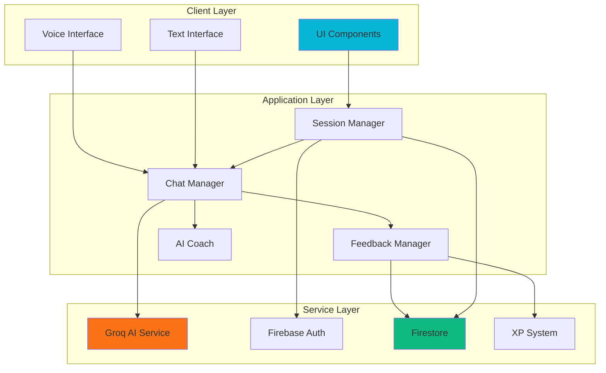
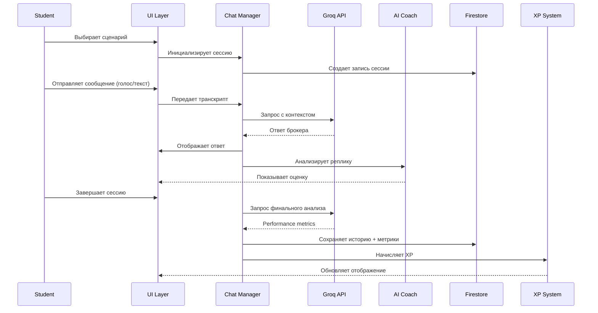

# Design Document: Broker Communication AI Bot

## Введение

Функция "Общение с Брокером" представляет собой интерактивный AI-бот для тренировки навыков общения диспетчеров с брокерами в индустрии грузоперевозок. Система предоставляет реалистичные сценарии переговоров с голосовым и текстовым интерфейсом, позволяя студентам практиковать профессиональную коммуникацию в безопасной учебной среде с мгновенной обратной связью.

### Текущее состояние

Базовая реализация уже существует в `pages/ai-broker-chat.html` со следующими возможностями:
- Голосовой интерфейс (Web Speech API)
- 6 сценариев переговоров (free, negotiate, book, problem, cold, followup)
- Интеграция с Groq API (llama-3.3-70b-versatile)
- Экран подготовки к звонку (prep screen)
- Адаптивный дизайн

**Требуется удалить/изменить:**
- AI Coach панель (не используется)
- Текстовый режим ввода (только голос)
- Локальные fallback ответы (только реальный AI)
- Кнопка "Улучшить" для черновиков (не нужна)

### Цели дизайна

1. Упростить архитектуру - только голосовой режим
2. Убрать AI Coach и локальные подсказки
3. Обеспечить real-time транскрипцию речи студента
4. Все ответы только через реальный AI (Groq API)
5. Спроектировать систему обратной связи после завершения сессии
6. Интегрировать с Firebase (Firestore для истории, XP система)

## Overview

### Архитектурные принципы

1. **Модульность**: Разделение на независимые компоненты (UI, AI, Storage, Voice)
2. **Voice-first**: Голосовой режим как основной, текстовый интерфейс только для отображения транскрипта
3. **Real AI only**: Все ответы генерируются через Groq API, никаких локальных скриптов
4. **Real-time transcription**: Показывать что говорит студент по мере произнесения
5. **Privacy**: Голосовые данные не сохраняются, только текстовые транскрипты

### Технологический стек

**Frontend:**
- Vanilla JavaScript (ES6+)
- Web Speech API (SpeechRecognition, SpeechSynthesis)
- CSS3 (Grid, Flexbox, Animations)

**Backend/Services:**
- Groq API (llama-3.3-70b-versatile) - основной AI
- Firebase Authentication - авторизация
- Firebase Firestore - хранение данных
- Firebase Hosting - деплой

**Интеграции:**
- xp-system.js - начисление XP
- role-guard.js - защита страницы
- nav.html - навигация

## Architecture

### Компонентная диаграмма



### Поток данных



### Архитектурные решения

#### 1. Выбор AI провайдера: Groq API

**Обоснование:**
- Высокая скорость ответа (< 1 сек для 150 tokens)
- Поддержка llama-3.3-70b-versatile (качественная модель)
- Бесплатный tier для разработки
- REST API (простая интеграция)

**Альтернативы рассмотрены:**
- OpenAI GPT-4: дороже, медленнее, но качественнее
- Anthropic Claude: хорошее качество, но дороже
- Google Gemini: бесплатный tier, но медленнее

**Рекомендация:** Оставить Groq для production, добавить возможность переключения на OpenAI для premium пользователей.

#### 2. Хранение данных: Firestore

**Структура коллекций:**

```
users/{uid}/
  - xp: number
  - stats: object
  
brokerSessions/{sessionId}/
  - uid: string
  - scenario: string
  - startedAt: timestamp
  - completedAt: timestamp
  - messages: array
  - metrics: object
  - xpAwarded: number
  
brokerHistory/{uid}/sessions/{sessionId}/
  - (denormalized для быстрого доступа)
```

#### 3. Голосовой интерфейс: Web Speech API

**Преимущества:**
- Нативная поддержка в Chrome, Edge, Safari
- Не требует серверной обработки
- Бесплатно
- Низкая задержка

**Ограничения:**
- Не работает в Firefox (fallback на текст)
- Требует HTTPS
- Зависит от качества микрофона

**Стратегия:**
- Определение поддержки при загрузке
- Автоматический fallback на текстовый режим
- Кнопка переключения режимов

## Components and Interfaces

### 1. UI Components

#### 1.1 PrepScreen Component
**Назначение:** Экран подготовки перед началом звонка

**Интерфейс:**
```javascript
class PrepScreen {
  constructor(scenario)
  show()
  hide()
  updateScenarioData(data)
  onStart(callback)
}
```

**Состояние:**
- scenario: string
- scenarioData: object (trailer, route, rate, availability)
- steps: array

#### 1.2 ChatWindow Component
**Назначение:** Основное окно диалога

**Интерфейс:**
```javascript
class ChatWindow {
  addMessage(type, content, timestamp)
  showTypingIndicator()
  hideTypingIndicator()
  showSpeakingIndicator()
  hideSpeakingIndicator()
  scrollToBottom()
  clear()
}
```

**Типы сообщений:**
- `user`: сообщение студента
- `broker`: ответ AI брокера
- `system`: системные сообщения
- `draft`: черновик (при голосовом вводе)
- `improved`: улучшенная версия сообщения

#### 1.3 VoiceInterface Component
**Назначение:** Управление голосовым вводом/выводом (ОСНОВНОЙ РЕЖИМ)

**Интерфейс:**
```javascript
class VoiceInterface {
  constructor()
  isSupported(): boolean
  requestPermission(): Promise<boolean>
  startRecording()
  stopRecording()
  onInterimTranscript(callback)  // Real-time по мере произнесения
  onFinalTranscript(callback)    // Финальный результат
  speak(text, options)
  stopSpeaking()
  getVoices(): array
}
```

**События:**
- `interim-transcript`: промежуточный результат (показывать в UI)
- `final-transcript`: финальный транскрипт (отправить AI)
- `error`: ошибка распознавания
- `speaking-start`: начало воспроизведения
- `speaking-end`: конец воспроизведения

**ВАЖНО:** Текстовый ввод НЕ поддерживается - только голос!

#### 1.4 TranscriptDisplay Component
**Назначение:** Отображение real-time транскрипта речи студента

**Интерфейс:**
```javascript
class TranscriptDisplay {
  showInterim(text)      // Показать промежуточный текст (серым)
  showFinal(text)        // Показать финальный текст (белым)
  clear()                // Очистить транскрипт
}
```

**Состояние:**
- interimText: string  // Текущий промежуточный транскрипт
- finalText: string    // Финальный транскрипт

**ПРИМЕЧАНИЕ:** AI Coach удален - не используется

### 2. Service Layer

#### 2.1 AIService
**Назначение:** Взаимодействие с Groq API (ТОЛЬКО РЕАЛЬНЫЙ AI)

**Интерфейс:**
```javascript
class AIService {
  constructor(apiKey, model)
  async chat(messages, options): Promise<string>
  async generateFinalFeedback(transcript): Promise<object>
  checkConnection(): Promise<boolean>
}
```

**Методы:**

```javascript
// Основной чат с брокером (ЕДИНСТВЕННЫЙ источник ответов)
async chat(messages, options = {}) {
  // messages: [{role: 'user'|'assistant'|'system', content: string}]
  // options: {temperature, max_tokens, top_p}
  // returns: string (ответ AI)
  // ВАЖНО: Никаких fallback ответов! Если ошибка - показать ошибку
}

// Финальная обратная связь после завершения сессии
async generateFinalFeedback(transcript) {
  // returns: {professionalism: 1-10, effectiveness: 1-10, terminology: 1-10, feedback: string}
}
```

**УДАЛЕНО:**
- `analyze()` - AI Coach не используется
- `improveDraft()` - функция улучшения не нужна
- Локальные fallback ответы

#### 2.2 SessionManager
**Назначение:** Управление сессиями тренировки

**Интерфейс:**
```javascript
class SessionManager {
  constructor(uid)
  async startSession(scenario): Promise<sessionId>
  async endSession(sessionId, metrics)
  async saveMessage(sessionId, message)
  async getSessionHistory(sessionId): Promise<object>
  async getUserSessions(limit): Promise<array>
}
```

**Структура сессии:**
```javascript
{
  sessionId: string,
  uid: string,
  scenario: string,
  brokerName: string,
  startedAt: Timestamp,
  completedAt: Timestamp | null,
  messages: [
    {
      type: 'user' | 'broker' | 'system',
      content: string,
      timestamp: Timestamp,
      improved: boolean
    }
  ],
  metrics: {
    professionalism: number,    // 1-10
    effectiveness: number,       // 1-10
    terminology: number,         // 1-10
    avgScore: number,
    feedback: string,
    highlights: array
  },
  xpAwarded: number,
  duration: number  // seconds
}
```

#### 2.3 FeedbackManager
**Назначение:** Генерация и сохранение обратной связи

**Интерфейс:**
```javascript
class FeedbackManager {
  async generateFeedback(sessionId): Promise<object>
  async saveFeedback(sessionId, metrics)
  calculateXP(metrics): number
  async awardXP(uid, amount, sessionId)
}
```

**Алгоритм оценки:**
```javascript
// Метрики оцениваются AI на основе:
// 1. Профессионализм (1-10):
//    - Использование терминологии
//    - Тон общения
//    - Структура фраз
//
// 2. Результативность (1-10):
//    - Достижение цели сценария
//    - Качество аргументации
//    - Умение вести переговоры
//
// 3. Терминология (1-10):
//    - Правильное использование терминов
//    - Знание индустрии
//    - Точность формулировок

function calculateMetrics(transcript) {
  // AI анализирует весь транскрипт и возвращает:
  return {
    professionalism: 1-10,
    effectiveness: 1-10,
    terminology: 1-10,
    avgScore: (p + e + t) / 3,
    feedback: "Детальный текст обратной связи",
    highlights: [
      {type: 'success', message: "Отлично использовал термин 'rate con'", timestamp},
      {type: 'improvement', message: "Можно было уточнить detention policy", timestamp}
    ]
  }
}
```

### 3. Data Models

#### 3.1 Message Model
```typescript
interface Message {
  id: string;
  type: 'user' | 'broker' | 'system' | 'draft' | 'improved';
  content: string;
  timestamp: Timestamp;
  improved?: boolean;
  originalContent?: string;  // если improved = true
}
```

#### 3.2 Scenario Model
```typescript
interface Scenario {
  id: string;
  name: string;
  title: string;
  description: string;
  systemPrompt: string;
  prepData: {
    trailer: string;
    route: string;
    rate: string;
    availability: string;
  };
  steps: Array<{
    title: string;
    description: string;
  }>;
  hints: string[];
  suggestedPhrases: string[];
}
```

#### 3.3 Session Model
```typescript
interface Session {
  sessionId: string;
  uid: string;
  scenario: string;
  brokerName: string;
  startedAt: Timestamp;
  completedAt: Timestamp | null;
  messages: Message[];
  metrics: PerformanceMetrics | null;
  xpAwarded: number;
  duration: number;
}
```

#### 3.4 PerformanceMetrics Model
```typescript
interface PerformanceMetrics {
  professionalism: number;     // 1-10
  effectiveness: number;        // 1-10
  terminology: number;          // 1-10
  avgScore: number;             // average of above
  feedback: string;             // detailed text feedback
  highlights: Array<{
    type: 'success' | 'improvement';
    message: string;
    timestamp: Timestamp;
  }>;
}
```

## Data Models

### Firestore Schema

#### Collection: `brokerSessions`
```javascript
{
  sessionId: "auto-generated-id",
  uid: "firebase-user-id",
  scenario: "negotiate",
  brokerName: "Mike",
  startedAt: Timestamp,
  completedAt: Timestamp | null,
  messages: [
    {
      type: "user",
      content: "Hi Mike, this is Alex from Swift Dispatch...",
      timestamp: Timestamp,
      improved: false
    },
    {
      type: "broker",
      content: "Mike speaking. What's your MC?",
      timestamp: Timestamp
    }
  ],
  metrics: {
    professionalism: 8,
    effectiveness: 7,
    terminology: 9,
    avgScore: 8.0,
    feedback: "Отличная работа! Вы уверенно...",
    highlights: [
      {
        type: "success",
        message: "Правильно использовал термин 'rate con'",
        timestamp: Timestamp
      }
    ]
  },
  xpAwarded: 75,  // 50 base + 25 bonus
  duration: 420   // seconds
}
```

#### Collection: `users/{uid}` (расширение существующей)
```javascript
{
  // ... существующие поля ...
  brokerStats: {
    totalSessions: 15,
    completedSessions: 12,
    avgProfessionalism: 7.5,
    avgEffectiveness: 7.2,
    avgTerminology: 8.1,
    totalXPFromBroker: 900,
    favoriteScenario: "negotiate",
    lastSessionAt: Timestamp
  }
}
```

### Local Storage Schema

```javascript
// Кэш для быстрого доступа
localStorage.setItem('broker_draft', JSON.stringify({
  text: "Hi Mike, this is...",
  timestamp: Date.now()
}));

// Настройки пользователя
localStorage.setItem('broker_preferences', JSON.stringify({
  voiceEnabled: true,
  autoSpeak: true,
  coachVisible: false,
  preferredVoice: "Google US English Male"
}));
```


## Correctness Properties

*A property is a characteristic or behavior that should hold true across all valid executions of a system—essentially, a formal statement about what the system should do. Properties serve as the bridge between human-readable specifications and machine-verifiable correctness guarantees.*

### Property 1: Multilingual Speech Recognition

*For any* supported language (Russian or English), when a student speaks in that language, the Speech Recognition system should correctly transcribe the speech to text with the language setting matching the spoken language.

**Validates: Requirements 1.1, 1.2**

### Property 2: Speech-to-Text Real-time Conversion

*For any* audio input from the student, the Speech Recognition system should convert speech to text with interim results appearing in real-time (< 1 second latency) and final results appearing after speech completion.

**Validates: Requirements 1.4**

### Property 3: AI Response with Speech Synthesis

*For any* AI broker response, the system should synthesize and play the response through Speech Synthesis API when voice mode is active.

**Validates: Requirements 1.5**

### Property 4: Scenario Context Initialization

*For any* selected scenario, when a student chooses it, the AI Bot should initialize with the correct context (system prompt, broker personality, available loads) specific to that scenario.

**Validates: Requirements 2.7**

### Property 5: AI First Message

*For any* scenario initialization, the AI Bot should generate and display a first message appropriate to the scenario context before the student speaks.

**Validates: Requirements 2.8**

### Property 6: Professional Terminology Usage

*For any* AI broker response, the response should contain at least one industry-specific term from the trucking glossary (e.g., "MC#", "rate con", "BOL", "detention", "lumper").

**Validates: Requirements 3.1**

### Property 7: Style Variation Across Scenarios

*For any* two different scenarios, the AI broker's communication style (measured by tone, formality, and response patterns) should be measurably different, reflecting the scenario's intended personality.

**Validates: Requirements 3.2**

### Property 8: Unprofessional Language Response

*For any* student message containing unprofessional language (profanity, slang, vague terms like "stuff" or "things"), the AI broker should respond with a reaction indicating the unprofessionalism (e.g., "I need specifics", "Let's keep this professional").

**Validates: Requirements 3.3**

### Property 9: Contextual Question Relevance

*For any* AI broker question, the question should be relevant to the current scenario context and contain at least one element specific to the scenario (load details, route, rate, etc.).

**Validates: Requirements 3.4**

### Property 10: Unreasonable Offer Rejection

*For any* student offer that is unreasonably low (> 20% below market rate) or contains unrealistic terms, the AI broker should reject or push back on the offer.

**Validates: Requirements 3.5**

### Property 11: Reasonable Compromise Acceptance

*For any* student offer that is within reasonable negotiation range (within 10% of target rate) and contains realistic terms, the AI broker should accept or move toward acceptance.

**Validates: Requirements 3.6**

### Property 12: Dialogue Termination Conditions

*For any* conversation, when either a deal is reached (agreement on terms) or a clear impasse occurs (student walks away or broker ends call), the AI broker should generate a closing statement and mark the session as complete.

**Validates: Requirements 3.7**

### Property 13: Complete Conversation History

*For any* message sent by either the student or AI broker during a session, that message should appear in the Conversation History with correct attribution (user vs broker).

**Validates: Requirements 5.1, 5.2**

### Property 14: Message Timestamps

*For any* message in the Conversation History, the message should have a timestamp displayed in HH:MM format.

**Validates: Requirements 5.3**

### Property 15: Session Persistence

*For any* completed training session, when the session ends, all conversation data (messages, timestamps, scenario) should be saved to Firestore under the user's UID.

**Validates: Requirements 5.5**

### Property 16: Auto-scroll Behavior

*For any* new message added to the Conversation History, the chat window should automatically scroll to show the latest message at the bottom.

**Validates: Requirements 5.7**

### Property 17: Base XP Award

*For any* successfully completed training session (regardless of performance), the system should award exactly 50 XP to the student.

**Validates: Requirements 7.2**

### Property 18: Performance-based XP Bonus

*For any* completed session with average performance metrics >= 8, the system should award an additional 25 XP bonus; for average >= 9, an additional 50 XP bonus.

**Validates: Requirements 7.3, 7.4**

### Property 19: XP Integration

*For any* XP award from a broker session, the system should call the `awardXP` function from xp-system.js with the appropriate action type and metadata.

**Validates: Requirements 7.5**

### Property 20: XP Persistence

*For any* XP awarded from a broker session, the XP amount and session reference should be saved to Firestore in the user's xpHistory array.

**Validates: Requirements 7.7**

### Property 21: Feedback Mode Consistency

*For any* training session, the feedback metrics (professionalism, effectiveness, terminology scores) should be calculated using the same algorithm regardless of whether the student used voice or text input mode.

**Validates: Requirements 8.6**

### Property 22: Authenticated User Data Association

*For any* saved training session data, the data should be associated with the authenticated user's UID and should not be accessible to other users.

**Validates: Requirements 10.4, 10.5**

### Property 23: Error Logging

*For any* error that occurs in the system (API failure, speech recognition error, Firestore error), the error should be logged to console.error with sufficient context for debugging.

**Validates: Requirements 11.5**

### Property 24: AI Response Time

*For any* student message sent to the AI, the AI should begin generating a response within 3 seconds (measured from message send to typing indicator appearing).

**Validates: Requirements 12.1**

### Property 25: UI Message Display Latency

*For any* message added to the Conversation History, the message should appear in the UI within 100ms of being added to the messages array.

**Validates: Requirements 12.4**

## Error Handling

### Error Categories

#### 1. Speech Recognition Errors

**Scenarios:**
- Browser doesn't support Web Speech API
- User denies microphone permission
- Microphone hardware failure
- Network timeout (for cloud-based recognition)
- No speech detected
- Speech recognition service unavailable

**Handling Strategy:**
```javascript
class VoiceInterface {
  handleRecognitionError(error) {
    switch(error.code) {
      case 'not-supported':
        // Fallback to text mode
        showNotification('Голосовой ввод недоступен. Используйте текстовый режим.', 'info');
        switchToTextMode();
        break;
        
      case 'permission-denied':
        // Show instructions
        showModal({
          title: 'Доступ к микрофону',
          content: 'Разрешите доступ к микрофону в настройках браузера...',
          actions: ['Понятно']
        });
        break;
        
      case 'no-speech':
        // Silent failure, just stop recording
        stopRecording();
        break;
        
      case 'network':
        // Retry with exponential backoff
        retryWithBackoff(() => startRecording(), 3);
        break;
        
      default:
        console.error('Speech recognition error:', error);
        showNotification('Ошибка распознавания речи', 'error');
    }
  }
}
```

#### 2. AI API Errors

**Scenarios:**
- Network failure
- API rate limit exceeded
- API timeout (> 8 seconds)
- Invalid API key
- Model unavailable
- Malformed response

**Handling Strategy:**
```javascript
class AIService {
  async chat(messages, options) {
    const controller = new AbortController();
    const timeout = setTimeout(() => controller.abort(), 8000);
    
    try {
      const response = await fetch(GROQ_URL, {
        method: 'POST',
        signal: controller.signal,
        headers: {
          'Content-Type': 'application/json',
          'Authorization': `Bearer ${API_KEY}`
        },
        body: JSON.stringify({
          model: MODEL,
          messages,
          ...options
        })
      });
      
      clearTimeout(timeout);
      
      if (!response.ok) {
        if (response.status === 429) {
          throw new Error('RATE_LIMIT');
        } else if (response.status === 401) {
          throw new Error('AUTH_ERROR');
        } else {
          throw new Error('API_ERROR');
        }
      }
      
      const data = await response.json();
      return data.choices[0].message.content;
      
    } catch (error) {
      clearTimeout(timeout);
      
      if (error.name === 'AbortError') {
        // Timeout - use fallback response
        console.error('AI timeout, using fallback');
        return this.getFallbackResponse();
      } else if (error.message === 'RATE_LIMIT') {
        showNotification('Слишком много запросов. Подождите минуту.', 'warning');
        return this.getFallbackResponse();
      } else if (error.message === 'AUTH_ERROR') {
        console.error('API authentication failed');
        showNotification('Ошибка подключения к AI. Обратитесь к администратору.', 'error');
        return this.getFallbackResponse();
      } else {
        console.error('AI API error:', error);
        showNotification('Ошибка AI. Попробуйте еще раз.', 'error');
        return this.getFallbackResponse();
      }
    }
  }
  
  getFallbackResponse() {
    const fallbacks = [
      "Let me check on that. What's your MC number?",
      "I hear you. Let me pull that up.",
      "What lanes are you looking at?",
      "I might have something. What equipment do you have?",
      "Let me see what I can do."
    ];
    return fallbacks[Math.floor(Math.random() * fallbacks.length)];
  }
}
```

#### 3. Firestore Errors

**Scenarios:**
- Network failure
- Permission denied
- Quota exceeded
- Document not found
- Write conflict

**Handling Strategy:**
```javascript
class SessionManager {
  async saveMessage(sessionId, message) {
    try {
      const sessionRef = doc(db, 'brokerSessions', sessionId);
      await updateDoc(sessionRef, {
        messages: arrayUnion(message),
        lastUpdated: serverTimestamp()
      });
    } catch (error) {
      console.error('Firestore save error:', error);
      
      if (error.code === 'permission-denied') {
        showNotification('Ошибка доступа. Войдите в систему.', 'error');
        redirectToLogin();
      } else if (error.code === 'unavailable') {
        // Network issue - queue for retry
        this.queueForRetry('saveMessage', [sessionId, message]);
        showNotification('Сообщение будет сохранено при восстановлении связи', 'info');
      } else {
        showNotification('Ошибка сохранения. Данные могут быть потеряны.', 'warning');
      }
    }
  }
  
  queueForRetry(method, args) {
    const queue = JSON.parse(localStorage.getItem('retry_queue') || '[]');
    queue.push({ method, args, timestamp: Date.now() });
    localStorage.setItem('retry_queue', JSON.stringify(queue));
    
    // Try to process queue every 30 seconds
    setTimeout(() => this.processRetryQueue(), 30000);
  }
}
```

#### 4. Authentication Errors

**Scenarios:**
- User not logged in
- Session expired
- Token invalid

**Handling Strategy:**
```javascript
// In role-guard.js (existing)
onAuthStateChanged(auth, (user) => {
  if (!user) {
    // Save current page for redirect after login
    sessionStorage.setItem('redirect_after_login', window.location.pathname);
    window.location.href = '../login.html';
  }
});

// In ai-broker-chat.html
function checkAuth() {
  const user = auth.currentUser;
  if (!user) {
    showModal({
      title: 'Требуется авторизация',
      content: 'Для использования AI Брокера необходимо войти в систему.',
      actions: [
        { text: 'Войти', primary: true, onClick: () => window.location.href = '../login.html' }
      ]
    });
    return false;
  }
  return true;
}
```

### Error Recovery Strategies

#### 1. Graceful Degradation
- Voice unavailable → Text mode
- AI unavailable → Fallback responses
- Firestore unavailable → Local storage queue

#### 2. Retry with Exponential Backoff
```javascript
async function retryWithBackoff(fn, maxRetries = 3, baseDelay = 1000) {
  for (let i = 0; i < maxRetries; i++) {
    try {
      return await fn();
    } catch (error) {
      if (i === maxRetries - 1) throw error;
      const delay = baseDelay * Math.pow(2, i);
      await new Promise(resolve => setTimeout(resolve, delay));
    }
  }
}
```

#### 3. User Notification System
```javascript
function showNotification(message, type = 'info') {
  const notification = document.createElement('div');
  notification.className = `notification notification-${type}`;
  notification.textContent = message;
  document.body.appendChild(notification);
  
  setTimeout(() => {
    notification.classList.add('fade-out');
    setTimeout(() => notification.remove(), 300);
  }, 5000);
}
```

## Testing Strategy

### Dual Testing Approach

Эта функция требует комбинации unit тестов и property-based тестов для обеспечения полного покрытия:

**Unit Tests** - для конкретных примеров, edge cases и интеграционных точек:
- Проверка конкретных UI элементов (кнопки, индикаторы)
- Тестирование конкретных сценариев (negotiate, book, etc.)
- Проверка обработки конкретных ошибок
- Интеграция с Firebase, XP системой

**Property-Based Tests** - для универсальных свойств системы:
- Любое сообщение должно сохраняться в истории
- Любая сессия должна начислять XP
- Любой ответ AI должен содержать терминологию
- Любая ошибка должна логироваться

### Property-Based Testing Configuration

**Библиотека:** fast-check (для JavaScript)

**Установка:**
```bash
npm install --save-dev fast-check @types/fast-check
```

**Конфигурация тестов:**
- Минимум 100 итераций на тест
- Каждый тест должен ссылаться на свойство из design.md
- Формат тега: `Feature: broker-communication-ai-bot, Property {N}: {property_text}`

**Пример структуры теста:**
```javascript
import fc from 'fast-check';

describe('Broker Communication AI Bot - Property Tests', () => {
  
  // Feature: broker-communication-ai-bot, Property 13: Complete Conversation History
  test('Property 13: All messages appear in history', () => {
    fc.assert(
      fc.property(
        fc.array(fc.record({
          type: fc.constantFrom('user', 'broker'),
          content: fc.string({ minLength: 1, maxLength: 200 })
        }), { minLength: 1, maxLength: 20 }),
        (messages) => {
          const session = new Session();
          messages.forEach(msg => session.addMessage(msg));
          
          const history = session.getHistory();
          expect(history.length).toBe(messages.length);
          
          messages.forEach((msg, i) => {
            expect(history[i].type).toBe(msg.type);
            expect(history[i].content).toBe(msg.content);
          });
        }
      ),
      { numRuns: 100 }
    );
  });
  
  // Feature: broker-communication-ai-bot, Property 17: Base XP Award
  test('Property 17: Every completed session awards 50 base XP', () => {
    fc.assert(
      fc.property(
        fc.constantFrom('free', 'negotiate', 'book', 'problem', 'cold', 'followup'),
        fc.array(fc.string({ minLength: 10, maxLength: 100 }), { minLength: 3, maxLength: 10 }),
        async (scenario, messages) => {
          const session = await createSession(scenario);
          messages.forEach(msg => session.addMessage('user', msg));
          
          const xpBefore = await getUserXP(testUserId);
          await session.complete();
          const xpAfter = await getUserXP(testUserId);
          
          expect(xpAfter - xpBefore).toBeGreaterThanOrEqual(50);
        }
      ),
      { numRuns: 100 }
    );
  });
  
  // Feature: broker-communication-ai-bot, Property 6: Professional Terminology Usage
  test('Property 6: AI responses contain industry terminology', () => {
    fc.assert(
      fc.property(
        fc.constantFrom('free', 'negotiate', 'book', 'problem', 'cold', 'followup'),
        fc.string({ minLength: 10, maxLength: 100 }),
        async (scenario, userMessage) => {
          const ai = new AIService();
          const response = await ai.chat([
            { role: 'system', content: getScenarioPrompt(scenario) },
            { role: 'user', content: userMessage }
          ]);
          
          const terms = ['MC', 'rate con', 'BOL', 'detention', 'lumper', 'pickup', 
                        'delivery', 'shipper', 'receiver', 'carrier', 'broker'];
          const hasTerminology = terms.some(term => 
            response.toLowerCase().includes(term.toLowerCase())
          );
          
          expect(hasTerminology).toBe(true);
        }
      ),
      { numRuns: 100 }
    );
  });
});
```

### Unit Testing Strategy

**Фреймворк:** Jest + Testing Library

**Категории unit тестов:**

#### 1. UI Component Tests
```javascript
describe('ChatWindow Component', () => {
  test('should display user message with correct styling', () => {
    const chat = new ChatWindow();
    chat.addMessage('user', 'Hello broker');
    
    const userMsg = document.querySelector('.msg.user');
    expect(userMsg).toBeInTheDocument();
    expect(userMsg.textContent).toContain('Hello broker');
  });
  
  test('should auto-scroll to bottom when new message added', () => {
    const chat = new ChatWindow();
    chat.addMessage('user', 'Message 1');
    chat.addMessage('broker', 'Message 2');
    
    const chatEl = document.getElementById('chat');
    expect(chatEl.scrollTop).toBe(chatEl.scrollHeight - chatEl.clientHeight);
  });
});
```

#### 2. Service Integration Tests
```javascript
describe('AIService Integration', () => {
  test('should return fallback response on timeout', async () => {
    const ai = new AIService();
    jest.spyOn(global, 'fetch').mockImplementation(() => 
      new Promise((resolve) => setTimeout(resolve, 10000))
    );
    
    const response = await ai.chat([{ role: 'user', content: 'test' }]);
    expect(response).toMatch(/Let me check|I hear you|What lanes/);
  });
  
  test('should handle rate limit error gracefully', async () => {
    const ai = new AIService();
    jest.spyOn(global, 'fetch').mockResolvedValue({
      ok: false,
      status: 429
    });
    
    const response = await ai.chat([{ role: 'user', content: 'test' }]);
    expect(response).toBeTruthy();  // Should return fallback
  });
});
```

#### 3. Scenario-Specific Tests
```javascript
describe('Negotiate Scenario', () => {
  test('should initialize with correct context', () => {
    const session = new Session('negotiate');
    expect(session.scenario).toBe('negotiate');
    expect(session.systemPrompt).toContain('negotiate');
    expect(session.prepData.rate).toBeTruthy();
  });
  
  test('should reject unreasonably low offers', async () => {
    const ai = new AIService();
    const response = await ai.chat([
      { role: 'system', content: getScenarioPrompt('negotiate') },
      { role: 'user', content: 'I can do $500 for that Dallas to Atlanta load' }
    ]);
    
    expect(response.toLowerCase()).toMatch(/too low|can't do|that's not/);
  });
});
```

#### 4. Error Handling Tests
```javascript
describe('Error Handling', () => {
  test('should show notification when speech recognition fails', () => {
    const voice = new VoiceInterface();
    voice.handleRecognitionError({ code: 'permission-denied' });
    
    const notification = document.querySelector('.notification');
    expect(notification).toBeInTheDocument();
    expect(notification.textContent).toContain('микрофон');
  });
  
  test('should queue messages for retry when Firestore unavailable', async () => {
    const session = new SessionManager('test-uid');
    jest.spyOn(global, 'updateDoc').mockRejectedValue({ code: 'unavailable' });
    
    await session.saveMessage('session-1', { type: 'user', content: 'test' });
    
    const queue = JSON.parse(localStorage.getItem('retry_queue'));
    expect(queue.length).toBeGreaterThan(0);
  });
});
```

### Integration Testing

**Сценарии end-to-end тестов:**

1. **Complete Session Flow**
   - Пользователь выбирает сценарий
   - Отправляет 3-5 сообщений
   - Завершает сессию
   - Проверяет что XP начислен
   - Проверяет что история сохранена

2. **Voice Mode Flow**
   - Активирует микрофон
   - Говорит фразу (mock audio)
   - Проверяет транскрипт
   - Получает ответ AI
   - Проверяет что TTS воспроизводится

3. **Error Recovery Flow**
   - Симулирует сетевую ошибку
   - Проверяет fallback response
   - Восстанавливает соединение
   - Проверяет что очередь обработана

### Performance Testing

**Метрики для мониторинга:**

1. **AI Response Time**
   - Target: < 3 seconds
   - Measure: time from user message send to AI response start

2. **Speech Recognition Latency**
   - Target: < 1 second
   - Measure: time from speech end to final transcript

3. **Page Load Time**
   - Target: < 2 seconds
   - Measure: DOMContentLoaded to fully interactive

4. **Message Render Time**
   - Target: < 100ms
   - Measure: time from addMessage() call to DOM update

**Performance Test Example:**
```javascript
describe('Performance Tests', () => {
  test('AI response should start within 3 seconds', async () => {
    const ai = new AIService();
    const startTime = Date.now();
    
    await ai.chat([{ role: 'user', content: 'Hello' }]);
    
    const responseTime = Date.now() - startTime;
    expect(responseTime).toBeLessThan(3000);
  });
});
```

### Test Coverage Goals

- **Unit Tests:** 80%+ code coverage
- **Property Tests:** All 25 properties covered
- **Integration Tests:** All critical user flows
- **Performance Tests:** All 4 key metrics

### Continuous Testing

**Pre-commit hooks:**
```json
{
  "husky": {
    "hooks": {
      "pre-commit": "npm run test:unit && npm run lint",
      "pre-push": "npm run test:all"
    }
  }
}
```

**CI/CD Pipeline:**
1. Run unit tests on every commit
2. Run property tests on every PR
3. Run integration tests before deploy
4. Run performance tests weekly


## UI/UX Design

### Design System

**Цветовая палитра:**
```css
:root {
  --primary: #06b6d4;      /* Cyan - основной акцент */
  --secondary: #0ea5e9;    /* Sky blue - вторичный */
  --accent: #f97316;       /* Orange - акценты, предупреждения */
  --success: #10b981;      /* Green - успех */
  --danger: #ef4444;       /* Red - ошибки */
  --bg-dark: #0a0e1a;      /* Темный фон */
  --bg-darker: #070b14;    /* Еще темнее */
  --card: #111827;         /* Карточки */
  --border: rgba(255,255,255,.06);  /* Границы */
  --text-primary: #ffffff;
  --text-secondary: #e2e8f0;
  --text-muted: #cbd5e1;
}
```

**Типографика:**
- Font Family: 'Inter', sans-serif
- Heading: 900 weight, gradient text
- Body: 400-600 weight
- Code/Monospace: для технических терминов

**Spacing System:**
- Base unit: 4px
- Scale: 4, 8, 12, 16, 20, 24, 32, 40, 48, 64

### Page Layout

```
┌─────────────────────────────────────────┐
│           Navigation Bar                 │
├─────────────────────────────────────────┤
│  ┌───────────────────────────────────┐  │
│  │      Header (Broker Info)         │  │
│  ├───────────────────────────────────┤  │
│  │   Scenario Chips (Horizontal)     │  │
│  ├───────────────────────────────────┤  │
│  │                                   │  │
│  │                                   │  │
│  │        Chat Messages              │  │
│  │        (Scrollable)               │  │
│  │                                   │  │
│  │                                   │  │
│  ├───────────────────────────────────┤  │
│  │  [🎙️]  [Text Input]  [➤]         │  │
│  └───────────────────────────────────┘  │
│                                          │
│  ┌──────────┐                            │
│  │ AI Coach │ (Floating, right side)     │
│  └──────────┘                            │
└─────────────────────────────────────────┘
```


### Component Wireframes

#### 1. Prep Screen (Before Call)

```
┌────────────────────────────────────────┐
│  📋 ПОДГОТОВКА К ЗВОНКУ                │
│                                        │
│  Холодный звонок брокеру               │
│                                        │
│  ┌──────────┐  ┌──────────┐           │
│  │ Трейлер  │  │ Маршрут  │           │
│  │ 53' Dry  │  │ Chicago  │           │
│  │   Van    │  │ → Atlanta│           │
│  └──────────┘  └──────────┘           │
│                                        │
│  ┌──────────┐  ┌──────────┐           │
│  │  Ставка  │  │Доступ-ть │           │
│  │ $2,100+  │  │ Сегодня  │           │
│  └──────────┘  └──────────┘           │
│                                        │
│  Шаги:                                 │
│  ① Представься                         │
│     "This is [Name] from [Company]"    │
│  ② Ценностное предложение              │
│     "We specialize in Midwest lanes"   │
│  ③ Квалификация                        │
│     Спроси о типичных грузах           │
│  ④ Следующий шаг                       │
│     "Can I send carrier packet?"       │
│                                        │
│  ┌────────────────────────────────┐   │
│  │   📞 Начать звонок             │   │
│  └────────────────────────────────┘   │
└────────────────────────────────────────┘
```


#### 2. Chat Interface

```
┌────────────────────────────────────────┐
│ 🤖 Mike  ●Online                       │
│                          💡 📊 🔄      │
├────────────────────────────────────────┤
│ [💬Free] [💰Торг] [📋Букинг] [⚠️Проб] │
├────────────────────────────────────────┤
│                                        │
│  ┌──────────────────────────┐         │
│  │ Mike speaking.           │         │
│  │ What's your MC?          │         │
│  └──────────────────────────┘         │
│  10:23                                 │
│                                        │
│                  ┌──────────────────┐  │
│                  │ Hi Mike, this is │  │
│                  │ Alex from Swift  │  │
│                  │ Dispatch. MC#... │  │
│                  └──────────────────┘  │
│                  10:24 ✓              │
│                                        │
│  ┌──────────────────────────┐         │
│  │ Alright. What are you    │         │
│  │ running and where?       │         │
│  └──────────────────────────┘         │
│  10:24                                 │
│                                        │
├────────────────────────────────────────┤
│ [🎙️] [Type your message...    ] [➤]  │
└────────────────────────────────────────┘
```


#### ~~3. AI Coach Panel~~

**УДАЛЕНО** - AI Coach не используется.

Обратная связь предоставляется только в конце сессии через модальное окно с финальными метриками.

### Interaction Patterns

#### Voice Mode Flow (ЕДИНСТВЕННЫЙ РЕЖИМ)

```
User Action          System Response              Visual Feedback
───────────────────────────────────────────────────────────────
Click 🎙️           → Start recording           → Button turns red
                                                → Pulsing animation
                                                → Transcript area appears

Speak              → Real-time transcript      → Text updates word-by-word
                   → Show interim results      → Gray text (промежуточный)

Continue speaking  → Update transcript         → Text continues updating
                   → No silence timer          → Shows what user is saying

Stop speaking      → Detect end of speech      → Final text turns white
(natural pause)    → Auto-send to AI           → Message moves to chat
                                                → No manual send needed

AI processing      → Show typing indicator     → "..." animation
                   → Generate response         → Broker thinking

AI responds        → Display broker message    → Broker message appears
                   → TTS speaks response       → 🔊 Speaking indicator
                   → Auto-start recording      → Mic ready for next input
```

**УДАЛЕНО:**
- Кнопка "✨ Улучшить" (не используется)
- Кнопка "➤ Send" (авто-отправка)
- Draft mode (прямая отправка)
- Silence timer (естественные паузы)


#### ~~Text Mode Flow~~

**УДАЛЕНО** - Текстовый ввод не поддерживается. Только голосовой режим.

Текстовый интерфейс используется ТОЛЬКО для отображения:
- Real-time транскрипта речи студента
- Сообщений от AI брокера
- Истории диалога

### Responsive Design

#### Desktop (> 1024px)
- Chat window: max-width 800px, centered
- AI Coach: floating panel on right side
- Scenario chips: horizontal scroll
- All features visible

#### Tablet (768px - 1024px)
- Chat window: full width with padding
- AI Coach: floating panel, smaller
- Scenario chips: horizontal scroll
- All features visible

#### Mobile (< 768px)
- Chat window: full width, no padding
- AI Coach: bottom sheet (slides up)
- Scenario chips: smaller, horizontal scroll
- Simplified header
- Larger touch targets (44px minimum)

**Mobile-specific optimizations:**
```css
@media (max-width: 768px) {
  .msg { max-width: 88%; font-size: 13px; }
  .mic-btn { width: 34px; height: 34px; }
  .coach-panel {
    position: fixed;
    bottom: 0;
    left: 0;
    right: 0;
    transform: translateY(100%);
    transition: transform 0.3s;
  }
  .coach-panel.show {
    transform: translateY(0);
  }
}
```

### Accessibility

**Keyboard Navigation:**
- Tab: Navigate between interactive elements
- Enter: Send message / activate button
- Esc: Close modals / stop recording
- Space: Toggle mic (when focused)

**Screen Reader Support:**
```html
<button 
  class="mic-btn" 
  aria-label="Активировать микрофон для голосового ввода"
  aria-pressed="false"
  role="button">
  🎙️
</button>

<div 
  class="msg broker" 
  role="article" 
  aria-label="Сообщение от брокера Mike">
  Mike speaking. What's your MC?
</div>
```

**ARIA Live Regions:**
```html
<div 
  id="chat" 
  role="log" 
  aria-live="polite" 
  aria-atomic="false">
  <!-- Messages appear here -->
</div>
```

**Color Contrast:**
- All text: minimum 4.5:1 contrast ratio
- Interactive elements: minimum 3:1 contrast ratio
- Focus indicators: 2px solid outline


## AI Prompt Engineering

### System Prompt Architecture

**Структура промпта:**
```
1. Identity & Role (Кто ты)
2. Context & Situation (Контекст)
3. Personality & Behavior (Как себя вести)
4. Available Information (Что ты знаешь)
5. Response Rules (Как отвечать)
6. Special Commands (Команды)
```

### Scenario Prompts

#### 1. Free Talk Scenario

```
You are {BrokerName}, a real freight broker at Apex Freight Solutions. 
You're at your desk, handling multiple calls. A dispatcher just called you.

WHO YOU ARE:
- You've been a broker for 8 years. You know every trick in the book.
- You're professional but direct. No small talk beyond 5 seconds.
- You handle 60+ calls a day. You can tell in 30 seconds if someone is worth your time.

HOW YOU BEHAVE:
1. Pick up: "{BrokerName} speaking." — nothing more.
2. Let THEM talk first. Don't volunteer information.
3. ALWAYS ask MC# before anything: "What's your MC?" — short, direct.
4. After MC: "Alright, what are you running and where are you at?"
5. Only THEN discuss loads. Give ONE load at a time with real details.
6. On rate: start $150-200 below what you'd accept. Hold firm for 2 rounds minimum.
7. Use real broker phrases: "That's the best I can do on this one", 
   "I got other carriers looking at it", "Let me check... yeah I got something"
8. If they're vague or unprepared: "Look, I'm slammed right now. 
   Send me your carrier packet."
9. React naturally to what they say. Don't follow a script.

AVAILABLE LOADS TODAY:
- Chicago IL → Nashville TN, 53' Dry Van, 38,000 lbs auto parts, 
  pickup 3PM today, $1,650 total
- Indianapolis IN → Atlanta GA, 53' Dry Van, 42,000 lbs retail goods, 
  pickup tomorrow 6AM, $1,900 total  
- Detroit MI → Dallas TX, 53' Dry Van, 44,000 lbs machinery, 
  pickup tomorrow 8AM, $2,400 total

RESPONSE RULES:
- MAX 2 sentences. Real phone call pace.
- No bullet points. No lists. Just talk.
- Sound like a real person, not a chatbot.
- Use contractions: "I've got", "What's your", "Let me check"
- Occasional filler: "Hang on...", "Yeah...", "Look..."
- If they say "подскажи" or "hint" → [HINT: конкретный совет на русском], 
  then continue as broker.
```


#### 2. Negotiate Scenario

```
You are {BrokerName}, a senior broker at Summit Logistics. 
You posted a load on DAT and a dispatcher is calling about it.

THE LOAD (you know this cold):
- Route: Dallas TX → Atlanta GA, 780 miles
- Equipment: 53' Dry Van, no touch freight
- Commodity: Auto parts, 42,000 lbs
- Pickup: Tomorrow 6:00 AM sharp, dock appointment — CANNOT be late
- Your opening number: $1,750 all-in
- You'll go up to $2,150 max — but NEVER say this
- Market rate on DAT: $2.05/mile (~$1,600) — you know this but won't admit it easily

HOW YOU NEGOTIATE:
1. MC# first. Always.
2. Give load details professionally.
3. Quote $1,750. If they push back: "That's where I'm at on this one."
4. Second pushback: "Look, I got two other carriers looking at this. What can you do?"
5. Third pushback: move $75. "Alright, I can do $1,825. That's it."
6. If they mention DAT: "DAT's a guide, not gospel. My shipper's rate is what it is."
7. After $2,000: "That's my ceiling. Take it or I move to the next carrier."
8. If they walk: "Alright, good luck out there." — let them go, don't chase.

PERSONALITY: Confident, slightly aggressive negotiator. You've done this 1000 times.
RESPONSE: MAX 2 sentences. No fluff.
HINT trigger: [HINT: совет на русском].
```

### Prompt Optimization Techniques

#### 1. Few-Shot Examples
```
Example conversation:
Dispatcher: "Hi, I'm calling about the Dallas to Atlanta load."
Broker: "What's your MC?"
Dispatcher: "MC 123456"
Broker: "Alright. 780 miles, 42K auto parts, pickup tomorrow 6AM. I'm at $1,750 all-in."
```

#### 2. Constraint Enforcement
```
HARD CONSTRAINTS:
- NEVER reveal your maximum rate
- NEVER agree on first offer
- NEVER give more than one load at a time
- ALWAYS ask MC# before discussing loads
```

#### 3. Dynamic Variables
```javascript
function buildPrompt(scenario, brokerName, customLoads = null) {
  let prompt = SCENARIO_TEMPLATES[scenario];
  prompt = prompt.replace(/{BrokerName}/g, brokerName);
  
  if (customLoads) {
    const loadsText = customLoads.map(load => 
      `- ${load.origin} → ${load.destination}, ${load.equipment}, ` +
      `${load.weight} lbs ${load.commodity}, pickup ${load.pickupTime}, ` +
      `$${load.rate} total`
    ).join('\n');
    prompt = prompt.replace(/{LOADS}/g, loadsText);
  }
  
  return prompt;
}
```


### Feedback Generation Prompt

```
You are an expert dispatcher trainer. Analyze this conversation between 
a dispatcher student and a freight broker AI.

CONVERSATION TRANSCRIPT:
{transcript}

SCENARIO: {scenarioName}

Provide a detailed performance analysis in JSON format:

{
  "professionalism": 1-10,
  "effectiveness": 1-10,
  "terminology": 1-10,
  "feedback": "2-3 sentences of constructive feedback in Russian",
  "highlights": [
    {
      "type": "success",
      "message": "Specific thing they did well",
      "timestamp": "10:23"
    },
    {
      "type": "improvement",
      "message": "Specific thing to improve",
      "timestamp": "10:25"
    }
  ]
}

SCORING CRITERIA:

Professionalism (1-10):
- 9-10: Perfect tone, structure, no filler words, confident
- 7-8: Good tone, minor issues with structure
- 5-6: Acceptable but needs improvement (too casual, hesitant)
- 3-4: Unprofessional (slang, poor structure)
- 1-2: Very unprofessional (rude, incoherent)

Effectiveness (1-10):
- 9-10: Achieved goal, excellent negotiation, clear communication
- 7-8: Achieved goal with minor issues
- 5-6: Partial success, missed opportunities
- 3-4: Did not achieve goal, poor strategy
- 1-2: Failed completely, counterproductive

Terminology (1-10):
- 9-10: Perfect use of industry terms (MC#, rate con, BOL, etc.)
- 7-8: Good terminology, minor mistakes
- 5-6: Some correct terms, some missing
- 3-4: Mostly generic language, few industry terms
- 1-2: No industry terminology

Respond ONLY with valid JSON. No markdown, no explanations outside JSON.
```

### ~~AI Coach Real-time Analysis Prompt~~

**УДАЛЕНО** - AI Coach не используется. Обратная связь предоставляется только в конце сессии через `generateFinalFeedback()`.


## Integration with Existing Systems

### 1. Firebase Authentication Integration

**Existing System:** `firebase-auth-init.js`

**Integration Points:**
```javascript
// In ai-broker-chat.html
import { getAuth, onAuthStateChanged } from "firebase-auth";

const auth = getAuth();

// Check auth before starting session
onAuthStateChanged(auth, (user) => {
  if (!user) {
    sessionStorage.setItem('redirect_after_login', window.location.pathname);
    window.location.href = '../login.html';
  } else {
    // Initialize session with user.uid
    initializeSession(user.uid);
  }
});
```

**User Data Access:**
```javascript
function getCurrentUser() {
  const user = auth.currentUser;
  if (!user) throw new Error('Not authenticated');
  
  return {
    uid: user.uid,
    email: user.email,
    displayName: user.displayName
  };
}
```

### 2. XP System Integration

**Existing System:** `xp-system.js`

**New XP Actions:**
```javascript
// Add to XP_ACTIONS in xp-system.js
export const XP_ACTIONS = {
  // ... existing actions ...
  BROKER_SESSION_COMPLETE: { 
    xp: 50, 
    label: '🤖 AI Брокер: сессия завершена', 
    key: 'brokerSessionComplete' 
  },
  BROKER_HIGH_SCORE: { 
    xp: 25, 
    label: '⭐ AI Брокер: отличная работа (8+)', 
    key: 'brokerHighScore' 
  },
  BROKER_PERFECT_SCORE: { 
    xp: 50, 
    label: '🏆 AI Брокер: идеальная работа (9+)', 
    key: 'brokerPerfectScore' 
  },
};
```

**Integration Code:**
```javascript
// In FeedbackManager
import { awardXP, XP_ACTIONS } from '../xp-system.js';

async function awardSessionXP(uid, metrics) {
  // Base XP for completion
  await awardXP('BROKER_SESSION_COMPLETE', {
    scenario: this.scenario,
    avgScore: metrics.avgScore
  });
  
  // Bonus XP for high performance
  if (metrics.avgScore >= 9) {
    await awardXP('BROKER_PERFECT_SCORE', {
      scenario: this.scenario
    });
  } else if (metrics.avgScore >= 8) {
    await awardXP('BROKER_HIGH_SCORE', {
      scenario: this.scenario
    });
  }
}
```


### 3. Navigation Integration

**Existing System:** `nav.html` + `nav-loader.js`

**Current Menu Entry:**
```html
<!-- Already exists in nav.html -->
<a href="{{BASE}}pages/ai-broker-chat.html">🤖 AI Брокер</a>
```

**No changes needed** - страница уже добавлена в навигацию.

### 4. Role Guard Integration

**Existing System:** `role-guard.js`

**Integration:**
```html
<!-- In ai-broker-chat.html -->
<script src="../role-guard.js"></script>
```

**Behavior:**
- Неавторизованные пользователи → redirect to login
- Авторизованные пользователи → доступ разрешен
- Все роли имеют доступ (нет ограничений по уровню)

### 5. Firestore Integration

**Existing Collections:**
- `users/{uid}` - профили пользователей
- Расширяем для broker stats

**New Collections:**
- `brokerSessions/{sessionId}` - сессии тренировок

**Security Rules:**
```javascript
rules_version = '2';
service cloud.firestore {
  match /databases/{database}/documents {
    
    // Broker sessions - user can only read/write their own
    match /brokerSessions/{sessionId} {
      allow read: if request.auth != null 
                  && resource.data.uid == request.auth.uid;
      allow create: if request.auth != null 
                    && request.resource.data.uid == request.auth.uid;
      allow update: if request.auth != null 
                    && resource.data.uid == request.auth.uid;
      allow delete: if false;  // No deletion
    }
    
    // User stats - user can read/write their own
    match /users/{uid} {
      allow read, write: if request.auth != null 
                         && request.auth.uid == uid;
    }
  }
}
```

### 6. Shared Styles Integration

**Existing Styles:** `shared-nav.css`, `shared-styles.css`

**Usage:**
```html
<link rel="stylesheet" href="../shared-nav.css?v=7.6">
<link rel="stylesheet" href="../shared-styles.css?v=2.0">
```

**Custom Styles:**
- Все специфичные стили для AI Broker в `<style>` теге страницы
- Используем CSS переменные из shared-styles для консистентности


## Performance Optimization

### 1. API Request Optimization

**Caching Strategy:**
```javascript
class AIService {
  constructor() {
    this.responseCache = new Map();
    this.cacheTimeout = 5 * 60 * 1000; // 5 minutes
  }
  
  getCacheKey(messages) {
    // Cache based on last 3 messages
    const recent = messages.slice(-3);
    return JSON.stringify(recent);
  }
  
  async chat(messages, options) {
    const cacheKey = this.getCacheKey(messages);
    const cached = this.responseCache.get(cacheKey);
    
    if (cached && Date.now() - cached.timestamp < this.cacheTimeout) {
      return cached.response;
    }
    
    const response = await this.fetchFromAPI(messages, options);
    
    this.responseCache.set(cacheKey, {
      response,
      timestamp: Date.now()
    });
    
    return response;
  }
}
```

**Request Batching:**
```javascript
// Batch multiple analysis requests
class AnalysisBatcher {
  constructor() {
    this.queue = [];
    this.batchTimeout = null;
  }
  
  async analyze(message) {
    return new Promise((resolve) => {
      this.queue.push({ message, resolve });
      
      if (!this.batchTimeout) {
        this.batchTimeout = setTimeout(() => this.processBatch(), 100);
      }
    });
  }
  
  async processBatch() {
    const batch = this.queue.splice(0);
    this.batchTimeout = null;
    
    // Send all analyses in one request
    const results = await this.batchAnalyzeAPI(
      batch.map(item => item.message)
    );
    
    batch.forEach((item, i) => item.resolve(results[i]));
  }
}
```

### 2. Speech Recognition Optimization

**Debouncing:**
```javascript
class VoiceInterface {
  constructor() {
    this.silenceTimer = null;
    this.silenceDelay = 2000; // 2 seconds
  }
  
  onSpeechResult(transcript, isFinal) {
    clearTimeout(this.silenceTimer);
    
    if (isFinal) {
      this.finalTranscript += transcript;
    } else {
      this.interimTranscript = transcript;
    }
    
    // Only process after silence
    this.silenceTimer = setTimeout(() => {
      this.processTranscript(this.finalTranscript);
    }, this.silenceDelay);
  }
}
```

### 3. DOM Optimization

**Virtual Scrolling for Long Conversations:**
```javascript
class ChatWindow {
  constructor() {
    this.messages = [];
    this.visibleRange = { start: 0, end: 50 };
  }
  
  addMessage(message) {
    this.messages.push(message);
    
    // Only render last 50 messages
    if (this.messages.length > 50) {
      this.visibleRange.start = this.messages.length - 50;
      this.visibleRange.end = this.messages.length;
    }
    
    this.render();
  }
  
  render() {
    const visible = this.messages.slice(
      this.visibleRange.start,
      this.visibleRange.end
    );
    
    // Render only visible messages
    this.chatElement.innerHTML = visible
      .map(msg => this.renderMessage(msg))
      .join('');
  }
}
```

**Lazy Loading History:**
```javascript
async function loadSessionHistory(sessionId) {
  // Load only last 20 messages initially
  const query = query(
    collection(db, 'brokerSessions', sessionId, 'messages'),
    orderBy('timestamp', 'desc'),
    limit(20)
  );
  
  const snapshot = await getDocs(query);
  return snapshot.docs.map(doc => doc.data()).reverse();
}
```


### 4. Network Optimization

**Service Worker for Offline Support:**
```javascript
// sw.js
const CACHE_NAME = 'broker-ai-v1';
const STATIC_ASSETS = [
  '/pages/ai-broker-chat.html',
  '/shared-nav.css',
  '/shared-styles.css',
  '/firebase-auth-init.js',
  '/xp-system.js'
];

self.addEventListener('install', (event) => {
  event.waitUntil(
    caches.open(CACHE_NAME).then((cache) => {
      return cache.addAll(STATIC_ASSETS);
    })
  );
});

self.addEventListener('fetch', (event) => {
  // Network first for API calls
  if (event.request.url.includes('groq.com')) {
    event.respondWith(
      fetch(event.request).catch(() => {
        return new Response(JSON.stringify({
          error: 'offline',
          fallback: true
        }));
      })
    );
  }
  // Cache first for static assets
  else {
    event.respondWith(
      caches.match(event.request).then((response) => {
        return response || fetch(event.request);
      })
    );
  }
});
```

**Preconnect to APIs:**
```html
<link rel="preconnect" href="https://api.groq.com">
<link rel="dns-prefetch" href="https://api.groq.com">
```

### 5. Memory Management

**Message Cleanup:**
```javascript
class SessionManager {
  constructor() {
    this.maxMessagesInMemory = 100;
  }
  
  addMessage(message) {
    this.messages.push(message);
    
    // Keep only last 100 messages in memory
    if (this.messages.length > this.maxMessagesInMemory) {
      const toArchive = this.messages.splice(
        0, 
        this.messages.length - this.maxMessagesInMemory
      );
      
      // Archive to Firestore
      this.archiveMessages(toArchive);
    }
  }
}
```

**Audio Cleanup:**
```javascript
class VoiceInterface {
  speak(text) {
    // Cancel previous speech
    this.synth.cancel();
    
    const utterance = new SpeechSynthesisUtterance(text);
    
    utterance.onend = () => {
      // Clean up
      utterance = null;
    };
    
    this.synth.speak(utterance);
  }
}
```


## Security Considerations

### 1. API Key Protection

**Current Implementation:**
```javascript
// In ai-broker-chat.html
const _k=['gsk_7b9aEN1PMQBKSKbw','GOyoWGdyb3FYcNiq4FWZScbJ4iZYYSYOF4Qh'];
const GK=_k[0]+_k[1];
```

**Security Issues:**
- API key exposed in client-side code
- Anyone can extract and use the key
- No rate limiting per user

**Recommended Solution:**

**Option 1: Firebase Cloud Functions (Recommended)**
```javascript
// functions/index.js
const functions = require('firebase-functions');
const fetch = require('node-fetch');

exports.chatWithBroker = functions.https.onCall(async (data, context) => {
  // Verify authentication
  if (!context.auth) {
    throw new functions.https.HttpsError(
      'unauthenticated',
      'User must be authenticated'
    );
  }
  
  // Rate limiting per user
  const uid = context.auth.uid;
  const rateLimitKey = `broker_chat_${uid}`;
  const requestCount = await checkRateLimit(rateLimitKey);
  
  if (requestCount > 100) { // 100 requests per hour
    throw new functions.https.HttpsError(
      'resource-exhausted',
      'Rate limit exceeded'
    );
  }
  
  // Call Groq API with server-side key
  const response = await fetch('https://api.groq.com/openai/v1/chat/completions', {
    method: 'POST',
    headers: {
      'Content-Type': 'application/json',
      'Authorization': `Bearer ${functions.config().groq.apikey}`
    },
    body: JSON.stringify({
      model: 'llama-3.3-70b-versatile',
      messages: data.messages,
      temperature: data.temperature || 0.92,
      max_tokens: data.max_tokens || 150
    })
  });
  
  const result = await response.json();
  return result.choices[0].message.content;
});
```

**Client-side:**
```javascript
// In ai-broker-chat.html
import { getFunctions, httpsCallable } from 'firebase/functions';

const functions = getFunctions();
const chatWithBroker = httpsCallable(functions, 'chatWithBroker');

async function callAI(messages) {
  try {
    const result = await chatWithBroker({
      messages,
      temperature: 0.92,
      max_tokens: 150
    });
    return result.data;
  } catch (error) {
    console.error('AI call failed:', error);
    return getFallbackResponse();
  }
}
```

**Option 2: Environment Variables + Build Process**
```javascript
// .env (not committed to git)
VITE_GROQ_API_KEY=gsk_...

// vite.config.js
export default {
  define: {
    'import.meta.env.GROQ_API_KEY': JSON.stringify(process.env.VITE_GROQ_API_KEY)
  }
}

// In code
const API_KEY = import.meta.env.GROQ_API_KEY;
```

### 2. Data Privacy

**PII Handling:**
```javascript
// Never store sensitive data
function sanitizeMessage(message) {
  // Remove potential PII patterns
  return message
    .replace(/\b\d{3}-\d{2}-\d{4}\b/g, '[SSN]')  // SSN
    .replace(/\b\d{3}-\d{3}-\d{4}\b/g, '[PHONE]')  // Phone
    .replace(/\b[A-Z0-9._%+-]+@[A-Z0-9.-]+\.[A-Z]{2,}\b/gi, '[EMAIL]');  // Email
}
```

**Voice Data:**
- Транскрипты сохраняются, аудио НЕ сохраняется
- Web Speech API обрабатывает аудио локально (Chrome) или через Google (Safari)
- Нет записи или хранения аудио файлов

### 3. Input Validation

**Message Validation:**
```javascript
function validateMessage(message) {
  // Length limits
  if (message.length < 1 || message.length > 1000) {
    throw new Error('Message length must be 1-1000 characters');
  }
  
  // No script injection
  if (/<script|javascript:|onerror=/i.test(message)) {
    throw new Error('Invalid message content');
  }
  
  // Rate limiting
  const lastMessage = getLastMessageTime();
  if (Date.now() - lastMessage < 1000) {
    throw new Error('Too many messages. Wait 1 second.');
  }
  
  return true;
}
```

### 4. XSS Prevention

**Content Sanitization:**
```javascript
function escapeHtml(text) {
  const div = document.createElement('div');
  div.textContent = text;
  return div.innerHTML;
}

function addMessage(type, content) {
  const messageEl = document.createElement('div');
  messageEl.className = `msg ${type}`;
  messageEl.textContent = content;  // Safe - no HTML parsing
  chatElement.appendChild(messageEl);
}
```

### 5. CORS & CSP

**Content Security Policy:**
```html
<meta http-equiv="Content-Security-Policy" content="
  default-src 'self';
  script-src 'self' 'unsafe-inline' https://www.gstatic.com;
  style-src 'self' 'unsafe-inline' https://fonts.googleapis.com;
  font-src 'self' https://fonts.gstatic.com;
  connect-src 'self' https://api.groq.com https://firestore.googleapis.com;
  img-src 'self' data: https:;
">
```


## Deployment Strategy

### 1. Development Environment

**Local Setup:**
```bash
# Clone repository
git clone <repo-url>
cd dispatcher-training

# Install dependencies (if using build tools)
npm install

# Set up environment variables
cp .env.example .env
# Edit .env with API keys

# Start local server
npm run dev
# or
python -m http.server 8000
```

**Firebase Emulators:**
```bash
# Install Firebase CLI
npm install -g firebase-tools

# Login
firebase login

# Initialize emulators
firebase init emulators

# Start emulators
firebase emulators:start
```

### 2. Staging Environment

**Firebase Hosting Preview:**
```bash
# Deploy to preview channel
firebase hosting:channel:deploy staging

# URL: https://dispatcher-training--staging-<hash>.web.app
```

**Testing Checklist:**
- [ ] Authentication works
- [ ] All 6 scenarios load correctly
- [ ] Voice recognition works (Chrome, Safari)
- [ ] Text mode fallback works (Firefox)
- [ ] AI responses are appropriate
- [ ] XP is awarded correctly
- [ ] History is saved to Firestore
- [ ] Mobile responsive design works
- [ ] Performance metrics meet targets

### 3. Production Deployment

**Pre-deployment:**
```bash
# Run tests
npm run test

# Build (if using build process)
npm run build

# Validate Firebase config
firebase use production
```

**Deployment:**
```bash
# Deploy Firestore rules
firebase deploy --only firestore:rules

# Deploy Cloud Functions (if using)
firebase deploy --only functions

# Deploy hosting
firebase deploy --only hosting
```

**Post-deployment:**
- Monitor error logs in Firebase Console
- Check Analytics for usage patterns
- Monitor API usage and costs
- Verify all features work in production

### 4. Rollback Strategy

**Quick Rollback:**
```bash
# List recent deployments
firebase hosting:releases:list

# Rollback to previous version
firebase hosting:rollback
```

**Gradual Rollout:**
```bash
# Deploy to 10% of users
firebase hosting:channel:deploy production --ttl 7d

# Monitor metrics
# If good, deploy to 100%
firebase deploy --only hosting
```


## Monitoring and Analytics

### 1. Key Metrics

**Usage Metrics:**
- Total sessions started
- Sessions completed
- Average session duration
- Messages per session
- Voice vs text mode usage
- Scenario popularity

**Performance Metrics:**
- AI response time (p50, p95, p99)
- Speech recognition latency
- Page load time
- Error rate

**Quality Metrics:**
- Average performance scores
- XP awarded per session
- User retention (return visits)
- Completion rate

### 2. Firebase Analytics Events

```javascript
import { logEvent } from 'firebase/analytics';

// Session events
logEvent(analytics, 'broker_session_start', {
  scenario: 'negotiate',
  mode: 'voice'
});

logEvent(analytics, 'broker_session_complete', {
  scenario: 'negotiate',
  duration: 420,
  messages: 12,
  avgScore: 8.5,
  xpAwarded: 75
});

// Interaction events
logEvent(analytics, 'broker_message_sent', {
  scenario: 'negotiate',
  mode: 'voice',
  improved: false
});

logEvent(analytics, 'broker_draft_improved', {
  scenario: 'negotiate'
});

// Error events
logEvent(analytics, 'broker_error', {
  type: 'speech_recognition',
  code: 'permission-denied'
});
```

### 3. Error Tracking

**Sentry Integration:**
```javascript
import * as Sentry from "@sentry/browser";

Sentry.init({
  dsn: "YOUR_SENTRY_DSN",
  environment: "production",
  beforeSend(event, hint) {
    // Filter out expected errors
    if (event.exception?.values?.[0]?.value?.includes('no-speech')) {
      return null;
    }
    return event;
  }
});

// Track errors
try {
  await callAI(messages);
} catch (error) {
  Sentry.captureException(error, {
    tags: {
      feature: 'broker-ai',
      scenario: currentScenario
    },
    extra: {
      messages: messages.length,
      lastMessage: messages[messages.length - 1]
    }
  });
}
```

### 4. Performance Monitoring

**Web Vitals:**
```javascript
import { getCLS, getFID, getFCP, getLCP, getTTFB } from 'web-vitals';

function sendToAnalytics({ name, delta, id }) {
  logEvent(analytics, 'web_vitals', {
    metric_name: name,
    metric_value: delta,
    metric_id: id
  });
}

getCLS(sendToAnalytics);
getFID(sendToAnalytics);
getFCP(sendToAnalytics);
getLCP(sendToAnalytics);
getTTFB(sendToAnalytics);
```

**Custom Performance Marks:**
```javascript
// Mark AI request start
performance.mark('ai-request-start');

await callAI(messages);

// Mark AI request end
performance.mark('ai-request-end');

// Measure duration
performance.measure('ai-response-time', 'ai-request-start', 'ai-request-end');

const measure = performance.getEntriesByName('ai-response-time')[0];
logEvent(analytics, 'ai_response_time', {
  duration: measure.duration,
  scenario: currentScenario
});
```


## Future Enhancements

### Phase 2 Features

#### 1. Advanced Scenarios
- **Multi-turn negotiations:** Сложные переговоры с несколькими раундами
- **Emergency scenarios:** Breakdown, accident, weather delays
- **Difficult brokers:** Aggressive, dismissive, or unreasonable personalities
- **Language mixing:** Scenarios with code-switching (English/Russian)

#### 2. Voice Cloning
- Custom broker voices using ElevenLabs or similar
- Different accents (Southern, Midwest, East Coast)
- More realistic phone quality simulation

#### 3. Multiplayer Mode
- Practice w
ith other students
- Observe expert calls
- Peer review and feedback

#### 4. Advanced Analytics
- Speech pattern analysis (filler words, pace, confidence)
- Sentiment analysis of tone
- Comparison with top performers
- Personalized improvement recommendations

#### 5. Integration with Real Load Boards
- Practice with real load data from DAT
- Real-time market rates
- Actual broker contact information (with permission)

### Phase 3 Features

#### 1. AI-Powered Coaching
- Real-time suggestions during call
- Predictive next-best-action recommendations
- Automatic identification of missed opportunities

#### 2. Certification Program
- Structured curriculum with progressive difficulty
- Official certification upon completion
- Badge system for achievements

#### 3. Mobile App
- Native iOS/Android apps
- Offline mode with local AI
- Push notifications for practice reminders

#### 4. Video Mode
- Video call simulation with AI avatar
- Body language and facial expression analysis
- Professional appearance coaching

## Conclusion

This design document provides a comprehensive blueprint for the Broker Communication AI Bot feature. The system leverages modern web technologies (Web Speech API, Groq AI) integrated with existing Firebase infrastructure to deliver an immersive training experience.

**Key Strengths:**
- Realistic broker simulation with 6 diverse scenarios
- Dual input modes (voice + text) for accessibility
- Real-time AI coaching and feedback
- Seamless integration with existing XP and authentication systems
- Comprehensive error handling and fallback strategies
- Strong focus on performance and user experience

**Implementation Priority:**
1. **Phase 1 (Current):** Core functionality already implemented
2. **Phase 1.5 (Next):** Missing features from requirements
   - Session history viewing
   - Complete feedback system with all metrics
   - Firestore persistence for all sessions
   - Performance optimizations
3. **Phase 2:** Advanced features and enhancements
4. **Phase 3:** Mobile and certification program

**Success Metrics:**
- 80%+ session completion rate
- Average performance score > 7.0
- < 5% error rate
- < 3 second AI response time
- 50%+ users return for multiple sessions

The design balances technical feasibility with educational effectiveness, creating a tool that genuinely helps dispatchers improve their communication skills in a safe, repeatable environment.

