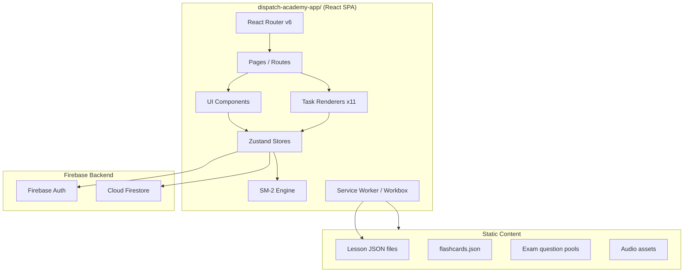
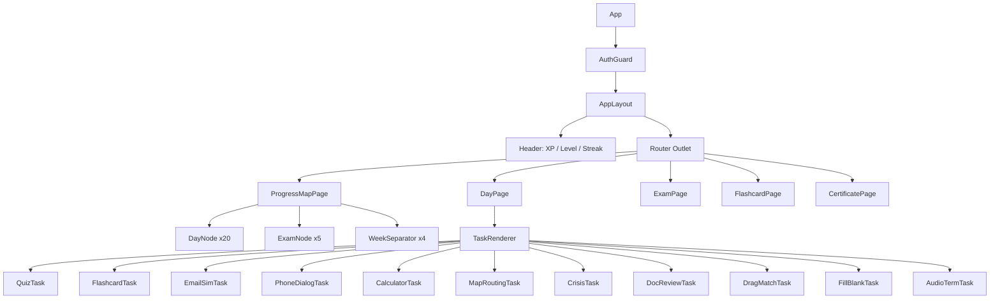
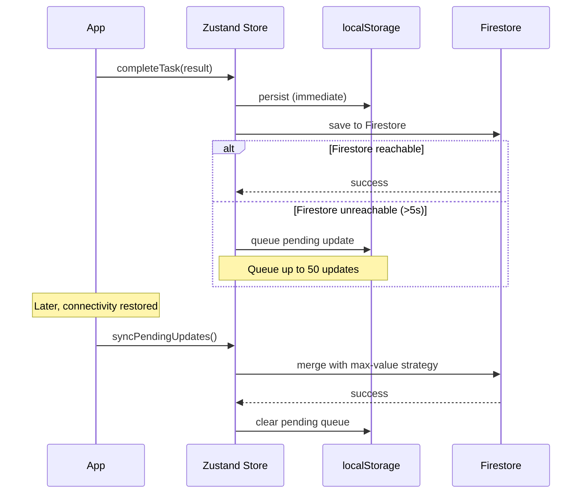

# Design Document: Dispatch Academy App

## Overview

Dispatch Academy App — геймифицированная обучающая платформа в стиле Duolingo для подготовки русскоязычных студентов к работе диспетчером грузоперевозок в США. Приложение реализуется как standalone React SPA (Vite + React 18 + TypeScript) в отдельной папке `dispatch-academy-app/` с собственным build pipeline.

### Ключевые технологические решения

| Решение | Технология | Обоснование |
|---------|-----------|-------------|
| Framework | React 18 + TypeScript | Типобезопасность, компонентная модель, широкая экосистема |
| Build tool | Vite 5 | Быстрый HMR, нативный ESM, tree-shaking, code splitting |
| State management | Zustand | Минимальный boilerplate, поддержка persist middleware для offline |
| Routing | React Router v6 | Стандарт для React SPA, lazy routes для code splitting |
| Animation | Framer Motion | Декларативные анимации, 60fps на мобильных, layout animations |
| Backend | Firebase Auth + Firestore | Managed services, realtime sync, offline persistence |
| Offline | Workbox (Service Worker) | Precaching + runtime caching стратегии |
| Styling | Tailwind CSS | Utility-first, mobile-first, dead code elimination |
| PDF generation | jsPDF | Клиентская генерация сертификатов без сервера |
| Testing | Vitest + fast-check | Быстрый runner совместимый с Vite, PBT library |

### Design Rationale

1. **Zustand vs Redux**: Zustand выбран за минимальный boilerplate и встроенный persist middleware, что критично для offline-first сценариев. Для app с ~5 store slices Redux избыточен.
2. **Tailwind CSS vs CSS Modules**: Tailwind обеспечивает consistent design tokens, utility classes уменьшают bundle size через purging, mobile-first breakpoints из коробки.
3. **jsPDF vs серверная генерация**: Сертификат генерируется на клиенте, что работает offline и не требует backend infrastructure.
4. **Workbox vs ручной SW**: Workbox предоставляет надёжные caching strategies (StaleWhileRevalidate, CacheFirst) с минимальной конфигурацией.

---

## Architecture

### High-Level Architecture



### Layered Architecture

```mermaid
graph LR
    subgraph Presentation["Presentation Layer"]
        ProgressMap[Progress Map]
        LessonView[Lesson View]
        ExamView[Exam View]
        FlashcardView[Flashcard View]
        Settings[Settings]
    end

    subgraph Logic["Business Logic Layer"]
        XPEngine[XP/Level Engine]
        StreakEngine[Streak Engine]
        SM2[SM-2 Algorithm]
        UnlockEngine[Day Unlock Logic]
        ScoreCalc[Score Calculator]
        ExamLogic[Exam Logic]
    end

    subgraph Data["Data Layer"]
        ZustandStore[Zustand Store + Persist]
        FirebaseService[Firebase Service]
        LocalCache[localStorage Cache]
        ContentLoader[Content Loader]
    end

    Presentation --> Logic
    Logic --> Data
```



### Route Structure

```
/                    → Redirect to /map or /login
/login               → Login/Register screen
/map                 → Progress Map (main dashboard)
/day/:dayId          → Day lesson view with tasks
/day/:dayId/task/:n  → Individual task view
/exam/mini/:weekId   → Weekly mini-exam
/exam/final          → Final exam
/flashcards          → Flashcard review screen
/certificate         → Certificate view/download
/settings            → User settings (sound, theme)
```

---

## Components and Interfaces

### Core Component Tree



### Key Interfaces

```typescript
// === Content Types ===

type TaskType =
  | 'quiz'
  | 'flashcard'
  | 'email-sim'
  | 'phone-dialog'
  | 'calculator'
  | 'map-routing'
  | 'crisis'
  | 'document-review'
  | 'drag-match'
  | 'fill-blank'
  | 'audio-term';

interface Task {
  id: string;
  type: TaskType;
  title: string;
  /** Task-specific payload */
  data: TaskData;
}

interface QuizData {
  question: string;
  options: [string, string, string, string];
  correctIndex: 0 | 1 | 2 | 3;
  explanation: string;
}

interface EmailSimData {
  senderName: string;
  subject: string;
  body: string;
  responses: Array<{
    text: string;
    isCorrect: boolean;
    feedback: string;
  }>;
}

interface PhoneDialogData {
  turns: Array<{
    speaker: 'npc';
    text: string;
    replies: Array<{
      text: string;
      isCorrect: boolean;
      feedback: string;
    }>;
  }>;
}

interface CalculatorData {
  problem: string;
  context: string;
  correctAnswer: number;
  tolerancePercent: number; // default 2
  unit: string;
}

interface MapRoutingData {
  origin: string;
  destination: string;
  routes: Array<{
    name: string;
    miles: number;
    rate: number;
    isOptimal: boolean;
  }>;
}

interface CrisisData {
  scenario: string;
  timeLimitSeconds: number; // default 60
  options: Array<{
    text: string;
    isCorrect: boolean;
    explanation: string;
  }>;
}

interface DocReviewData {
  documentType: 'rate-con' | 'bol';
  fields: Array<{
    id: string;
    label: string;
    value: string;
    hasError: boolean;
    errorExplanation?: string;
  }>;
}

interface DragMatchData {
  pairs: Array<{
    term: string;
    definition: string;
  }>;
}

interface FillBlankData {
  sentence: string; // blanks marked with ___
  blanks: Array<{
    correctAnswer: string;
    wordBank?: string[]; // if provided, show word bank
  }>;
}

interface AudioTermData {
  audioUrl: string;
  correctTerm: string;
  options: [string, string, string, string];
}

type TaskData =
  | QuizData
  | EmailSimData
  | PhoneDialogData
  | CalculatorData
  | MapRoutingData
  | CrisisData
  | DocReviewData
  | DragMatchData
  | FillBlankData
  | AudioTermData;

// === Day/Week Structure ===

interface DayContent {
  dayId: number; // 1-20
  weekId: number; // 1-4
  title: string;
  estimatedMinutes: number;
  tasks: Task[];
}

interface WeekContent {
  weekId: number;
  theme: string;
  days: DayContent[];
}

// === Flashcard ===

interface Flashcard {
  id: string;
  category: string;
  difficulty: 'easy' | 'medium' | 'hard';
  term: string; // English
  definition: string; // Russian
  example: string; // English usage
}

interface FlashcardReviewState {
  cardId: string;
  easeFactor: number; // min 1.3, default 2.5
  interval: number; // days
  repetitions: number;
  nextReviewDate: string; // ISO date
  lastRating?: 'again' | 'hard' | 'good' | 'easy';
}

type SM2Rating = 'again' | 'hard' | 'good' | 'easy';

// === Gamification ===

interface XPEvent {
  taskId: string;
  dayId: number;
  xpAmount: number;
  reason: 'task-complete' | 'perfect-score' | 'day-perfect' | 'mini-exam' | 'final-exam';
  timestamp: string;
}

interface LevelDefinition {
  level: number;
  title: string;
  xpThreshold: number;
}

// === Exam ===

interface ExamQuestion {
  id: string;
  type: 'quiz' | 'fill-blank' | 'calculator' | 'drag-match';
  moduleSource: number; // 1-12
  data: TaskData;
}

interface ExamSession {
  examType: 'mini' | 'final';
  weekId?: number; // for mini exams
  questions: ExamQuestion[];
  answers: Map<string, unknown>;
  startTime: string;
  timeLimitMinutes: number;
  status: 'in-progress' | 'submitted' | 'timed-out';
}

// === TaskRenderer Props ===

interface TaskRendererProps {
  task: Task;
  onComplete: (result: TaskResult) => void;
  isRetry: boolean;
}

interface TaskResult {
  taskId: string;
  score: number; // 0-100
  correct: boolean;
  timeSpentSeconds: number;
  attempts: number;
}
```

### Zustand Store Slices

```typescript
// store/useProgressStore.ts
interface ProgressState {
  // Identity
  userId: string;
  displayName: string;

  // XP & Level
  totalXP: number;
  level: number;

  // Streak
  currentStreak: number;
  lastActivityDate: string | null; // ISO date

  // Day progress
  dayStatuses: Record<number, DayStatus>; // dayId → status
  taskScores: Record<string, TaskResult>; // taskId → result

  // Exam progress
  miniExamPassed: Record<number, boolean>; // weekId → passed
  finalExamPassed: boolean;
  finalExamScore: number | null;
  certificateId: string | null;

  // Flashcard states
  flashcardStates: Record<string, FlashcardReviewState>;

  // Cooldowns
  miniExamCooldowns: Record<number, string>; // weekId → cooldown end ISO
  finalExamCooldown: string | null;

  // Actions
  addXP: (amount: number, reason: string) => void;
  completeTask: (dayId: number, result: TaskResult) => void;
  unlockNextDay: (currentDayId: number) => void;
  updateStreak: () => void;
  updateFlashcardState: (cardId: string, rating: SM2Rating) => void;
  submitExam: (examType: 'mini' | 'final', score: number, weekId?: number) => void;
  syncToFirestore: () => Promise<void>;
  loadFromFirestore: () => Promise<void>;
}

type DayStatus = 'locked' | 'available' | 'in-progress' | 'completed';

// store/useUIStore.ts
interface UIState {
  soundEnabled: boolean;
  isOffline: boolean;
  pendingSyncCount: number;
  showLevelUpModal: boolean;
  levelUpData: { level: number; title: string } | null;
  toastMessage: string | null;

  toggleSound: () => void;
  setOffline: (offline: boolean) => void;
  showToast: (message: string, duration?: number) => void;
  triggerLevelUp: (level: number, title: string) => void;
}
```

---

## Data Models

### Firestore Document Structure

```
users/{userId}
├── displayName: string
├── email: string
├── createdAt: Timestamp
├── totalXP: number
├── level: number
├── currentStreak: number
├── lastActivityDate: string (ISO)
├── dayStatuses: Map<string, DayStatus>
├── taskScores: Map<string, TaskResult>
├── miniExamPassed: Map<string, boolean>
├── finalExamPassed: boolean
├── finalExamScore: number | null
├── certificateId: string | null
├── flashcardStates: Map<string, FlashcardReviewState>
├── miniExamCooldowns: Map<string, string>
└── finalExamCooldown: string | null
```

### Local Content JSON Structure

```
src/data/
├── lessons/
│   ├── day-01.json   ... day-20.json
│   └── index.ts      (manifest with metadata)
├── exams/
│   ├── mini-exam-pool-week1.json ... week4.json
│   └── final-exam-pool.json
├── flashcards.json
└── levels.json
```

**Day JSON schema:**
```json
{
  "dayId": 1,
  "weekId": 1,
  "title": "Знакомство с индустрией",
  "estimatedMinutes": 35,
  "tasks": [
    {
      "id": "d1-t1",
      "type": "quiz",
      "title": "Основы грузоперевозок",
      "data": {
        "question": "Что такое MC Number?",
        "options": ["...", "...", "...", "..."],
        "correctIndex": 0,
        "explanation": "MC Number — уникальный номер перевозчика от FMCSA."
      }
    }
  ]
}
```

**Flashcard JSON schema:**
```json
{
  "id": "c1",
  "category": "Термины",
  "difficulty": "easy",
  "term": "MC Number",
  "definition": "Motor Carrier Number — уникальный номер перевозчика от FMCSA. Обязателен для interstate перевозок.",
  "example": "«Our MC is 123456, verify on SAFER.»"
}
```

### SM-2 Algorithm Implementation

```typescript
function calculateSM2(
  card: FlashcardReviewState,
  rating: SM2Rating
): FlashcardReviewState {
  const ratingMap: Record<SM2Rating, number> = {
    again: 0,
    hard: 1,
    good: 2,
    easy: 3,
  };

  let { easeFactor, interval, repetitions } = card;
  const q = ratingMap[rating];

  switch (rating) {
    case 'again':
      interval = 1;
      easeFactor = Math.max(1.3, easeFactor - 0.2);
      repetitions = 0;
      break;
    case 'hard':
      interval = Math.ceil(interval * 1.2);
      easeFactor = Math.max(1.3, easeFactor - 0.15);
      repetitions += 1;
      break;
    case 'good':
      if (repetitions === 0) interval = 1;
      else if (repetitions === 1) interval = 6;
      else interval = Math.ceil(interval * easeFactor);
      repetitions += 1;
      break;
    case 'easy':
      if (repetitions === 0) interval = 1;
      else if (repetitions === 1) interval = 6;
      else interval = Math.ceil(interval * easeFactor * 1.3);
      easeFactor += 0.15;
      repetitions += 1;
      break;
  }

  // Cap interval at 365 days
  interval = Math.min(interval, 365);

  const nextReviewDate = addDays(new Date(), interval).toISOString().split('T')[0];

  return {
    ...card,
    easeFactor,
    interval,
    repetitions,
    nextReviewDate,
    lastRating: rating,
  };
}
```

### XP & Level Calculation

```typescript
const LEVELS: LevelDefinition[] = [
  { level: 1,  title: 'Наблюдатель', xpThreshold: 0 },
  { level: 2,  title: 'Стажёр',     xpThreshold: 100 },
  { level: 3,  title: 'Новичок',    xpThreshold: 250 },
  { level: 4,  title: 'Ученик',     xpThreshold: 500 },
  { level: 5,  title: 'Помощник',   xpThreshold: 1000 },
  { level: 6,  title: 'Диспетчер',  xpThreshold: 1500 },
  { level: 7,  title: 'Специалист', xpThreshold: 2000 },
  { level: 8,  title: 'Эксперт',    xpThreshold: 2500 },
  { level: 9,  title: 'Мастер',     xpThreshold: 3000 },
  { level: 10, title: 'Профи',      xpThreshold: 4000 },
];

function getLevelForXP(xp: number): LevelDefinition {
  // Return highest level whose threshold ≤ xp
  return LEVELS.reduce((acc, lvl) => (xp >= lvl.xpThreshold ? lvl : acc));
}

function getXPForTask(taskType: TaskType, isFirstCompletion: boolean): number {
  if (!isFirstCompletion) return 0;
  const simTypes: TaskType[] = ['email-sim', 'phone-dialog', 'crisis', 'calculator', 'map-routing', 'document-review'];
  return simTypes.includes(taskType) ? 20 : 10;
}
```

### Offline Sync Strategy



**Merge Strategy (per-field maximum value):**
- `totalXP`: max(local, remote)
- `level`: max(local, remote)
- `currentStreak`: max(local, remote)
- `dayStatuses`: furthest unlocked (available > locked, completed > in-progress)
- `flashcardStates.nextReviewDate`: latest date wins

---


## Correctness Properties

*A property is a characteristic or behavior that should hold true across all valid executions of a system — essentially, a formal statement about what the system should do. Properties serve as the bridge between human-readable specifications and machine-verifiable correctness guarantees.*

### Property 1: SM-2 Algorithm Correctness

*For any* flashcard state (with ease factor ≥ 1.3, interval ≥ 1, repetitions ≥ 0) and any rating (Again, Hard, Good, Easy), applying the SM-2 calculation SHALL produce a new state where: the ease factor never falls below 1.3, the interval is between 1 and 365 days, the interval for "Again" is always 1, the interval for "Hard" equals ceil(oldInterval × 1.2), the interval for "Good" equals ceil(oldInterval × easeFactor) (for rep > 1), and the interval for "Easy" equals ceil(oldInterval × easeFactor × 1.3) (for rep > 1).

**Validates: Requirements 7.2, 7.5, 7.6, 7.7, 7.8**

### Property 2: XP Calculation Invariants

*For any* sequence of task completions (with varying task types and scores), the total XP awarded SHALL equal the sum of: base XP per task type (10 for standard, 20 for simulation) counted only on first completion of each unique task, +5 bonus for each first-attempt perfect score (100%), +10 bonus for each day where all tasks scored 100% on first attempt. Retrying a previously completed task SHALL never increase total XP.

**Validates: Requirements 5.1, 5.2, 5.9**

### Property 3: Level Determination from XP

*For any* non-negative XP value, the level returned SHALL be the highest level whose xpThreshold is ≤ the given XP (Level 1 at 0, Level 2 at 100, ..., Level 10 at 4000). Additionally, for any pair (oldXP, newXP) where newXP > oldXP, a level-up event SHALL be triggered if and only if getLevelForXP(newXP).level > getLevelForXP(oldXP).level.

**Validates: Requirements 5.3, 5.4**

### Property 4: Streak Calculation

*For any* sequence of calendar dates on which at least one task was completed, the streak counter SHALL equal the length of the longest consecutive-day suffix ending on the most recent activity date. If the current date has no activity and is more than one calendar day after the last activity date, the streak SHALL be 0. Milestone detection SHALL trigger at exactly streak values 3, 7, 14, and 30.

**Validates: Requirements 5.5, 5.6, 5.8**

### Property 5: Day Unlock Logic

*For any* day (1–20) and a set of task scores for that day, the next sequential day SHALL be unlocked if and only if ALL tasks in the current day have been completed AND the arithmetic mean of all task scores within that day is ≥ 70%. If the mean is below 70%, the next day SHALL remain locked regardless of individual task scores.

**Validates: Requirements 3.3, 3.8**

### Property 6: Sequential Unlock Chain

*For any* combination of day completion states within a week (5 days) and mini-exam pass states across 4 weeks: a Mini_Exam for week W unlocks iff all 5 days of week W are completed; the Final_Exam unlocks iff all 4 Mini_Exams are passed. No exam can be unlocked without its prerequisites being satisfied.

**Validates: Requirements 3.5, 8.1, 9.1**

### Property 7: Exam Pass/Fail Threshold

*For any* exam score (0–100) and exam type (mini or final), the exam SHALL be marked as passed iff the score meets the threshold: ≥ 70% for Mini_Exam, ≥ 80% for Final_Exam. XP SHALL be awarded (50 for mini, 100 for final) only on pass and only on first pass of that specific exam.

**Validates: Requirements 8.4, 9.5**

### Property 8: Cooldown Enforcement

*For any* failed exam attempt at time T and a retry attempt at time T2: retake SHALL be blocked if T2 - T < cooldown duration (30 minutes for Mini_Exam, 24 hours for Final_Exam). Retake SHALL be allowed if T2 - T ≥ cooldown duration.

**Validates: Requirements 8.5, 9.6**

### Property 9: Exam Question Selection Constraints

*For any* question pool and exam configuration: Mini_Exam selection SHALL produce exactly 25 questions all from the specified week's topics, with at least 3 questions of each required type (multiple-choice, fill-blank, calculator, matching). Final_Exam selection SHALL produce exactly 100 questions (50 terminology + 50 situational) with at least 4 questions per module (12 modules).

**Validates: Requirements 8.2, 9.2**

### Property 10: Calculator Tolerance Validation

*For any* student input and correct answer (both numeric), the validation function SHALL return true iff: for non-zero correct answers, |input - correct| / |correct| ≤ 0.02; for zero correct answers, input must exactly equal 0.

**Validates: Requirements 6.6**

### Property 11: Document Review Score Formula

*For any* document review task with N total errors, K incorrect taps by the student, and M missed errors (errors not tapped): the score SHALL equal max(0, 100 - (K × 10) - (M / N × 100)). The score SHALL always be between 0 and 100 inclusive.

**Validates: Requirements 6.9**

### Property 12: Offline Merge Strategy (Per-Field Maximum)

*For any* two progress states (local and remote) with different values, the merge function SHALL produce a result where: totalXP = max(local.totalXP, remote.totalXP), level = max(local.level, remote.level), currentStreak = max(local.streak, remote.streak), each dayStatus takes the furthest-progressed value (completed > in-progress > available > locked), and each flashcard nextReviewDate takes the latest date.

**Validates: Requirements 2.5**

### Property 13: Flashcard Due Card Filtering and Sorting

*For any* set of flashcard review states and a given "today" date, the due cards list SHALL contain exactly those cards whose nextReviewDate ≤ today, sorted in descending order of overdue days (most overdue first). Cards with nextReviewDate > today SHALL never appear in the due list.

**Validates: Requirements 7.3**

---

## Error Handling

### Error Categories and Strategies

| Category | Trigger | User Impact | Strategy |
|----------|---------|-------------|----------|
| Network offline | Firestore unreachable >5s | Progress not synced | Queue in localStorage (max 50), show offline indicator, sync on reconnect |
| Auth failure | Invalid credentials / network | Cannot access app | Show specific Russian error message, preserve email, stay on login |
| Content load failure | Fetch timeout >15s / 404 | Cannot view lesson | Show error message + retry button, serve from SW cache if available |
| Audio load failure | 404 / network error on audio | Cannot hear term | Fallback to text display of the term |
| SW registration failure | Browser unsupported / error | No offline support | Continue without SW, log warning to console |
| Exam interruption | Tab close / network drop | Lose progress | Persist answers + remaining time to localStorage, allow resume |
| Storage quota exceeded | localStorage full | Cannot cache updates | Evict oldest pending sync items, warn user |

### Error Boundaries

```typescript
// Top-level error boundary wraps entire app
<ErrorBoundary fallback={<CrashScreen />}>
  <App />
</ErrorBoundary>

// Per-route error boundaries for isolation
<Route path="/day/:dayId" element={
  <ErrorBoundary fallback={<DayLoadError />}>
    <Suspense fallback={<DaySkeleton />}>
      <DayPage />
    </Suspense>
  </ErrorBoundary>
} />
```

### Offline Queue Management

```typescript
interface PendingUpdate {
  id: string;
  timestamp: string;
  type: 'task-complete' | 'xp-update' | 'flashcard-review' | 'exam-submit';
  payload: Record<string, unknown>;
}

// Queue constraints:
// - Maximum 50 pending updates
// - FIFO eviction when full (oldest removed)
// - Each update includes timestamp for conflict resolution
// - Sync uses per-field maximum value merge
```

### User-Facing Error Messages (Russian)

| Error | Message |
|-------|---------|
| Invalid credentials | «Неверный email или пароль. Проверьте данные и попробуйте снова.» |
| Network error (auth) | «Нет подключения к интернету. Проверьте соединение.» |
| Account not found | «Аккаунт не найден. Зарегистрируйтесь или проверьте email.» |
| Content load failed | «Не удалось загрузить урок. Проверьте интернет и нажмите "Повторить".» |
| Offline mode active | «Офлайн-режим. Прогресс сохраняется локально и синхронизируется при подключении.» |
| Cooldown active | «Повторная попытка доступна через {time}. Повторите пройденные темы.» |

---

## Testing Strategy

### Testing Pyramid

```
        ╱╲
       ╱  ╲       E2E (Playwright) — 5-10 critical flows
      ╱────╲
     ╱      ╲     Integration (Vitest + Firebase Emulator) — Auth, Firestore sync
    ╱────────╲
   ╱          ╲   Property Tests (Vitest + fast-check) — 13 properties, 100+ iterations each
  ╱────────────╲
 ╱              ╲  Unit Tests (Vitest + Testing Library) — Components, logic functions
╱────────────────╲
```

### Technology Choices

| Layer | Tool | Purpose |
|-------|------|---------|
| Unit | Vitest + React Testing Library | Component rendering, user interactions |
| Property | Vitest + fast-check | Universal properties across generated inputs |
| Integration | Vitest + Firebase Emulator | Auth flows, Firestore read/write |
| E2E | Playwright | Critical user journeys |
| Visual | Playwright screenshots | Responsive layout regression |
| Accessibility | axe-core (via @axe-core/react) | WCAG compliance checks |
| Performance | Lighthouse CI | Bundle size, TTI metrics |

### Property-Based Testing Configuration

- **Library**: fast-check (TypeScript-native PBT library)
- **Minimum iterations**: 100 per property
- **Runner**: Vitest with `--run` flag (no watch mode)
- **Tag format**: `Feature: dispatch-academy-app, Property {N}: {title}`

Each correctness property maps to a single property-based test file:

```
src/__tests__/properties/
├── sm2-algorithm.property.test.ts          // Property 1
├── xp-calculation.property.test.ts         // Property 2
├── level-determination.property.test.ts    // Property 3
├── streak-calculation.property.test.ts     // Property 4
├── day-unlock.property.test.ts             // Property 5
├── sequential-unlock.property.test.ts      // Property 6
├── exam-threshold.property.test.ts         // Property 7
├── cooldown-enforcement.property.test.ts   // Property 8
├── exam-question-selection.property.test.ts // Property 9
├── calculator-tolerance.property.test.ts   // Property 10
├── doc-review-score.property.test.ts       // Property 11
├── offline-merge.property.test.ts          // Property 12
└── flashcard-due-filter.property.test.ts   // Property 13
```

### Example Property Test Structure

```typescript
// src/__tests__/properties/sm2-algorithm.property.test.ts
import { describe, it } from 'vitest';
import * as fc from 'fast-check';
import { calculateSM2 } from '../../logic/sm2';

// Feature: dispatch-academy-app, Property 1: SM-2 Algorithm Correctness
describe('Property 1: SM-2 Algorithm Correctness', () => {
  const validCardState = fc.record({
    cardId: fc.string(),
    easeFactor: fc.double({ min: 1.3, max: 5.0 }),
    interval: fc.integer({ min: 1, max: 365 }),
    repetitions: fc.integer({ min: 0, max: 100 }),
    nextReviewDate: fc.date().map(d => d.toISOString().split('T')[0]),
  });

  const rating = fc.constantFrom('again', 'hard', 'good', 'easy');

  it('ease factor never falls below 1.3', () => {
    fc.assert(
      fc.property(validCardState, rating, (card, r) => {
        const result = calculateSM2(card, r);
        return result.easeFactor >= 1.3;
      }),
      { numRuns: 100 }
    );
  });

  it('interval is always between 1 and 365', () => {
    fc.assert(
      fc.property(validCardState, rating, (card, r) => {
        const result = calculateSM2(card, r);
        return result.interval >= 1 && result.interval <= 365;
      }),
      { numRuns: 100 }
    );
  });

  it('Again always resets interval to 1', () => {
    fc.assert(
      fc.property(validCardState, (card) => {
        const result = calculateSM2(card, 'again');
        return result.interval === 1 && result.repetitions === 0;
      }),
      { numRuns: 100 }
    );
  });
});
```

### Unit Test Coverage Targets

| Module | Coverage Target | Focus Areas |
|--------|----------------|-------------|
| Logic (SM-2, XP, Streak, Unlock) | 95%+ | All branching conditions |
| Task Renderers | 80%+ | Correct/incorrect flows, edge cases |
| Store slices | 90%+ | State transitions, persistence |
| Firebase service | 70%+ | Mock-based, error paths |
| UI Components | 75%+ | Rendering, user interactions |

### Integration Tests

- **Firebase Auth**: Sign-up flow, sign-in flow, error handling (Firebase Emulator)
- **Firestore sync**: Write after task completion, read on new session, offline queue sync
- **Service Worker**: Cache hit for previously loaded content, fallback behavior

### E2E Critical Paths (Playwright)

1. **New user onboarding**: Register → Login → See Progress Map → Start Day 1
2. **Complete a day**: Open Day → Complete all tasks → See completion summary → Day unlocks
3. **Flashcard review session**: Open flashcards → Review due cards → Rate → See updated stats
4. **Mini-exam flow**: Complete week → Take exam → Score 70%+ → Next week unlocks
5. **Offline resilience**: Go offline → Complete task → Come back online → Progress syncs

### Accessibility Testing

- `axe-core` integrated as dev-time React plugin (`@axe-core/react`)
- Playwright tests include `page.accessibility.snapshot()` for critical pages
- Manual testing checklist for keyboard-only navigation on all 11 task types
- ARIA labels verified via Testing Library `getByRole` queries

### Performance Budget

| Metric | Budget | Enforcement |
|--------|--------|-------------|
| Initial JS bundle (gzipped) | < 200KB | Vite build + CI size check |
| Time to Interactive (4G) | < 3s | Lighthouse CI |
| Largest Contentful Paint | < 2.5s | Lighthouse CI |
| Animation frame rate | 60fps | Manual testing on mid-range Android |
