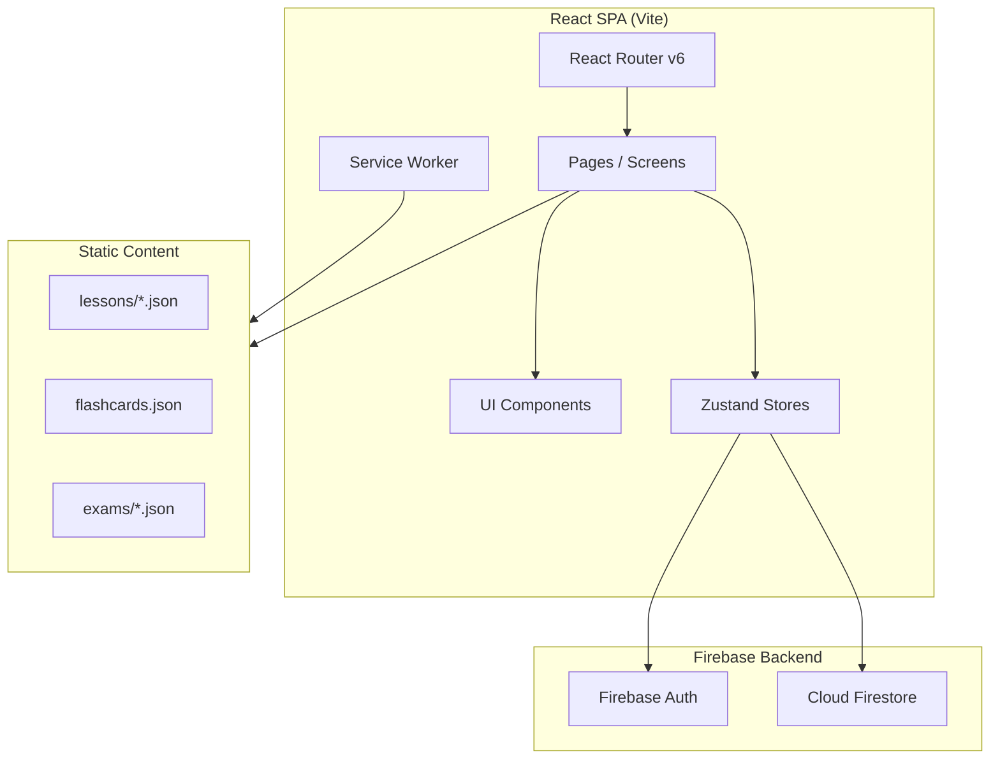

# Design Document — Dispatch Academy

## Overview

Dispatch Academy — React SPA (Vite + React 18 + TypeScript), размещённое по адресу `/academy/` на dispatch4you.com. Приложение реализует 20-дневный геймифицированный курс обучения диспетчерству грузоперевозок в США для русскоязычных студентов в стиле Duolingo.

### Ключевые решения

- **Vite** вместо Expo (как в adventure/) — Academy это чистый веб-SPA, не мобильное приложение
- **React Router v6** для клиентской навигации
- **Zustand** для глобального стейта (консистентно с adventure/)
- **Firebase Auth + Firestore** для аутентификации и персистенции
- **Service Worker (Workbox)** для офлайн-кеша
- **Framer Motion** для анимаций (level-up, confetti, переходы)
- **Контент как JSON** — миграция 12 HTML-модулей, 80 флеш-карточек и 100 экзаменационных вопросов в структурированные JSON-файлы

### Принципы

1. Mobile-first responsive (320px → 1920px)
2. Тёмная тема по умолчанию (консистентно с dispatch4you.com)
3. Ленивая загрузка контента — только активный Day
4. Офлайн-устойчивость через Service Worker + localStorage fallback

---

## Architecture

### Высокоуровневая архитектура



### Структура маршрутов

```
/academy/                    → ProgressMap (главный экран)
/academy/login               → LoginScreen
/academy/day/:dayId          → DayView (урок дня)
/academy/day/:dayId/task/:n  → TaskView (конкретное задание)
/academy/exam/mini/:weekId   → MiniExamView
/academy/exam/final          → FinalExamView
/academy/flashcards          → FlashcardReviewView
/academy/settings            → SettingsView
/academy/certificate         → CertificateView
```

### Файловая структура проекта

```
academy/
├── index.html
├── vite.config.ts
├── tsconfig.json
├── package.json
├── public/
│   ├── sw.js
│   └── manifest.json
├── src/
│   ├── main.tsx
│   ├── App.tsx
│   ├── router.tsx
│   ├── pages/
│   │   ├── ProgressMap.tsx
│   │   ├── LoginScreen.tsx
│   │   ├── DayView.tsx
│   │   ├── TaskView.tsx
│   │   ├── MiniExamView.tsx
│   │   ├── FinalExamView.tsx
│   │   ├── FlashcardReview.tsx
│   │   ├── Settings.tsx
│   │   └── Certificate.tsx
│   ├── components/
│   │   ├── ProgressNode.tsx
│   │   ├── TaskRenderer.tsx
│   │   ├── QuizTask.tsx
│   │   ├── FlashcardTask.tsx
│   │   ├── EmailSimTask.tsx
│   │   ├── PhoneDialogTask.tsx
│   │   ├── CalculatorTask.tsx
│   │   ├── MapTask.tsx
│   │   ├── CrisisTask.tsx
│   │   ├── DocumentReviewTask.tsx
│   │   ├── DragDropTask.tsx
│   │   ├── FillBlankTask.tsx
│   │   ├── AudioTask.tsx
│   │   ├── XPBar.tsx
│   │   ├── StreakBadge.tsx
│   │   ├── LevelUpModal.tsx
│   │   ├── Timer.tsx
│   │   └── ui/ (Button, Card, Modal, etc.)
│   ├── store/
│   │   ├── progressStore.ts
│   │   ├── xpStore.ts
│   │   ├── streakStore.ts
│   │   ├── flashcardStore.ts
│   │   ├── examStore.ts
│   │   └── authStore.ts
│   ├── services/
│   │   ├── firebase.ts
│   │   ├── firestoreSync.ts
│   │   ├── offlineCache.ts
│   │   └── contentLoader.ts
│   ├── engine/
│   │   ├── xpCalculator.ts
│   │   ├── levelSystem.ts
│   │   ├── streakTracker.ts
│   │   ├── spacedRepetition.ts
│   │   ├── progressUnlocker.ts
│   │   └── examScorer.ts
│   ├── data/
│   │   ├── lessons/ (day-01.json ... day-20.json)
│   │   ├── flashcards.json
│   │   ├── exams/
│   │   │   ├── mini-week-1.json ... mini-week-4.json
│   │   │   └── final.json
│   │   └── course-structure.json
│   ├── types/
│   │   ├── task.ts
│   │   ├── progress.ts
│   │   ├── flashcard.ts
│   │   └── exam.ts
│   └── utils/
│       ├── validators.ts
│       └── formatters.ts
└── tests/
    ├── engine/
    │   ├── xpCalculator.test.ts
    │   ├── xpCalculator.property.test.ts
    │   ├── levelSystem.test.ts
    │   ├── levelSystem.property.test.ts
    │   ├── streakTracker.test.ts
    │   ├── streakTracker.property.test.ts
    │   ├── spacedRepetition.test.ts
    │   ├── spacedRepetition.property.test.ts
    │   ├── progressUnlocker.test.ts
    │   ├── progressUnlocker.property.test.ts
    │   └── examScorer.property.test.ts
    └── components/
        └── (component tests)
```

---

## Components and Interfaces

### Core Engine Modules

#### `xpCalculator.ts`

```typescript
interface XPAwardResult {
  baseXP: number;
  bonusXP: number;
  totalXP: number;
  reasons: string[];
}

function calculateTaskXP(taskType: TaskType, score: number, isPerfect: boolean): XPAwardResult;
function calculateDayBonusXP(dayResults: TaskResult[]): XPAwardResult;
```

#### `levelSystem.ts`

```typescript
interface LevelInfo {
  level: number;
  title: string;         // "Стажёр", "Новичок", "Диспетчер", "Профи"
  currentXP: number;
  xpForNextLevel: number;
  progress: number;      // 0..1
}

const LEVEL_THRESHOLDS: number[] = [0, 100, 250, 500, 1000, 1500, 2000, 2500, 3000, 4000];

function getLevelForXP(totalXP: number): LevelInfo;
function didLevelUp(previousXP: number, newXP: number): boolean;
```

#### `streakTracker.ts`

```typescript
interface StreakState {
  currentStreak: number;
  lastActivityDate: string; // ISO date "YYYY-MM-DD"
  longestStreak: number;
}

function updateStreak(state: StreakState, today: string): StreakState;
function isStreakActive(state: StreakState, today: string): boolean;
```

#### `spacedRepetition.ts` (SM-2 Algorithm)

```typescript
interface CardReviewState {
  cardId: string;
  easeFactor: number;    // min 1.3, default 2.5
  interval: number;      // days
  nextReviewDate: string;
  repetitions: number;
}

type Rating = 'again' | 'hard' | 'good' | 'easy';

function reviewCard(state: CardReviewState, rating: Rating, today: string): CardReviewState;
function getDueCards(cards: CardReviewState[], today: string): CardReviewState[];
function sortByOverdue(cards: CardReviewState[], today: string): CardReviewState[];
```

#### `progressUnlocker.ts`

```typescript
interface DayProgress {
  dayId: number;
  status: 'locked' | 'available' | 'in-progress' | 'completed';
  score: number;        // 0..100
  tasksCompleted: number;
  totalTasks: number;
}

interface CourseProgress {
  days: DayProgress[];
  miniExams: ExamStatus[];
  finalExam: ExamStatus | null;
}

function canUnlockNextDay(current: DayProgress): boolean;   // score >= 70
function canUnlockMiniExam(weekDays: DayProgress[]): boolean; // all 5 completed
function canUnlockFinalExam(miniExams: ExamStatus[]): boolean; // all 4 passed
```

#### `examScorer.ts`

```typescript
interface ExamResult {
  totalQuestions: number;
  correctAnswers: number;
  score: number;          // percentage 0..100
  passed: boolean;
  topicBreakdown: TopicScore[];
  timeSpent: number;      // seconds
}

function scoreExam(answers: Answer[], correctAnswers: Answer[], passingScore: number): ExamResult;
function canRetakeExam(lastAttempt: Date, cooldownMinutes: number): boolean;
```

### Task Type Interfaces

```typescript
type TaskType = 
  | 'quiz'
  | 'flashcard'
  | 'email-sim'
  | 'phone-dialog'
  | 'calculator'
  | 'map-route'
  | 'crisis'
  | 'document-review'
  | 'drag-drop'
  | 'fill-blank'
  | 'audio-pronunciation';

interface BaseTask {
  id: string;
  type: TaskType;
  title: string;
  instructions: string;
  xpReward: number;   // 10 standard, 20 simulation
}

interface QuizTask extends BaseTask {
  type: 'quiz';
  question: string;
  options: string[];
  correctIndex: number;
  explanation: string;
}

interface CalculatorTask extends BaseTask {
  type: 'calculator';
  problem: string;
  correctAnswer: number;
  tolerance: number;      // 0.02 = ±2%
  hint?: string;
}

interface CrisisTask extends BaseTask {
  type: 'crisis';
  scenario: string;
  options: CrisisOption[];
  timeLimit: number;     // seconds, default 60
}

// ... (аналогично для каждого типа задания)
```

### Zustand Store Interfaces

```typescript
// progressStore.ts
interface ProgressState {
  courseProgress: CourseProgress;
  completeTask: (dayId: number, taskIndex: number, result: TaskResult) => void;
  completeDay: (dayId: number) => void;
  unlockNextDay: () => void;
}

// xpStore.ts
interface XPState {
  totalXP: number;
  level: LevelInfo;
  addXP: (award: XPAwardResult) => void;
  showLevelUp: boolean;
  dismissLevelUp: () => void;
}

// streakStore.ts
interface StreakStoreState {
  streak: StreakState;
  checkAndUpdateStreak: () => void;
}
```

### Firebase Data Schema

```typescript
// Firestore: users/{uid}
interface UserDocument {
  uid: string;
  email: string;
  displayName: string;
  createdAt: Timestamp;
  lastLogin: Timestamp;
}

// Firestore: users/{uid}/progress
interface ProgressDocument {
  totalXP: number;
  level: number;
  streak: StreakState;
  days: Record<number, DayProgress>;
  miniExams: Record<number, ExamStatus>;
  finalExam: ExamStatus | null;
  flashcards: Record<string, CardReviewState>;
  updatedAt: Timestamp;
}
```

---

## Data Models

### Course Structure

```json
{
  "weeks": [
    {
      "id": 1,
      "title": "Основы индустрии",
      "modules": [1, 2, 3],
      "days": [
        {
          "id": 1,
          "title": "Индустрия грузоперевозок США",
          "estimatedMinutes": 45,
          "tasks": [
            { "type": "quiz", "contentRef": "day-01/task-01" },
            { "type": "flashcard", "contentRef": "day-01/task-02" },
            { "type": "email-sim", "contentRef": "day-01/task-03" }
          ]
        }
      ]
    }
  ]
}
```

### Flashcard Data Model

```json
{
  "id": "c1",
  "category": "Термины",
  "difficulty": "easy",
  "front": {
    "term": "MC Number",
    "audio": "mc-number.mp3"
  },
  "back": {
    "definition": "Motor Carrier Number — уникальный номер перевозчика от FMCSA.",
    "example": "«Our MC is 123456, verify on SAFER.»"
  }
}
```

### XP Level Thresholds

| Level | Title | XP Required | Cumulative |
|-------|-------|-------------|------------|
| 1 | Наблюдатель | 0 | 0 |
| 2 | Стажёр | 100 | 100 |
| 3 | Новичок | 150 | 250 |
| 4 | Ученик | 250 | 500 |
| 5 | Помощник | 500 | 1000 |
| 6 | Диспетчер | 500 | 1500 |
| 7 | Специалист | 500 | 2000 |
| 8 | Эксперт | 500 | 2500 |
| 9 | Мастер | 500 | 3000 |
| 10 | Профи | 1000 | 4000 |

### SM-2 Spaced Repetition Parameters

| Rating | Quality Score | Interval Change | Ease Factor Change |
|--------|--------------|-----------------|-------------------|
| Again | 0 | Reset to 1 day | -0.2 (min 1.3) |
| Hard | 2 | × 1.2 | -0.15 |
| Good | 3 | × ease factor | 0 |
| Easy | 5 | × ease factor × 1.3 | +0.15 |

---


## Correctness Properties

*A property is a characteristic or behavior that should hold true across all valid executions of a system — essentially, a formal statement about what the system should do. Properties serve as the bridge between human-readable specifications and machine-verifiable correctness guarantees.*

### Property 1: XP Calculation Correctness

*For any* completed task with a given type and score, the XP awarded SHALL equal the defined base rate for that type (10 for standard, 20 for simulation, 50 for mini-exam, 100 for final-exam) plus applicable bonuses (+5 for perfect score, +10 for error-free day), and the total XP SHALL never be negative.

**Validates: Requirements 5.1, 5.2, 8.4, 9.6**

### Property 2: Level Monotonicity

*For any* two XP values where `xp1 <= xp2`, the level computed from `xp1` SHALL be less than or equal to the level computed from `xp2`. Additionally, *for any* XP value, there SHALL exist exactly one level such that the XP falls within that level's threshold range.

**Validates: Requirements 5.3, 5.4**

### Property 3: Streak State Machine

*For any* streak state and sequence of activity dates, the streak counter SHALL increment by exactly 1 for each consecutive calendar day with activity, and SHALL reset to 0 when there is a gap of more than 1 calendar day between activity dates. The streak counter SHALL never be negative.

**Validates: Requirements 5.5, 5.6, 11.4**

### Property 4: Progression Unlocking Invariant

*For any* course progress state, if Day N has status 'completed' with score ≥ 70%, then Day N+1 SHALL have status 'available' or higher. Conversely, if Day N has status 'locked' or has score < 70%, then all Days M > N SHALL have status 'locked'. Mini-exam for Week W SHALL be unlocked if and only if all 5 days of Week W are completed. Final exam SHALL be unlocked if and only if all 4 mini-exams are passed.

**Validates: Requirements 3.3, 3.4, 3.5, 4.2, 9.1**

### Property 5: SM-2 Spaced Repetition Invariants

*For any* flashcard review state and rating, after applying the SM-2 algorithm: (a) the ease factor SHALL remain ≥ 1.3, (b) the interval SHALL remain ≥ 1 day, (c) a rating of "again" SHALL reset the interval to 1 day, (d) a rating of "easy" or "good" SHALL increase or maintain the interval, and (e) the next review date SHALL always be in the future relative to the review date.

**Validates: Requirements 6.3, 7.2, 7.5**

### Property 6: Due Cards Sorting

*For any* set of flashcards with review states and a given today's date, the list returned by `getDueCards` SHALL be sorted in descending order of overdue time (most overdue first), and SHALL contain only cards whose `nextReviewDate` is on or before today.

**Validates: Requirements 7.3**

### Property 7: Calculator Tolerance Validation

*For any* correct answer `C` (C ≠ 0) and user input `U`, the validation SHALL pass if and only if `|U - C| / |C| ≤ 0.02`. For C = 0, the validation SHALL pass if and only if U = 0.

**Validates: Requirements 6.6**

### Property 8: Exam Composition Integrity

*For any* generated mini-exam for Week W, all 25 questions SHALL belong to topics covered in Week W's modules. *For any* generated final exam, it SHALL contain exactly 50 terminology questions and exactly 50 situational questions, drawn from all 12 modules.

**Validates: Requirements 8.2, 9.2**

### Property 9: Retake Cooldown

*For any* exam attempt timestamp and current time, retaking SHALL be allowed if and only if the elapsed time exceeds the cooldown period (30 minutes for mini-exams, 24 hours for final exam). The cooldown function SHALL be monotonic: if retake is allowed at time T, it SHALL also be allowed at any time T' > T.

**Validates: Requirements 8.5, 9.5**

### Property 10: Flashcard Data Migration Round-Trip

*For any* flashcard from the original trainer-data.js, after migration to the JSON format and loading back, the card's id, category, difficulty, term, definition, and example sentence SHALL be preserved exactly (byte-for-byte equality for strings).

**Validates: Requirements 10.4**

### Property 11: Offline Sync Merge Consistency

*For any* local progress cache and remote Firestore state, after synchronization: (a) the merged state SHALL contain the maximum XP of local and remote, (b) all task completions from both sources SHALL be present, and (c) the merge operation SHALL be idempotent — applying it twice yields the same result.

**Validates: Requirements 2.5**

---

## Error Handling

### Network Errors

| Scenario | Behavior |
|----------|----------|
| Firestore unreachable during save | Cache update in localStorage, queue for sync |
| Firestore unreachable during load | Serve from localStorage cache with stale indicator |
| Sync conflict (local vs remote) | Merge with "maximum progress" strategy (higher XP, more completions) |
| Auth token expired | Silent refresh; if refresh fails, redirect to login |

### User Input Errors

| Scenario | Behavior |
|----------|----------|
| Empty/invalid calculator answer | Show validation message, don't submit |
| Timer expires in crisis task | Auto-mark as failed, show correct answer |
| Exam cooldown not met | Show remaining time, disable retake button |
| Navigation to locked day | Redirect to progress map with toast message |

### Content Loading Errors

| Scenario | Behavior |
|----------|----------|
| Lesson JSON fails to load | Retry 3 times with exponential backoff, then show error screen with retry button |
| Audio file fails to load | Skip audio, show text-only fallback |
| Image/map asset fails | Show placeholder with descriptive alt text |

### State Recovery

- All progress writes are idempotent (repeated writes produce same state)
- Service Worker precaches critical app shell (router, stores, progress map)
- On app startup: check localStorage for pending sync, execute before showing current state
- Corrupted localStorage: reset to Firestore state (or initial state if both unavailable)

---

## Testing Strategy

### Unit Tests (Example-based)

Focus on specific examples, edge cases, and integration points:

- **Component rendering**: Each task type renders correctly with sample data
- **Initial state**: New user document has Level 1, 0 XP, Day 1 available
- **Edge cases**: XP exactly at level threshold, streak at midnight boundary
- **Content validation**: Course structure has 4×5=20 days, 80 flashcards, correct exam pool sizes
- **UI state mapping**: Known progress → correct visual states

### Property-Based Tests (fast-check)

Library: **fast-check** (already in project devDependencies)
Configuration: minimum **100 iterations** per property test.

Each property test references its design document property:

| Property | Test File | Tag |
|----------|-----------|-----|
| P1: XP Calculation | `xpCalculator.property.test.ts` | Feature: dispatch-academy, Property 1: XP Calculation Correctness |
| P2: Level Monotonicity | `levelSystem.property.test.ts` | Feature: dispatch-academy, Property 2: Level Monotonicity |
| P3: Streak State Machine | `streakTracker.property.test.ts` | Feature: dispatch-academy, Property 3: Streak State Machine |
| P4: Progression Unlocking | `progressUnlocker.property.test.ts` | Feature: dispatch-academy, Property 4: Progression Unlocking Invariant |
| P5: SM-2 Spaced Repetition | `spacedRepetition.property.test.ts` | Feature: dispatch-academy, Property 5: SM-2 Spaced Repetition Invariants |
| P6: Due Cards Sorting | `spacedRepetition.property.test.ts` | Feature: dispatch-academy, Property 6: Due Cards Sorting |
| P7: Calculator Tolerance | `examScorer.property.test.ts` | Feature: dispatch-academy, Property 7: Calculator Tolerance Validation |
| P8: Exam Composition | `examScorer.property.test.ts` | Feature: dispatch-academy, Property 8: Exam Composition Integrity |
| P9: Retake Cooldown | `examScorer.property.test.ts` | Feature: dispatch-academy, Property 9: Retake Cooldown |
| P10: Flashcard Migration | `spacedRepetition.property.test.ts` | Feature: dispatch-academy, Property 10: Flashcard Data Migration Round-Trip |
| P11: Offline Sync | `offlineSync.property.test.ts` | Feature: dispatch-academy, Property 11: Offline Sync Merge Consistency |

### Integration Tests

- Firebase Auth flow (email + Google sign-in) with Firebase emulator
- Firestore read/write/sync cycle
- Service Worker caching and offline behavior
- Route navigation and code splitting

### Manual / Visual Testing

- Responsive layout on all breakpoints (320px, 480px, 768px, 1024px, 1920px)
- Animations and transitions (Framer Motion)
- Color contrast audit (4.5:1 ratio)
- Keyboard navigation for all task types
- Touch targets (44×44px minimum)
