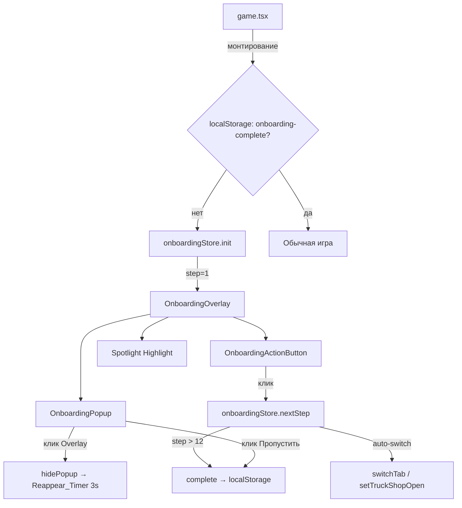

# Дизайн-документ: Game Onboarding Popups

## Обзор

Замена существующей чат-системы онбординга (`data/onboardingSteps.ts`) на 12 пошаговых блокирующих попапов в glassmorphism-стиле. Новая система использует отдельный Zustand-стор (`onboardingStore.ts`), конфигурацию шагов (`onboardingConfig.ts`), и три новых компонента: `OnboardingPopup`, `OnboardingActionButton`, `OnboardingOverlay`.

Ключевое отличие от старой системы: каждый шаг — блокирующий. Продвижение возможно ТОЛЬКО через Action_Button рядом с подсвеченным элементом. Клик вне попапа лишь временно скрывает его (возврат через 3 секунды). Игровое время приостанавливается на время онбординга.

## Архитектура

### Общая схема взаимодействия



### Поток данных

1. `game.tsx` при монтировании проверяет `localStorage` → если онбординг не завершён, вызывает `onboardingStore.init()`
2. `onboardingStore` устанавливает `step=1`, `isActive=true`, `popupVisible=true`
3. `game.tsx` ставит `timeSpeed=0` (пауза) пока `isActive=true`
4. `OnboardingOverlay` рендерится поверх всего, читает текущий шаг из `onboardingConfig`
5. Для каждого шага выполняется `autoSwitch` (переключение вкладки/открытие модала) ДО показа попапа
6. `OnboardingActionButton` рендерится рядом с целевым элементом (через `data-onboarding` атрибуты)
7. При нажатии Action_Button → `nextStep()` → следующий шаг или завершение

## Компоненты и интерфейсы

### 1. `store/onboardingStore.ts` — Zustand-стор

```typescript
interface OnboardingState {
  // Состояние
  step: number;              // 1–12, текущий шаг
  isActive: boolean;         // онбординг запущен
  popupVisible: boolean;     // попап видим (false при временном скрытии)
  isCompleted: boolean;      // онбординг завершён
  reappearTimerId: number | null; // ID таймера повторного появления

  // Действия
  init: () => void;                // запуск онбординга (step=1)
  nextStep: () => void;            // переход к следующему шагу
  hidePopup: () => void;           // временное скрытие + запуск Reappear_Timer
  showPopup: () => void;           // повторное появление попапа
  skip: () => void;                // пропуск всего онбординга
  complete: () => void;            // завершение (после шага 12)
  checkCompleted: (nickname: string) => boolean; // проверка localStorage
}
```

Стор хранит минимум состояния. `reappearTimerId` нужен для отмены таймера при нажатии Action_Button пока попап скрыт.

### 2. `data/onboardingConfig.ts` — Конфигурация 12 шагов

```typescript
interface OnboardingStepConfig {
  id: number;                          // 1–12
  icon: string;                        // эмодзи иконка
  title: string;                       // заголовок попапа
  text: string;                        // текст инструкции
  actionButtonText: string;            // текст кнопки действия
  targetSelector?: string;             // data-onboarding="..." для Spotlight
  popupPosition: 'center' | 'top' | 'bottom' | 'left' | 'right';
  autoSwitch?: {
    tab?: 'map' | 'loadboard' | 'trucks' | 'chat';
    openModal?: 'truckShop';
    scrollTo?: string;                 // data-onboarding selector для скролла
  };
}
```

### 3. `components/OnboardingOverlay.tsx` — Оверлей с вырезом

Полноэкранный затемняющий слой (`rgba(0,0,0,0.6)`) с вырезом (spotlight cutout) вокруг целевого элемента. Использует CSS `clip-path` или SVG mask для создания "дырки" в оверлее. Клик по оверлею вызывает `hidePopup()`.

Props:
```typescript
interface OnboardingOverlayProps {
  targetRect: DOMRect | null;  // координаты целевого элемента
  onOverlayClick: () => void;  // скрытие попапа
  visible: boolean;
}
```

### 4. `components/OnboardingPopup.tsx` — Попап с инструкцией

Glassmorphism-карточка с:
- Иконка + заголовок
- Текст инструкции
- Step_Indicator "N/12"
- Кнопка "Пропустить"

Не содержит Action_Button (она отдельно, рядом с целевым элементом).

Props:
```typescript
interface OnboardingPopupProps {
  step: OnboardingStepConfig;
  currentStep: number;
  totalSteps: number;
  onSkip: () => void;
  visible: boolean;
  position: { top: number; left: number };
}
```

### 5. `components/OnboardingActionButton.tsx` — Кнопка действия

Яркая пульсирующая кнопка рядом с подсвеченным элементом. Для шагов без целевого элемента (1, 12) — внутри попапа по центру.

Props:
```typescript
interface OnboardingActionButtonProps {
  text: string;
  onClick: () => void;
  targetRect: DOMRect | null;  // null = рендерить внутри попапа
  visible: boolean;
}
```

### 6. Интеграция в `game.tsx`

Изменения в `GameScreen`:
- Импорт `useOnboardingStore`
- При монтировании: проверка `checkCompleted(nickname)` → если нет, `init()`
- Пока `isActive`: `setTimeSpeed(0)` (пауза)
- При `nextStep` / `skip` / `complete`: восстановление `setTimeSpeed(1)`
- Выполнение `autoSwitch` при смене шага: `switchTab()`, `setTruckShopOpen(true)`
- Рендер `<OnboardingOverlay>` поверх всего контента когда `isActive`
- Удаление импорта `isOnboardingComplete` из `onboardingSteps.ts`

## Модели данных

### OnboardingStepConfig — 12 шагов

| # | Заголовок | Целевой элемент | Auto_Switch | Action_Button |
|---|-----------|-----------------|-------------|---------------|
| 1 | Добро пожаловать! | — (полноэкранный) | — | "Начать" |
| 2 | Цель игры | `[data-onboarding="balance"]` в TopBar | — | "Понятно ✓" |
| 3 | Твой первый трак | `[data-onboarding="truck-strip"]` | — | "Далее →" |
| 4 | Магазин траков | `[data-onboarding="truck-shop"]` | `openModal: 'truckShop'` | "Понятно ✓" |
| 5 | Статусы траков | `[data-onboarding="truck-strip"]` | closeTruckShop | "Далее →" |
| 6 | Load Board | `[data-onboarding="loadboard-tab"]` | `tab: 'loadboard'` | "Понятно ✓" |
| 7 | Переговоры | `[data-onboarding="call-broker"]` | — | "Далее →" |
| 8 | Назначение груза | `[data-onboarding="assign-area"]` | — | "Далее →" |
| 9 | Карта | `[data-onboarding="map"]` | `tab: 'map'` | "Понятно ✓" |
| 10 | Время и скорость | `[data-onboarding="time-controls"]` | — | "Понятно ✓" |
| 11 | Уведомления | `[data-onboarding="notification-bell"]` | — | "Понятно ✓" |
| 12 | Поехали! | — (полноэкранный) | — | "Начать игру 🚀" |

### Функция расчёта позиции попапа

```typescript
function calcPopupPosition(
  targetRect: DOMRect | null,
  popupSize: { width: number; height: number },
  viewport: { width: number; height: number },
  preferredPosition: 'center' | 'top' | 'bottom' | 'left' | 'right'
): { top: number; left: number }
```

Логика:
1. Если `targetRect === null` (шаги 1, 12) → центр экрана
2. Если `viewport.width < 900` (мобильный):
   - Если целевой элемент в верхней половине → попап внизу по центру
   - Если целевой элемент в нижней половине → попап вверху по центру
3. Если `viewport.width >= 900` (десктоп):
   - Позиционировать рядом с целевым элементом по `preferredPosition`
4. Коррекция границ: если попап выходит за viewport → сдвинуть внутрь с отступом 12px

### localStorage ключи

- `onboarding-complete-{nickname}` — совместимость со старой системой (тот же ключ)
- Значение: `'1'` если завершён

### Zustand State Shape

```typescript
{
  step: 1,
  isActive: true,
  popupVisible: true,
  isCompleted: false,
  reappearTimerId: null
}
```


## Correctness Properties

*Свойство корректности — это характеристика или поведение, которое должно выполняться при всех допустимых выполнениях системы. Свойства служат мостом между человекочитаемыми спецификациями и машинно-проверяемыми гарантиями корректности.*

### Property 1: Переход шага с очисткой таймера

*For any* шаг N в диапазоне [1..11] и любое состояние reappearTimerId (null или активный таймер), вызов `nextStep()` должен установить step = N+1, popupVisible = true, и reappearTimerId = null.

**Validates: Requirements 1.2, 8.4**

### Property 2: Скрытие попапа сохраняет активное состояние

*For any* активный шаг N в диапазоне [1..12], вызов `hidePopup()` должен установить popupVisible = false при сохранении isActive = true и step = N (шаг не меняется).

**Validates: Requirements 1.3, 3.5, 8.3**

### Property 3: Пропуск завершает онбординг из любого шага

*For any* активный шаг N в диапазоне [1..12], вызов `skip()` должен установить isCompleted = true, isActive = false, и сохранить флаг завершения в localStorage.

**Validates: Requirements 1.5**

### Property 4: Полнота конфигурации шагов

*For any* шаг в массиве ONBOARDING_STEPS, он должен содержать непустые поля: id (число 1–12), icon, title, text, actionButtonText, и popupPosition.

**Validates: Requirements 6.1, 6.2**

### Property 5: Попап остаётся в пределах viewport

*For any* целевой DOMRect и размеры viewport, результат `calcPopupPosition()` должен гарантировать что попап полностью находится внутри viewport (top >= 0, left >= 0, top + popupHeight <= viewport.height, left + popupWidth <= viewport.width).

**Validates: Requirements 2.3, 2.4, 9.1, 9.2, 9.5**

### Property 6: Отрендеренный контент соответствует конфигурации

*For any* OnboardingStepConfig, отрендеренный OnboardingPopup должен содержать icon, title, text из конфигурации, а OnboardingActionButton должен отображать actionButtonText из той же конфигурации.

**Validates: Requirements 2.2, 3.3**

## Обработка ошибок

| Ситуация | Поведение |
|----------|-----------|
| Целевой элемент не найден в DOM (`querySelector` возвращает null) | Попап позиционируется по центру экрана, spotlight не отображается. Шаг не блокируется — Action_Button рендерится внутри попапа |
| localStorage недоступен (приватный режим) | Онбординг запускается каждый раз. `try/catch` оборачивает все обращения к localStorage |
| Шаг выходит за диапазон (step > 12 или step < 1) | `nextStep()` при step=12 вызывает `complete()`. `init()` всегда устанавливает step=1 |
| Reappear_Timer не очищен при размонтировании | `useEffect` cleanup в `OnboardingOverlay` вызывает `clearTimeout(reappearTimerId)` |
| `setTruckShopOpen` вызван но модал не открылся | Попап шага 4 всё равно отображается. Action_Button доступна для продвижения |
| Быстрые множественные клики по Action_Button | `nextStep()` идемпотентен — повторный вызов на том же шаге не вызывает двойного перехода (проверка через guard) |

## Стратегия тестирования

### Unit-тесты (example-based)

- **onboardingStore**: init(), nextStep() на шаге 12 → complete, skip(), hidePopup() + showPopup() цикл, checkCompleted() с/без localStorage ключа, обратная совместимость со старым ключом `onboarding-complete-{nickname}`
- **onboardingConfig**: 12 шагов в правильном порядке, шаг 2 содержит текст о игровом цикле, шаг 4 имеет autoSwitch.openModal = 'truckShop'
- **calcPopupPosition**: центрирование для шагов без target, мобильная позиция (width < 900), десктопная позиция
- **OnboardingPopup**: рендер с glassmorphism стилями, Step_Indicator формат "N/12", кнопка "Пропустить"
- **OnboardingActionButton**: рендер внутри попапа для шагов 1 и 12, рендер рядом с target для остальных
- **Интеграция game.tsx**: timeSpeed=0 при активном онбординге, восстановление timeSpeed при завершении, autoSwitch вызывает switchTab/setTruckShopOpen

### Property-based тесты (fast-check)

Библиотека: `fast-check` (TypeScript)
Минимум 100 итераций на каждый тест.

- **Property 1**: Генерация случайного step ∈ [1..11] и случайного reappearTimerId → nextStep() → проверка step+1, popupVisible=true, reappearTimerId=null
  - Tag: `Feature: game-onboarding-popups, Property 1: Step transition with timer cleanup`
- **Property 2**: Генерация случайного step ∈ [1..12] → hidePopup() → проверка popupVisible=false, isActive=true, step не изменился
  - Tag: `Feature: game-onboarding-popups, Property 2: Hide popup preserves active state`
- **Property 3**: Генерация случайного step ∈ [1..12] → skip() → проверка isCompleted=true, isActive=false
  - Tag: `Feature: game-onboarding-popups, Property 3: Skip completes from any step`
- **Property 4**: Для каждого элемента ONBOARDING_STEPS → проверка наличия всех обязательных полей
  - Tag: `Feature: game-onboarding-popups, Property 4: Step config completeness`
- **Property 5**: Генерация случайных DOMRect (x, y, width, height ∈ [0..2000]) и viewport (width ∈ [320..1920], height ∈ [480..1080]) → calcPopupPosition() → проверка bounds
  - Tag: `Feature: game-onboarding-popups, Property 5: Popup viewport containment`
- **Property 6**: Генерация случайных OnboardingStepConfig (случайные строки для icon, title, text, actionButtonText) → рендер → проверка наличия всех строк в output
  - Tag: `Feature: game-onboarding-popups, Property 6: Rendered content matches config`
