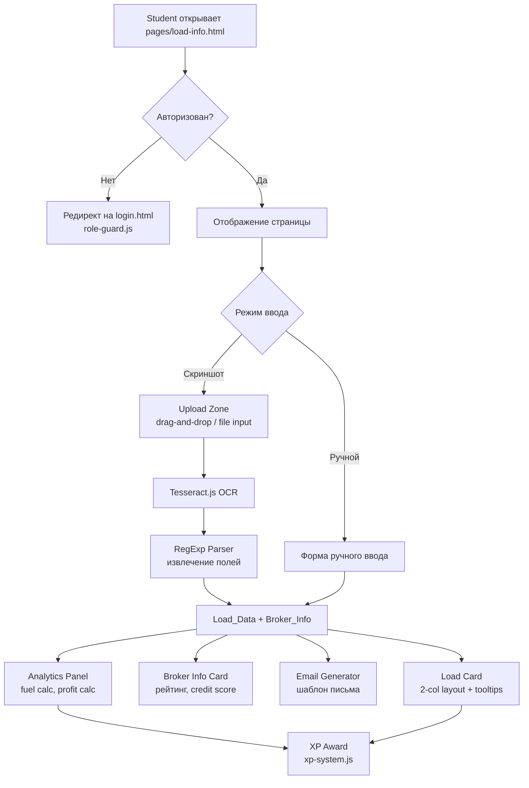
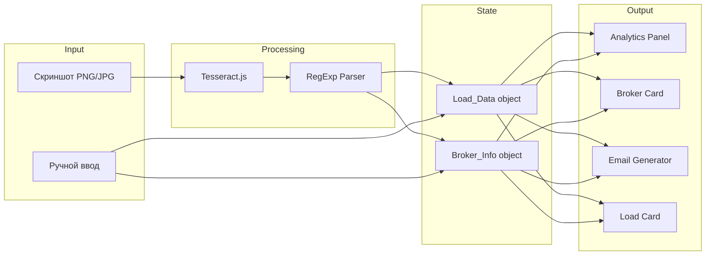

# Дизайн-документ: Анализатор скриншотов лоад-бордов

## Обзор

Анализатор скриншотов лоад-бордов — одностраничный инструмент (`pages/load-info.html`), который позволяет студентам загрузить скриншот с лоад-борда (DAT, Truckstop и др.) и получить:

1. Структурированные данные о грузе (Load Data)
2. Информацию о брокере (Broker Info)
3. Аналитику по грузу (расходы на топливо, профит)
4. Готовый шаблон письма брокеру
5. Load Info карточку для водителя

Страница интегрируется в существующую платформу: тёмная тема с CSS-переменными, навигация через `shared-nav.css`, аутентификация через Firebase + `role-guard.js`, начисление XP через `xp-system.js`.

Для распознавания скриншотов используется клиентский OCR (Tesseract.js) с последующим парсингом текста регулярными выражениями. Альтернативно — ручной ввод данных через формы.

### Ключевые решения

- **OCR на клиенте (Tesseract.js)** — не требует серверной инфраструктуры, работает офлайн после загрузки модели. Для обучающей платформы точность достаточна, а нераспознанные поля заполняются вручную.
- **Единый файл** — вся логика в одном HTML-файле с inline CSS/JS, как принято в проекте (см. `docs.html`, `simulator.html`).
- **2-колоночный layout с tooltip** для Load Card — по паттерну из `docs.html` (rc-field + data-tooltip).


## Архитектура



### Поток данных




## Компоненты и интерфейсы

### 1. Upload Zone

Область загрузки скриншота с поддержкой drag-and-drop и file input.

```
UploadZone
├── dropArea (div) — drag-and-drop зона
├── fileInput (input[type=file]) — accept="image/png,image/jpeg"
├── previewArea (div) — превью загруженного изображения
├── progressBar (div) — индикатор прогресса OCR
└── errorMessage (div) — сообщения об ошибках
```

**Ограничения:**
- Максимальный размер файла: 10 МБ
- Форматы: PNG, JPG, JPEG
- Touch-события для мобильных устройств

### 2. Screenshot Parser (OCR + RegExp)

Модуль распознавания текста и извлечения структурированных данных.

```javascript
// Интерфейс парсера
async function parseScreenshot(imageFile) // → { loadData, brokerInfo }

// Внутренние функции
async function runOCR(imageFile)          // Tesseract.js → текст
function extractLoadData(text)            // RegExp → Load_Data
function extractBrokerInfo(text)          // RegExp → Broker_Info
```

### 3. Analytics Panel

Панель расчёта аналитики по грузу.

```javascript
function calculateFuelCost(miles, mpg, fuelPrice) // → number
function calculateProfit(rate, fuelCost)           // → number
function calculateRatePerMile(rate, miles)         // → number
function updateAnalytics(loadData, mpg, fuelPrice) // → AnalyticsResult
```

### 4. Email Generator

Генератор шаблона письма брокеру.

```javascript
function generateBrokerEmail(loadData, brokerInfo) // → string (английский текст)
```

### 5. Load Card

Карточка для водителя с 2-колоночным layout и tooltip-подсказками (паттерн из `docs.html`).

```
LoadCard (2-column grid)
├── Left Column: чеклист полей с tooltip
│   ├── rc-field[data-tooltip] — Load ID
│   ├── rc-field[data-tooltip] — Pickup Address / Time / Number
│   ├── rc-field[data-tooltip] — Delivery Address / Time / Number
│   ├── rc-field[data-tooltip] — Rate
│   ├── rc-field[data-tooltip] — Commodity
│   └── rc-field[data-tooltip] — Weight
└── Right Column: форматированная карточка (белый фон)
    └── Поля документа (rc-field с data-tooltip, editable inputs)
```

Tooltip-система: desktop — hover показывает tooltip, клик фиксирует; mobile — клик открывает по центру экрана.

### 6. XP Integration

Интеграция с существующей системой `xp-system.js`.

```javascript
import { awardXP } from '../xp-system.js';

// Новые XP-действия:
// SCREENSHOT_ANALYZED: 30 XP
// LOAD_CARD_COMPLETE: 20 XP

// Дедупликация через хеш скриншота в localStorage
function getScreenshotHash(file)  // → string
function isAlreadyAnalyzed(hash)  // → boolean
function markAsAnalyzed(hash)     // → void
```

### Секции страницы (порядок отображения)

1. **Hero Section** — заголовок, описание инструмента
2. **Mode Toggle** — переключатель: Скриншот / Ручной ввод
3. **Upload Zone** — загрузка скриншота (или форма ручного ввода)
4. **Analytics Panel** — маршрут, рейт, топливо, профит
5. **Broker Info Card** — данные брокера, рейтинг звёздами
6. **Email Generator** — шаблон письма + кнопка копирования
7. **Load Card** — 2-колоночная карточка для водителя + кнопка копирования


## Модели данных

### Load_Data

```javascript
const Load_Data = {
    origin: { city: '', state: '' },
    destination: { city: '', state: '' },
    equipment: '',        // "Van", "Reefer", "Flatbed"
    trailerSize: '',      // "53 ft"
    weight: null,         // фунты, напр. 42000
    miles: null,          // расстояние маршрута
    spotRate: null,       // спот-рейт в $
    ratePerMile: null,    // $/mile
    rateRange: { min: null, max: null },
    // Поля для Load Card
    loadId: '',
    pickupAddress: '',
    pickupTime: '',
    pickupNumber: '',
    deliveryAddress: '',
    deliveryTime: '',
    deliveryNumber: '',
    commodity: '',
    // Метаданные распознавания
    _recognized: {}       // { fieldName: true/false }
};
```

### Broker_Info

```javascript
const Broker_Info = {
    company: '',
    mcNumber: '',         // "MC-123456"
    rating: { stars: 0, reviewCount: 0 },
    creditScore: null,
    location: { city: '', state: '' },
    email: '',
    factoring: { company: '', status: '', docket: '' },
    daysToPay: null,
    _recognized: {}
};
```

### AnalyticsResult

```javascript
const AnalyticsResult = {
    route: '',            // "Chicago, IL → Dallas, TX"
    miles: 0,
    spotRate: 0,
    ratePerMile: 0,
    rateRange: { min: 0, max: 0 },
    fuelCost: 0,
    gallonsNeeded: 0,
    profit: 0,
    profitPerMile: 0,
    mpg: 6.8,             // по умолчанию
    fuelPricePerGallon: 0
};
```

### Формулы расчёта

```
gallonsNeeded = miles / mpg
fuelCost = gallonsNeeded * fuelPricePerGallon
profit = spotRate - fuelCost
profitPerMile = profit / miles
ratePerMile = spotRate / miles
```


## Correctness Properties

*Свойство корректности (property) — это характеристика или поведение, которое должно выполняться при всех допустимых входных данных системы. Свойства служат мостом между человекочитаемыми спецификациями и машинно-проверяемыми гарантиями корректности.*

### Property 1: Валидация файла загрузки

*Для любого* файла, функция валидации должна принять файл тогда и только тогда, когда его расширение — PNG, JPG или JPEG, и его размер не превышает 10 МБ. Для всех остальных файлов валидация должна вернуть ошибку.

**Validates: Requirements 1.4, 1.8, 9.1**

### Property 2: Извлечение данных о грузе из текста OCR

*Для любого* текста, содержащего паттерны данных лоад-борда (город/штат origin, город/штат destination, тип оборудования, вес, мили, рейт, rate/mile, диапазон ставок), функция `extractLoadData` должна вернуть объект `Load_Data`, где каждое распознанное поле соответствует значению из текста, а нераспознанные поля помечены в `_recognized` как `false`.

**Validates: Requirements 1.5, 2.1, 2.2, 2.3, 2.4, 2.5, 2.6, 2.7, 2.8, 2.9, 2.10**

### Property 3: Извлечение данных о брокере из текста OCR

*Для любого* текста, содержащего паттерны данных брокера (название компании, MC#, рейтинг, credit score, город/штат, email, факторинг, days to pay), функция `extractBrokerInfo` должна вернуть объект `Broker_Info`, где каждое распознанное поле соответствует значению из текста.

**Validates: Requirements 1.6, 3.1, 3.2, 3.3, 3.4, 3.5, 3.6, 3.7, 3.8**

### Property 4: Корректность расчёта аналитики (топливо и профит)

*Для любых* положительных значений miles, mpg и fuelPrice, и любого неотрицательного rate:
- `fuelCost` должен равняться `(miles / mpg) * fuelPrice`
- `profit` должен равняться `rate - fuelCost`
- `ratePerMile` должен равняться `rate / miles`

**Validates: Requirements 4.4, 4.8, 10.3**

### Property 5: Цветовая индикация профита

*Для любого* значения профита: если профит отрицательный, индикатор цвета должен быть "danger" (красный); если профит положительный — "success" (зелёный); если профит равен нулю — нейтральный.

**Validates: Requirements 4.9, 4.10**

### Property 6: Генерация письма брокеру содержит все обязательные поля

*Для любых* валидных `Load_Data` (с заполненными origin и destination) и `Broker_Info`, сгенерированное письмо должно содержать: город отправления, город назначения, дату, и запрос лучшего рейта. Письмо должно быть на английском языке.

**Validates: Requirements 5.1, 5.2, 5.3, 5.4, 10.4**

### Property 7: Форматирование Load Card содержит все обязательные поля

*Для любого* объекта `Load_Data` со всеми заполненными полями, текстовое представление Load Card должно содержать: Load ID, Pickup Address, Pickup Time, Pickup Number, Delivery Address, Delivery Time, Delivery Number, Rate, Commodity и Weight.

**Validates: Requirements 6.2, 6.3, 6.4, 6.5, 6.6, 6.7, 6.8, 6.9, 6.11, 10.5**

### Property 8: Предупреждение о низком рейтинге брокера

*Для любого* объекта `Broker_Info`, функция проверки рейтинга должна вернуть предупреждение тогда и только тогда, когда `rating.stars < 3`.

**Validates: Requirements 3.10**

### Property 9: Дедупликация начисления XP

*Для любого* хеша скриншота, после вызова `markAsAnalyzed(hash)`, вызов `isAlreadyAnalyzed(hash)` должен вернуть `true`. Для любого хеша, который не был помечен, `isAlreadyAnalyzed` должен вернуть `false`.

**Validates: Requirements 11.5**

### Property 10: Проверка полноты заполнения Load Card

*Для любого* объекта `Load_Data`, функция `isCardComplete` должна вернуть `true` тогда и только тогда, когда все обязательные поля (loadId, pickupAddress, pickupTime, pickupNumber, deliveryAddress, deliveryTime, deliveryNumber, rate, commodity, weight) являются непустыми строками или ненулевыми числами.

**Validates: Requirements 11.2**


## Обработка ошибок

### Ошибки загрузки файла

| Ситуация | Сообщение | Действие |
|----------|-----------|----------|
| Неподдерживаемый формат | "Поддерживаются только PNG, JPG и JPEG файлы" | Показать ошибку в Upload Zone |
| Файл > 10 МБ | "Файл слишком большой. Максимальный размер — 10 МБ" | Показать ошибку в Upload Zone |
| Пустой файл | "Файл повреждён или пуст" | Показать ошибку в Upload Zone |

### Ошибки распознавания

| Ситуация | Сообщение | Действие |
|----------|-----------|----------|
| OCR не распознал текст | "Не удалось распознать данные. Попробуйте загрузить другой скриншот или введите данные вручную" | Кнопка переключения на ручной ввод |
| Нет данных лоад-борда | "Скриншот не содержит данных лоад-борда" | Предложить ручной ввод |
| Частичное распознавание | Поля помечены "Не распознано" | Позволить ручное заполнение |
| Ошибка Tesseract.js | "Ошибка при обработке изображения. Попробуйте ещё раз" | Кнопка повторной попытки |

### Ошибки расчётов

| Ситуация | Действие |
|----------|----------|
| Miles = 0 или null | Не рассчитывать ratePerMile и profitPerMile, показать "—" |
| MPG = 0 | Не рассчитывать fuelCost, показать предупреждение |
| Rate = null | Не рассчитывать profit, показать "—" |

### Ошибки копирования

| Ситуация | Действие |
|----------|----------|
| Clipboard API недоступен | Fallback: выделить текст и показать "Нажмите Ctrl+C" |

### Логирование

Все ошибки логируются в `console.error()` с контекстом:
```javascript
console.error('[LoadAnalyzer]', errorType, errorDetails);
```


## Стратегия тестирования

### Подход

Двойной подход к тестированию:

- **Unit-тесты** — проверка конкретных примеров, граничных случаев и ошибок
- **Property-тесты** — проверка универсальных свойств на множестве случайных входных данных

Оба типа дополняют друг друга: unit-тесты ловят конкретные баги, property-тесты гарантируют общую корректность.

### Библиотека для property-based тестирования

**fast-check** (JavaScript) — зрелая PBT-библиотека для JS/TS с богатым набором генераторов.

Конфигурация: минимум **100 итераций** на каждый property-тест.

### Property-тесты

Каждый property-тест ссылается на свойство из раздела Correctness Properties. Формат тегов:

```javascript
// Feature: load-screenshot-analyzer, Property N: Название свойства
```

| Property | Тест | Генераторы |
|----------|------|------------|
| 1: Валидация файла | Случайные имена файлов и размеры → accept/reject | `fc.record({ name, size, ext })` |
| 2: Извлечение Load_Data | Текст с паттернами лоад-борда → корректные поля | Кастомный генератор OCR-текста |
| 3: Извлечение Broker_Info | Текст с паттернами брокера → корректные поля | Кастомный генератор OCR-текста |
| 4: Расчёт аналитики | Случайные miles, mpg, fuelPrice, rate → формулы | `fc.float({min:1})` для каждого |
| 5: Цвет профита | Случайные значения профита → цветовой индикатор | `fc.float()` |
| 6: Email содержит поля | Случайные Load_Data + Broker_Info → содержимое | Кастомный генератор |
| 7: Load Card содержит поля | Случайные Load_Data → текст карточки | Кастомный генератор |
| 8: Предупреждение рейтинга | Случайный рейтинг 0-5 → наличие предупреждения | `fc.float({min:0, max:5})` |
| 9: Дедупликация XP | Случайные хеши → round-trip mark/check | `fc.string()` |
| 10: Полнота Load Card | Load_Data с разной заполненностью → isCardComplete | Кастомный генератор |

### Unit-тесты

| Область | Примеры тестов |
|---------|---------------|
| Валидация файла | PNG принят, BMP отклонён, файл 11MB отклонён, файл 0 байт отклонён |
| OCR парсинг | Конкретный скриншот DAT → ожидаемые поля, скриншот Truckstop → ожидаемые поля |
| Аналитика | 920 миль, 6.8 MPG, $3.50/gal → fuelCost=$473.53; rate $2500 → profit=$2026.47 |
| Email | Проверка шаблона с Chicago→Dallas |
| Load Card | Полная карточка → все поля в тексте; пустая → isCardComplete=false |
| Рейтинг брокера | rating 2.5 → warning=true; rating 3.0 → warning=false |
| Дефолт MPG | При инициализации MPG = 6.8 |

### Структура тестов

```
tests/
├── load-analyzer.test.js          // unit-тесты
└── load-analyzer.property.test.js // property-тесты (fast-check)
```

Каждый property-тест реализуется ОДНИМ тестом с использованием `fc.assert` и `fc.property`. Каждый тест помечен комментарием с номером свойства из дизайн-документа.
