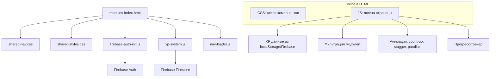

# Дизайн: Редизайн страницы modules-index.html

## Обзор

Редизайн единственного HTML-файла `pages/modules-index.html` — индексной страницы 12 модулей тестов платформы DispatcherPro. Текущая страница — статичная сетка из 3 колонок с fade-up анимацией. Цель — превратить её в интерактивную, геймифицированную страницу с XP-интеграцией, фильтрацией, прогресс-трекером и микроанимациями.

Вся реализация — в одном файле `pages/modules-index.html` (inline CSS + JS), с импортом `xp-system.js` (ES module) и подключением `shared-nav.css`, `shared-styles.css`. Firebase Auth уже инициализирован через `firebase-auth-init.js`.

### Ключевые решения

- Один файл — без создания дополнительных CSS/JS файлов, всё inline (как в текущей версии)
- CSS Grid для сетки модулей: 6 → 4 → 3 → 2 колонки
- Контейнер max-width: 1200px (расширение с текущих 1100px)
- XP-данные из localStorage (кеш) + Firebase (актуальные), graceful degradation при отсутствии авторизации
- Все анимации через CSS (transitions, keyframes) + минимальный JS для IntersectionObserver и count-up

## Архитектура

Страница остаётся single-file HTML. Архитектура — клиентская, без серверной логики.



### Поток данных

1. Страница загружается → inline CSS рендерит layout
2. `firebase-auth-init.js` проверяет авторизацию, кеширует user + xp_data в localStorage
3. Inline JS читает `localStorage.getItem('xp_data')` и `localStorage.getItem('user')` для мгновенного отображения
4. `xp-system.js` импортируется для получения `LEVELS`, `getLevelByXP`, `getNextLevel`
5. Событие `xpUpdated` (CustomEvent) обновляет UI без перезагрузки
6. IntersectionObserver запускает staggered-анимации при прокрутке

## Компоненты и интерфейсы

### 1. Hero-секция с живой статистикой

Верхний блок с заголовком, персональным уровнем, XP-прогрессом и анимированными счётчиками.

```html
<section class="hero">
  <div class="hero-badge">📚 Проверка знаний</div>
  <h1>Модули Тестов</h1>
  <p>12 модулей проверки знаний...</p>
  
  <!-- Персональный блок (скрыт если не авторизован) -->
  <div class="hero-xp" id="heroXp" style="display:none">
    <span class="hero-level" id="heroLevel">🌱 Новичок</span>
    <span class="hero-streak" id="heroStreak">🔥 0 дней</span>
    <div class="hero-progress">
      <div class="hero-progress-fill" id="heroProgressFill"></div>
    </div>
    <span class="hero-xp-text" id="heroXpText">0 / 50 XP</span>
  </div>
  
  <!-- Анимированные счётчики -->
  <div class="stats">
    <div class="stat"><div class="stat-num" data-target="12">0</div><div class="stat-label">Модулей</div></div>
    <div class="stat"><div class="stat-num" data-target="12">0</div><div class="stat-label">Часов</div></div>
    <div class="stat"><div class="stat-num" data-target="90">0</div><div class="stat-label">Тестов</div></div>
  </div>
</section>
```

Анимация count-up: JS при IntersectionObserver запускает `requestAnimationFrame` цикл от 0 до `data-target` за ~1.5 секунды с easeOutQuart.

### 2. Прогресс-трекер (Timeline)

Горизонтальная линия с 12 точками между Hero и сеткой модулей.

```html
<div class="progress-tracker" id="progressTracker">
  <div class="tracker-line">
    <div class="tracker-line-fill" id="trackerFill"></div>
  </div>
  <!-- 12 точек, генерируются JS -->
  <div class="tracker-dot completed" data-module="1">
    <span class="tracker-check">✓</span>
  </div>
  <div class="tracker-dot current" data-module="2">
    <span class="tracker-pulse"></span>
  </div>
  <div class="tracker-dot" data-module="3"></div>
  <!-- ... -->
</div>
```

Состояния точек:
- `.completed` — заполнена `var(--primary)`, галочка
- `.current` — пульсирующая анимация `var(--accent)`
- По умолчанию — приглушённая `rgba(255,255,255,0.1)`

Клик по точке → `scrollIntoView({ behavior: 'smooth' })` к карточке + highlight на 2 секунды.

На экранах < 768px: трекер скрывается, заменяется компактным текстовым индикатором `"3/12 пройдено"`.

### 3. Панель фильтров

```html
<div class="filter-bar">
  <button class="filter-btn active" data-filter="all">Все <span class="filter-count">12</span></button>
  <button class="filter-btn" data-filter="completed">Пройденные <span class="filter-count">0</span></button>
  <button class="filter-btn" data-filter="current">В процессе <span class="filter-count">0</span></button>
  <button class="filter-btn" data-filter="not-started">Не начатые <span class="filter-count">12</span></button>
</div>
```

JS-логика фильтрации:
- Клик по кнопке → toggle класс `.active` (цвет `var(--primary)`)
- Карточки, не соответствующие фильтру, получают `display:none` с CSS transition
- Счётчики в badge обновляются при загрузке XP-данных

### 4. Компактные карточки модулей

Ключевое изменение: 6 карточек в ряд на desktop. Карточки компактные — только номер, краткое название, иконка статуса и сложности.

```html
<div class="modules-grid">
  <!-- Навигационная карточка (полная ширина) -->
  <div class="module-card nav-card" id="navCard" style="grid-column:1/-1">...</div>
  
  <!-- Компактная карточка модуля -->
  <a href="doc-module-1-complete.html" class="module-card" data-module="1" data-status="completed">
    <div class="card-header">
      <span class="card-num">01</span>
      <span class="card-status-icon">✓</span>
    </div>
    <h3 class="card-title">Индустрия</h3>
    <div class="card-difficulty">
      <span class="diff-dot easy"></span>
    </div>
    <!-- Hover overlay -->
    <div class="card-hover-info">
      <div class="card-progress-mini">
        <div class="card-progress-fill" style="width:100%"></div>
      </div>
      <span class="card-xp">+50 XP</span>
    </div>
  </a>
</div>
```

CSS Grid:
```css
.modules-grid {
  display: grid;
  grid-template-columns: repeat(6, 1fr);
  gap: 12px;
}
```

Три визуальных состояния карточки:
- **Пройден** (`.completed`): зелёный акцент `#10b981`, иконка ✓
- **Текущий** (`.current`): оранжевый акцент `var(--accent)`, пульсирующая анимация
- **Не начат** (`.not-started`): приглушённый стиль, пониженная opacity

Hover-эффект:
- `transform: scale(1.05)` + `box-shadow` цвета состояния
- Появление `.card-hover-info` с мини-прогресс-баром и XP

Сложность (цветные точки):
- 🟢 Лёгкий (модули 1-4)
- 🟡 Средний (модули 5-8)
- 🔴 Сложный (модули 9-12)

### 5. Секция инструментов

4 карточки с анимированными иконками и расширяемым описанием при hover.

```html
<section class="tools">
  <h2>🛠️ Инструменты</h2>
  <div class="tools-grid">
    <a href="simulator.html" class="tool-card">
      <div class="tool-icon" data-anim="bounce">🎯</div>
      <h4>Симулятор</h4>
      <p class="tool-short">Практика переговоров</p>
      <p class="tool-expanded">Интерактивный тренажёр переговоров с брокерами. Реальные сценарии.</p>
      <span class="tool-usage-badge" style="display:none">0 раз</span>
    </a>
  </div>
</section>
```

Анимации иконок при hover: CSS `@keyframes` — bounce, wobble, pulse (разные для каждого инструмента).

Badge использований: данные из `xp_data.stats` в localStorage, если доступны.

### 6. Интерфейс с XP-системой

Импорт из `xp-system.js`:
```javascript
import { LEVELS, getLevelByXP, getNextLevel } from '../xp-system.js';
```

Функции страницы:
- `loadUserData()` — читает localStorage, обновляет Hero, карточки, трекер
- `updateModuleStatuses(userData)` — устанавливает data-status на карточках
- `handleXpUpdate(event)` — слушатель `xpUpdated`, обновляет XP/уровень в реальном времени

Graceful degradation: если `localStorage.getItem('user')` === null → все модули в состоянии "не начат", XP-блок скрыт.

## Модели данных

### Данные в localStorage

```typescript
// localStorage.getItem('user')
interface UserCache {
  uid: string;
  firstName: string;
  lastName: string;
  email: string;
  photoURL: string | null;
}

// localStorage.getItem('xp_data')
interface XPCache {
  totalXP: number;
  level?: number;
  levelLabel?: string;
  lastUpdated?: string;
}
```

### Данные из Firebase (Firestore: users/{uid})

```typescript
interface UserFirestore {
  xp: number;
  role: number;                    // 1-10, соответствует LEVELS
  loginStreak: number;             // серия дней
  lastDailyLogin: string;         // "Mon Jun 09 2025"
  stats: {
    quizCorrect: number;
    quizComplete: number;
    moduleComplete: number;
    sectorComplete: number;
    testPassed: number;
    simulatorDone: number;
    // ...
  };
  xpHistory: Array<{
    action: string;
    xp: number;
    label: string;
    ts: string;
  }>;
}
```

### Маппинг модулей (hardcoded в HTML)

```javascript
const MODULES = [
  { id: 1, title: 'Индустрия', href: 'doc-module-1-complete.html', difficulty: 'easy' },
  { id: 2, title: 'Термины', href: 'doc-module-2-complete.html', difficulty: 'easy' },
  { id: 3, title: 'Диспетчер', href: 'doc-module-3-complete.html', difficulty: 'easy' },
  { id: 4, title: 'Load Boards', href: 'doc-module-4-complete.html', difficulty: 'easy' },
  { id: 5, title: 'Маршруты', href: 'doc-module-5-complete.html', difficulty: 'medium' },
  { id: 6, title: 'Оборудование', href: 'doc-module-6-complete.html', difficulty: 'medium' },
  { id: 7, title: 'Переговоры', href: 'doc-module-7-complete.html', difficulty: 'medium' },
  { id: 8, title: 'Брокеры', href: 'doc-module-8-complete.html', difficulty: 'medium' },
  { id: 9, title: 'CSA Scores', href: 'doc-module-9-complete.html', difficulty: 'hard' },
  { id: 10, title: 'Грузы', href: 'doc-module-10-complete.html', difficulty: 'hard' },
  { id: 11, title: 'Проблемы', href: 'doc-module-11-complete.html', difficulty: 'hard' },
  { id: 12, title: 'Карьера', href: 'doc-module-12-complete.html', difficulty: 'hard' },
];
```

### Состояние модуля (определяется на клиенте)

```typescript
type ModuleStatus = 'completed' | 'current' | 'not-started';

// Логика определения:
// - completed: модуль есть в списке пройденных (из Firebase stats или xpHistory)
// - current: первый непройденный модуль
// - not-started: все остальные
```


## Correctness Properties

*Свойство (property) — это характеристика или поведение, которое должно оставаться истинным при всех допустимых выполнениях системы. По сути, это формальное утверждение о том, что система должна делать. Свойства служат мостом между человекочитаемыми спецификациями и машинно-верифицируемыми гарантиями корректности.*

### Property 1: Корректный маппинг XP → уровень и прогресс

*Для любого* значения XP (0 ≤ xp < 10000), вычисленный уровень должен соответствовать таблице LEVELS из xp-system.js, процент прогресса до следующего уровня должен быть в диапазоне [0, 100], а отображаемая серия дней (streak) должна равняться значению loginStreak из данных пользователя.

**Validates: Requirements 1.1, 1.3, 8.3**

### Property 2: Корректное назначение статусов модулей

*Для любого* набора пройденных модулей (подмножество {1..12}), каждый из 12 модулей должен получить ровно один статус: «completed» если модуль в наборе пройденных, «current» если это первый непройденный модуль, «not-started» для остальных. Точки прогресс-трекера должны иметь те же состояния что и соответствующие карточки.

**Validates: Requirements 2.3, 4.2, 4.3**

### Property 3: Структура компактной карточки

*Для любой* карточки модуля в сетке, она должна содержать номер модуля (01-12), краткое название (≤ 20 символов), иконку статуса, и НЕ должна содержать длинных описаний (элемент `<p>` с описанием) в свёрнутом состоянии.

**Validates: Requirements 2.2**

### Property 4: Маппинг сложности модулей

*Для любого* модуля с ID от 1 до 12, его уровень сложности должен определяться по правилу: модули 1-4 → «easy», модули 5-8 → «medium», модули 9-12 → «hard». Иконка сложности должна соответствовать уровню.

**Validates: Requirements 2.6**

### Property 5: Корректность фильтрации модулей

*Для любого* набора статусов модулей и любого выбранного фильтра («all», «completed», «current», «not-started»), видимые карточки должны быть ровно теми, чей статус соответствует фильтру (или все при фильтре «all»), а badge-счётчик на каждой кнопке фильтра должен равняться количеству модулей с соответствующим статусом.

**Validates: Requirements 3.2, 3.3**

### Property 6: Обновление XP в реальном времени

*Для любого* события `xpUpdated` с новым значением totalXP, отображаемые в Hero-секции значения XP и уровня должны обновиться до новых значений без перезагрузки страницы, и новый уровень должен соответствовать `getLevelByXP(newTotalXP)`.

**Validates: Requirements 8.2**

### Property 7: Маппинг использований инструментов

*Для любого* набора данных stats пользователя (simulatorDone, testPassed и т.д.), badge на каждой карточке инструмента должен отображать число, равное соответствующему счётчику из stats. Если данные недоступны, badge должен быть скрыт.

**Validates: Requirements 5.3**

## Обработка ошибок

### Отсутствие авторизации
- `localStorage.getItem('user')` возвращает null → скрыть Hero XP-блок, streak badge, tool usage badges
- Все модули отображаются в состоянии «не начат»
- Фильтры работают, но все модули в категории «Не начатые»

### Ошибка загрузки XP из Firebase
- Используем кешированные данные из `localStorage.getItem('xp_data')`
- Если и кеш пуст — аналогично неавторизованному пользователю
- Консоль: `console.warn('XP data unavailable, using defaults')`

### Некорректные данные
- XP < 0 → трактуем как 0
- loginStreak < 0 → трактуем как 0
- Отсутствующие поля в stats → трактуем как 0

### Ошибки DOM
- Если элемент не найден (getElementById возвращает null) → пропускаем обновление, не бросаем исключение
- Все DOM-операции обёрнуты в проверки `if (element)`

## Стратегия тестирования

### Подход

Двойной подход: unit-тесты для конкретных примеров и edge cases + property-based тесты для универсальных свойств.

### Unit-тесты (примеры и edge cases)

1. **Неавторизованный пользователь**: XP-блок скрыт, все модули «не начат» (Req 1.4, 8.4)
2. **Навигационная карточка присутствует**: DOM содержит #navCard с полной шириной (Req 9.1)
3. **Раскрытие навигационной карточки**: клик toggle → max-height меняется (Req 9.2)
4. **Панель фильтров содержит 4 кнопки**: «Все», «Пройденные», «В процессе», «Не начатые» (Req 3.1)
5. **Прогресс-трекер содержит 12 точек** (Req 4.1)
6. **Клик по точке трекера прокручивает к карточке** (Req 4.4)
7. **XP = 0**: уровень «Новичок», прогресс 0% (edge case)
8. **XP = 9999**: уровень «Администратор», нет следующего уровня (edge case)

### Property-based тесты

Библиотека: **fast-check** (JavaScript PBT library)

Каждый тест — минимум 100 итераций. Каждый тест помечен комментарием с ссылкой на свойство из дизайна.

1. **Feature: modules-index-redesign, Property 1: XP → Level/Progress mapping**
   - Генератор: `fc.integer({ min: 0, max: 9999 })` для XP, `fc.integer({ min: 0, max: 365 })` для streak
   - Проверка: `getLevelByXP(xp)` возвращает корректный уровень, процент прогресса в [0, 100]

2. **Feature: modules-index-redesign, Property 2: Module status assignment**
   - Генератор: `fc.subarray([1,2,3,4,5,6,7,8,9,10,11,12])` для набора пройденных модулей
   - Проверка: ровно один «current», остальные «completed» или «not-started», порядок корректен

3. **Feature: modules-index-redesign, Property 3: Compact card structure**
   - Генератор: `fc.integer({ min: 1, max: 12 })` для ID модуля
   - Проверка: карточка содержит номер, короткое название, иконку; не содержит длинного описания

4. **Feature: modules-index-redesign, Property 4: Difficulty mapping**
   - Генератор: `fc.integer({ min: 1, max: 12 })` для ID модуля
   - Проверка: getDifficulty(id) возвращает 'easy'|'medium'|'hard' по правилу

5. **Feature: modules-index-redesign, Property 5: Filter correctness**
   - Генератор: `fc.subarray([1..12])` для пройденных + `fc.constantFrom('all','completed','current','not-started')` для фильтра
   - Проверка: видимые карточки соответствуют фильтру, badge-счётчики корректны

6. **Feature: modules-index-redesign, Property 6: Real-time XP update**
   - Генератор: `fc.integer({ min: 0, max: 9999 })` для начального XP, `fc.integer({ min: 1, max: 500 })` для прибавки
   - Проверка: после dispatch xpUpdated, отображаемый уровень = getLevelByXP(newXP)

7. **Feature: modules-index-redesign, Property 7: Tool usage badge mapping**
   - Генератор: `fc.record({ simulatorDone: fc.nat(), testPassed: fc.nat(), ... })`
   - Проверка: badge каждого инструмента = соответствующий счётчик из stats
