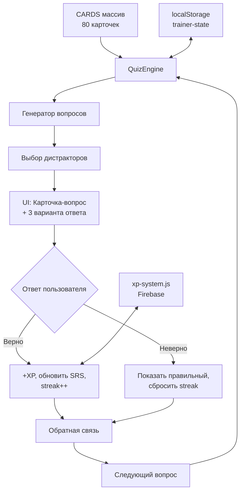
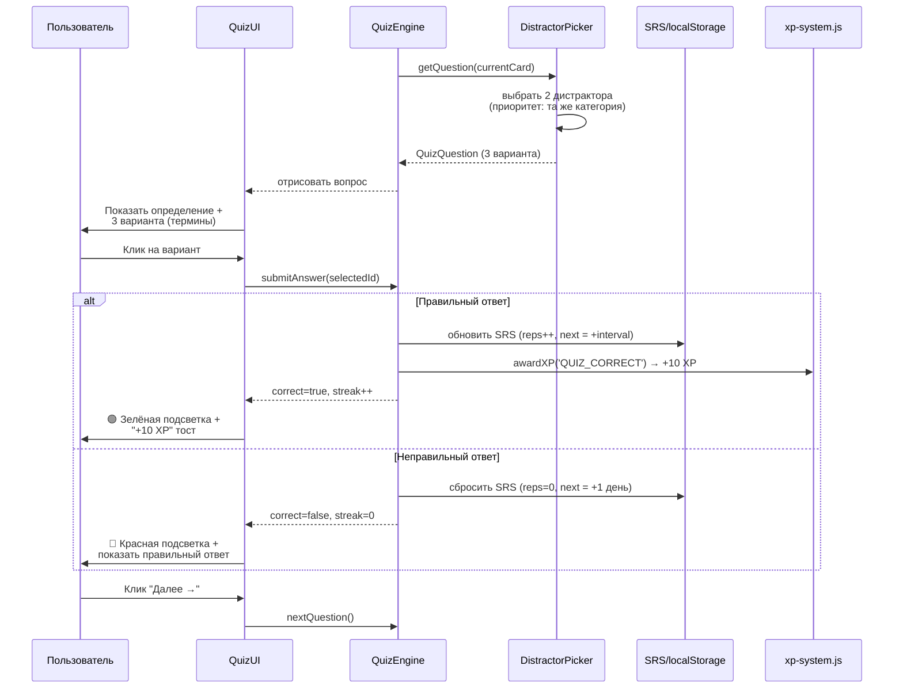

# Дизайн-документ: Редизайн карточек в квиз-формат

## Обзор

Текущий тренажёр использует флип-карточки (термин → определение) с оценкой уверенности (Сложно/Нормально/Легко). Новый формат превращает каждую из 80 карточек в квиз-вопрос: показывается определение/описание, пользователь выбирает правильный термин из 3 вариантов (1 верный + 2 случайных из пула). Мгновенная обратная связь, отслеживание прогресса, XP и серий.

Редизайн затрагивает только режим «Карточки» (вкладка `#p-cards`). Режимы «Тест» и «Сопоставить» остаются без изменений. Существующая SRS-система и интеграция с `xp-system.js` сохраняются.

## Архитектура



## Компоненты и интерфейсы

### Компонент 1: QuizEngine

**Назначение**: Управляет очередью вопросов, фильтрацией, SRS-сортировкой и состоянием сессии.

```javascript
// Состояние квиз-сессии
interface QuizSession {
  cards: Card[]           // отфильтрованный и отсортированный пул
  currentIndex: number    // текущий вопрос
  correctCount: number    // правильных в сессии
  wrongCount: number      // неправильных в сессии
  streak: number          // текущая серия правильных подряд
  maxStreak: number       // максимальная серия в сессии
}
```

**Ответственности**:
- Фильтрация карточек по категории, сложности, статусу (новые/на повторе)
- SRS-сортировка: карточки с просроченным `next` идут первыми
- Управление переходом между вопросами
- Подсчёт статистики сессии

### Компонент 2: DistractorPicker

**Назначение**: Генерирует 2 неправильных варианта ответа для каждого вопроса.

```javascript
// Вопрос с вариантами
interface QuizQuestion {
  card: Card              // исходная карточка (правильный ответ)
  options: Option[]       // 3 варианта (перемешаны)
}

interface Option {
  term: string            // текст варианта (термин)
  cardId: string          // id карточки
  isCorrect: boolean      // правильный ли
}
```

**Ответственности**:
- Выбор 2 дистракторов из того же пула CARDS
- Приоритет дистракторов из той же категории (для сложности)
- Перемешивание порядка вариантов
- Исключение дубликатов

### Компонент 3: FeedbackUI

**Назначение**: Отображение мгновенной обратной связи после ответа.

**Ответственности**:
- Подсветка правильного/неправильного варианта (зелёный/красный)
- Показ полного определения и примера использования
- Анимация перехода к следующему вопросу
- Отображение streak и XP-тоста

## Диаграмма последовательности: Ответ на вопрос



## Модели данных

### Card (существующая, без изменений)

```javascript
interface Card {
  id: string        // 'c1'...'c80'
  cat: string       // 'Термины', 'Переговоры', 'Документы', etc.
  diff: string      // 'easy' | 'medium' | 'hard'
  term: string      // термин (ответ на вопрос)
  hint: string      // подсказка (расшифровка аббревиатуры)
  def: string       // определение (текст вопроса)
  ex: string        // пример использования
}
```

### SRS State (существующая, расширяется)

```javascript
interface SRSData {
  reps: number      // количество правильных ответов подряд
  interval: number  // текущий интервал повторения (дни)
  next: number      // timestamp следующего повторения
}

// В localStorage 'trainer-state':
interface TrainerState {
  srs: { [cardId: string]: SRSData }
  xp: number
  known: string[]           // id изученных карточек
  streak: number            // дней подряд
  quizStats: {              // НОВОЕ: статистика квиза
    totalAnswered: number
    totalCorrect: number
    bestStreak: number
    sessionsCompleted: number
  }
}
```

**Правила валидации**:
- `reps` ≥ 0, сбрасывается в 0 при неправильном ответе
- `interval` берётся из `SRS_INTERVALS = [1, 3, 7, 14, 30]` по индексу `min(reps, 4)`
- Карточка считается «изученной» когда `reps ≥ 3`

## Алгоритм выбора дистракторов

```
АЛГОРИТМ pickDistractors(correctCard, allCards)
ВХОД: correctCard — карточка с правильным ответом, allCards — все 80 карточек
ВЫХОД: 2 карточки-дистрактора

НАЧАЛО
  // Шаг 1: Исключить правильную карточку
  pool ← allCards.filter(c => c.id ≠ correctCard.id)

  // Шаг 2: Разделить на «из той же категории» и «из других»
  sameCategory ← pool.filter(c => c.cat = correctCard.cat)
  otherCategory ← pool.filter(c => c.cat ≠ correctCard.cat)

  // Шаг 3: Приоритет — 1 из той же категории + 1 из другой
  ЕСЛИ sameCategory.length ≥ 1 ТОГДА
    distractor1 ← случайный из sameCategory
    distractor2 ← случайный из otherCategory ИЛИ sameCategory
  ИНАЧЕ
    distractor1, distractor2 ← 2 случайных из pool
  КОНЕЦ ЕСЛИ

  ВЕРНУТЬ [distractor1, distractor2]
КОНЕЦ
```

**Почему так**: Один дистрактор из той же категории делает вопрос сложнее (термины похожи по теме). Один из другой категории — даёт «лёгкий» вариант для отсечения.

## Обработка ошибок

### Сценарий 1: Недостаточно карточек для дистракторов

**Условие**: После фильтрации по категории/сложности осталось < 3 карточек
**Реакция**: Расширить пул до всех 80 карточек, игнорируя фильтры для дистракторов
**Восстановление**: Дистракторы берутся из полного пула CARDS

### Сценарий 2: Все карточки изучены (SRS next > now)

**Условие**: Нет карточек с просроченным `next`
**Реакция**: Показать сообщение «Все карточки повторены! Возвращайся позже» с кнопкой «Повторить всё заново»
**Восстановление**: Кнопка сбрасывает фильтр и показывает все карточки

### Сценарий 3: localStorage недоступен

**Условие**: Приватный режим браузера или переполнение хранилища
**Реакция**: Квиз работает без сохранения прогресса, показывается предупреждение
**Восстановление**: Прогресс сессии хранится только в памяти

## Стратегия тестирования

### Юнит-тесты

- `pickDistractors()` всегда возвращает ровно 2 карточки, отличные от правильной
- `pickDistractors()` не возвращает дубликаты
- SRS-интервалы корректно обновляются при правильном/неправильном ответе
- Streak корректно инкрементируется и сбрасывается
- Фильтрация по категории/сложности работает корректно

### Интеграционные тесты

- Полный цикл: показ вопроса → выбор ответа → обратная связь → следующий вопрос
- XP начисляется через `awardXP('QUIZ_CORRECT')` при правильном ответе
- Прогресс сохраняется в localStorage между перезагрузками
- Мобильная адаптация: 3 варианта в 1 колонку на экранах < 768px

## Соображения по производительности

- Все 80 карточек уже загружены в память (массив `CARDS`) — дополнительных запросов не нужно
- Перемешивание и выбор дистракторов — O(n) операция, мгновенно для 80 элементов
- localStorage read/write — синхронный, но объём данных минимален (~2KB)

## Соображения по безопасности

- XP начисляется через серверный `xp-system.js` (Firebase) — клиентская манипуляция не влияет на серверные данные
- Локальный `trainer-state` в localStorage — только для UX (SRS, прогресс), не для авторизации

## Зависимости

- `pages/trainer-data.js` — массив CARDS (80 карточек)
- `xp-system.js` — функция `awardXP()`, константы `XP_ACTIONS`
- `localStorage` — ключ `trainer-state` для SRS и прогресса
- Существующие CSS-классы `.quiz-*`, `.qopt`, `.qf-*` — переиспользуются из текущего quiz-mode

## Изменения в UI

### Было (флип-карточка):
```
┌─────────────────────────┐
│     📚 Термины          │
│                         │
│    Rate Con             │
│   (Rate Confirmation)   │
│                         │
│  Нажми чтобы увидеть →  │
└─────────────────────────┘
     [😰 Сложно] [🤔 Нормально] [😎 Легко]
```

### Стало (квиз-вопрос):
```
┌─────────────────────────────────────┐
│           📚 Термины                │
│                                     │
│  Официальный документ от брокера    │
│  с деталями груза: маршрут, ставка, │
│  условия. Подписывается обеими      │
│  сторонами.                         │
│                                     │
│  💡 Подсказка: Rate Confirmation    │
└─────────────────────────────────────┘

  ┌──────────────┐  ┌──────────────┐  ┌──────────────┐
  │  Rate Con     │  │  BOL          │  │  POD          │
  └──────────────┘  └──────────────┘  └──────────────┘

         1 / 80    🔥 5 подряд    ✅ 12  ❌ 3
```

### Варианты ответа: 3 вместо 4

Текущий quiz-mode использует 4 варианта. Новый формат — 3 варианта (1 правильный + 2 дистрактора), как указано в требованиях. Это упрощает UI и ускоряет принятие решения.

## Correctness Properties

*Свойство (property) — характеристика или поведение, которое должно выполняться для всех допустимых входных данных системы. Свойства служат мостом между человекочитаемыми спецификациями и машинно-проверяемыми гарантиями корректности.*

### Property 1: Валидность структуры QuizQuestion

*Для любой* карточки из массива CARDS, вызов DistractorPicker должен вернуть QuizQuestion с ровно 3 вариантами, где ровно 1 вариант помечен как правильный (isCorrect=true), и все 3 варианта имеют различные id между собой (включая id правильной карточки).

**Validates: Requirements 1.1, 1.2, 1.3**

### Property 2: Приоритет категории при выборе дистракторов

*Для любой* карточки, чья категория содержит хотя бы 2 карточки в пуле, как минимум 1 из 2 дистракторов должен принадлежать той же категории, что и правильная карточка.

**Validates: Requirement 1.4**

### Property 3: Корректность SRS-обновления при правильном ответе

*Для любой* карточки с произвольным значением reps ≥ 0, правильный ответ должен привести к состоянию: reps' = reps + 1, next' = now + SRS_INTERVALS[min(reps, 4)].

**Validates: Requirement 4.1**

### Property 4: Корректность SRS-обновления при неправильном ответе

*Для любой* карточки с произвольным значением reps ≥ 0, неправильный ответ должен привести к состоянию: reps' = 0, next' = now + 1 день.

**Validates: Requirement 4.2**

### Property 5: Корректность streak

*Для любой* последовательности ответов (правильных и неправильных), streak должен инкрементироваться на 1 при каждом правильном ответе и сбрасываться в 0 при неправильном, а maxStreak должен всегда равняться максимальному значению streak за сессию.

**Validates: Requirements 4.3, 4.4**

### Property 6: Персистентность состояния (round-trip)

*Для любого* ответа пользователя (правильного или неправильного), после сохранения TrainerState в localStorage и повторного чтения, полученное состояние должно быть эквивалентно сохранённому (reps, next, streak, quizStats).

**Validates: Requirement 4.6**

### Property 7: Корректность фильтрации

*Для любой* комбинации фильтров (категория и/или сложность), все карточки в результирующей сессии должны соответствовать выбранным фильтрам.

**Validates: Requirements 5.1, 5.2**

### Property 8: SRS-сортировка — просроченные карточки первыми

*Для любого* набора карточек с различными значениями next, после сортировки все карточки с next < текущее время должны располагаться перед карточками с next ≥ текущее время.

**Validates: Requirement 5.3**

### Property 9: Переход к следующему вопросу

*Для любой* позиции currentIndex в очереди (кроме последней), нажатие «Далее» должно увеличить currentIndex на 1 и сформировать новый QuizQuestion для карточки по новому индексу.

**Validates: Requirement 7.2**
