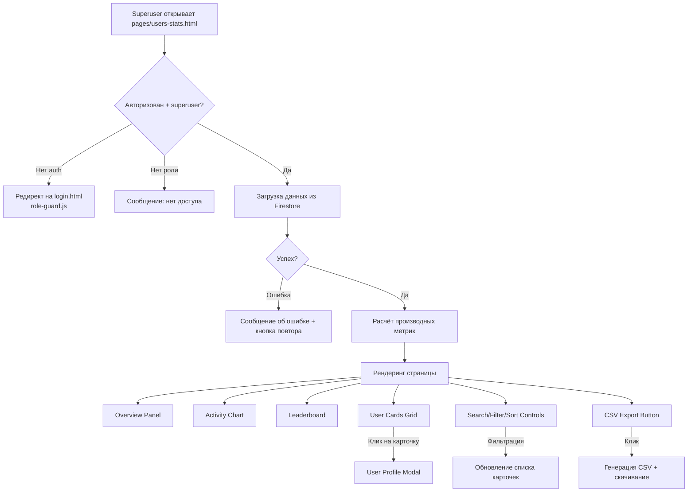
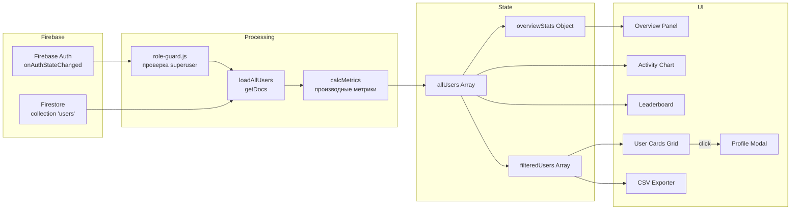

# Дизайн-документ: Страница статистики пользователей

## Обзор

Страница статистики пользователей (`pages/users-stats.html`) — административная страница платформы «Курсы Диспетчера», доступная только пользователям с ролью `superuser`. Страница предоставляет полную аналитику по всем студентам: XP, уровни, прогресс по курсу (15 уроков), модулям (12 тестов), кейсам (50), карточкам (80), streak, точность ответов и достижения.

Страница включает:
1. Панель общей статистики (Overview) — сводные метрики платформы
2. График активности (Chart.js) — тренды вовлечённости по дням
3. Лидерборд — топ-10 по XP/streak/прогрессу
4. Список пользователей (карточки) — с прогресс-барами по всем категориям
5. Поиск, фильтрация и сортировка
6. Модальное окно детального профиля пользователя
7. Экспорт данных в CSV

### Ключевые решения

- **Единый HTML-файл** с inline CSS/JS — по паттерну проекта (`admin.html`, `simulator.html`, `docs.html`). Вся логика, стили и разметка в одном файле.
- **Firebase Firestore** — данные загружаются из коллекции `users` через `getDocs(collection(db, 'users'))`, аналогично `admin.html`.
- **role-guard.js** — контроль доступа (только `superuser`). Подключается как обычный скрипт.
- **shared-nav.css + nav-loader.js** — навигация проекта. Подключается стандартно через `<div id="nav-placeholder">`.
- **Chart.js (CDN)** — для графика активности и мини-графиков в модальном окне профиля.
- **Клиентская фильтрация/сортировка** — все данные загружаются один раз, фильтрация и сортировка выполняются на клиенте в памяти.
- **CSS-переменные** — тёмная тема с переменными из `admin.html` (--bg, --card, --primary, --text и др.).
- **LEVELS из xp-system.js** — уровни и `getLevelByXP()` импортируются для расчёта уровней пользователей.

## Архитектура



### Поток данных



## Компоненты и интерфейсы

### 1. Инициализация и авторизация

Страница подключает `role-guard.js` (как `<script src="../role-guard.js"></script>`), который автоматически проверяет авторизацию и роль. Для `users-stats.html` требуется роль `superuser`. Если пользователь не авторизован — редирект на `login.html`. Если роль не `superuser` — отображается блок с сообщением об отсутствии доступа.

Дополнительно, в inline-скрипте (type="module") импортируются Firebase SDK и `xp-system.js`:

```javascript
import { initializeApp, getApps } from "https://www.gstatic.com/firebasejs/11.6.0/firebase-app.js";
import { getFirestore, collection, getDocs } from "https://www.gstatic.com/firebasejs/11.6.0/firebase-firestore.js";
import { getAuth, onAuthStateChanged } from "https://www.gstatic.com/firebasejs/11.6.0/firebase-auth.js";
import { LEVELS, getLevelByXP, getNextLevel } from '../xp-system.js';
```

### 2. Загрузка данных (loadAllUsers)

Функция `loadAllUsers()` выполняет `getDocs(collection(db, 'users'))` и для каждого документа извлекает:
- `displayName`, `email`, `photoURL` — профиль
- `xp`, `role`, `stats`, `loginStreak`, `lastActivity`, `trainerStats`, `createdAt` — метрики
- `xpHistory` — история XP для мини-графика

Производные метрики рассчитываются на клиенте:
- **Уровень**: `getLevelByXP(xp)` из `xp-system.js`
- **Точность**: `stats.correctAnswers / stats.totalAnswers * 100`
- **Прогресс по курсу**: количество пройденных уроков из 15 (на основе `stats.completedLessons` или аналогичного поля)
- **Прогресс по модулям**: количество пройденных тестов из 12
- **Прогресс по кейсам**: количество изученных кейсов из 50
- **Прогресс по карточкам**: количество изученных карточек из 80

### 3. Overview Panel

Панель из 6 карточек статистики в grid-layout (4 колонки на десктопе):

| Карточка | Значение | Иконка |
|----------|----------|--------|
| Всего пользователей | `users.length` | 👥 |
| Активных за 7 дней | фильтр по `lastActivity` | 🟢 |
| Активных за 30 дней | фильтр по `lastActivity` | 📊 |
| Средний XP | `sum(xp) / count` | ⚡ |
| Средний прогресс курса | `sum(courseProgress) / count` | 📚 |
| Средний streak | `sum(loginStreak) / count` | 🔥 |

Стиль карточек — аналогичен `.sc` из `admin.html`: тёмный фон (`var(--card)`), цветная полоска сверху, иконка, значение крупным шрифтом, подпись мелким.

### 4. Activity Chart

Линейный график (Chart.js) с количеством активных пользователей по дням. Данные рассчитываются из поля `lastActivity` каждого пользователя.

- Переключатель периода: 7 дней / 30 дней (кнопки-табы)
- Цвета: линия `var(--primary)` (#667eea), заливка с прозрачностью
- Tooltip при наведении на точку
- Контейнер: `.cc` карточка с заголовком и `<canvas>`

### 5. Leaderboard

Таблица топ-10 пользователей с переключателем критерия:

- По XP (по умолчанию)
- По streak
- По общему прогрессу (среднее по 4 категориям)

Каждая строка: ранг (🥇🥈🥉 для топ-3), аватар, имя, уровень (role-badge), значение критерия.

### 6. User Cards Grid

Grid карточек пользователей (3 колонки на десктопе, 2 на планшете, 1 на мобильном).

Каждая карточка содержит:
- Аватар (photoURL или инициалы на градиентном фоне)
- Имя, email, дата регистрации
- Уровень + XP (role-badge)
- 4 прогресс-бара: курс (из 15), модули (из 12), кейсы (из 50), карточки (из 80)
- Streak и дата последней активности
- Точность ответов (%)

Клик по карточке открывает модальное окно профиля.

### 7. Search/Filter/Sort Controls

Панель управления над списком карточек:

- **Поиск**: текстовое поле, фильтрация по `displayName` и `email` в реальном времени (debounce 300ms)
- **Фильтр по уровню**: `<select>` с опциями из `LEVELS` (1-10)
- **Фильтр по активности**: `<select>` — все / активные 7д / активные 30д / неактивные
- **Сортировка**: `<select>` — по XP ↓ / XP ↑ / последняя активность / прогресс / дата регистрации / streak
- **Счётчик результатов**: "Показано N из M пользователей"
- **Кнопка CSV**: "📥 Экспорт CSV"

Фильтрация и сортировка выполняются на клиенте: `allUsers` → фильтры → сортировка → `filteredUsers` → рендеринг карточек.

### 8. User Profile Modal

Модальное окно с детальной статистикой пользователя:

- Overlay с `backdrop-filter: blur(10px)`, закрытие по клику вне окна или кнопке ✕
- Анимация появления: `transform: scale(0.95) → scale(1)`, `opacity: 0 → 1`
- На мобильных (<768px): полноэкранный режим

Содержимое:
- Аватар, имя, email, дата регистрации
- Уровень, XP, прогресс до следующего уровня (Progress_Bar)
- Детальный прогресс по курсу: список 15 уроков с ✅/⬜
- Детальный прогресс по модулям: список 12 тестов с ✅/⬜
- Кейсы (N из 50) и карточки (N из 80)
- Streak (текущий и максимальный), точность (%), общее количество ответов
- Дата последней активности
- Mini Chart (Chart.js, line) — динамика XP из `xpHistory`

### 9. CSV Exporter

Функция `exportCSV(filteredUsers)`:

1. Формирует заголовки: Имя, Email, Уровень, XP, Курс (%), Модули (%), Кейсы (%), Карточки (%), Streak, Точность (%), Последняя активность, Дата регистрации
2. Для каждого пользователя формирует строку CSV
3. Добавляет BOM (`\uFEFF`) для корректного отображения кириллицы в Excel
4. Создаёт Blob с `type: 'text/csv;charset=utf-8'`
5. Инициирует скачивание через `URL.createObjectURL` + `<a download>`
6. Имя файла: `users-stats-YYYY-MM-DD.csv`

## Модели данных

### Firestore Document (коллекция `users`)

```typescript
interface FirestoreUser {
  displayName?: string;
  firstName?: string;
  lastName?: string;
  email?: string;
  photoURL?: string;
  xp: number;                    // Общий XP
  role: number;                  // 1-10, соответствует LEVELS
  stats: {
    completedLessons?: string[];  // ID пройденных уроков
    completedModules?: string[];  // ID пройденных модулей
    completedCases?: number;      // Количество изученных кейсов
    completedCards?: number;      // Количество изученных карточек
    correctAnswers?: number;      // Правильные ответы
    totalAnswers?: number;        // Всего ответов
    progress?: number;            // Общий прогресс (%)
  };
  loginStreak: number;           // Текущий streak (дни подряд)
  maxStreak?: number;            // Максимальный streak
  lastActivity?: Timestamp;      // Последняя активность
  createdAt?: Timestamp;         // Дата регистрации
  trainerStats?: object;         // Статистика тренажёра
  xpHistory?: Array<{            // История начислений XP
    action: string;
    xp: number;
    label: string;
    ts: string;                  // ISO timestamp
  }>;
}
```

### Клиентская модель (после обработки)

```typescript
interface ProcessedUser {
  id: string;                    // Firestore document ID
  name: string;                  // displayName или firstName+lastName
  email: string;
  photoURL: string | null;
  xp: number;
  role: number;
  level: {                       // Результат getLevelByXP(xp)
    level: number;
    minXP: number;
    label: string;
  };
  nextLevel: {                   // Результат getNextLevel(xp)
    level: number;
    minXP: number;
    label: string;
  } | null;
  courseProgress: number;        // Пройдено уроков из 15
  moduleProgress: number;       // Пройдено модулей из 12
  caseProgress: number;         // Изучено кейсов из 50
  cardProgress: number;         // Изучено карточек из 80
  accuracy: number;             // Точность ответов (0-100%)
  totalAnswers: number;
  loginStreak: number;
  maxStreak: number;
  lastActivity: Date | null;
  createdAt: Date | null;
  xpHistory: Array<{action: string; xp: number; ts: string}>;
}
```

### Overview Stats

```typescript
interface OverviewStats {
  totalUsers: number;
  activeUsers7d: number;
  activeUsers30d: number;
  avgXP: number;
  avgCourseProgress: number;     // Средний % прогресса по курсу
  avgStreak: number;
}
```

### CSV Row

```typescript
interface CSVRow {
  name: string;
  email: string;
  level: string;                 // "5 — ⭐ Диспетчер Sr"
  xp: number;
  coursePercent: number;          // (courseProgress / 15) * 100
  modulePercent: number;         // (moduleProgress / 12) * 100
  casePercent: number;           // (caseProgress / 50) * 100
  cardPercent: number;           // (cardProgress / 80) * 100
  streak: number;
  accuracy: number;
  lastActivity: string;          // Formatted date
  createdAt: string;             // Formatted date
}
```

## Correctness Properties

*Свойство корректности (property) — это характеристика или поведение, которое должно оставаться истинным при всех допустимых выполнениях системы. По сути, это формальное утверждение о том, что система должна делать. Свойства служат мостом между человекочитаемыми спецификациями и машинно-проверяемыми гарантиями корректности.*

### Property 1: Корректность расчёта производных метрик

*Для любого* документа пользователя из Firestore с полями `xp`, `stats.correctAnswers`, `stats.totalAnswers`, `stats.completedLessons`, `stats.completedModules`, `stats.completedCases`, `stats.completedCards`, функция расчёта производных метрик должна вернуть: уровень, совпадающий с `getLevelByXP(xp)`; точность, равную `correctAnswers / totalAnswers * 100` (или 0 при `totalAnswers === 0`); прогресс по курсу, модулям, кейсам и карточкам, соответствующий количеству завершённых элементов.

**Validates: Requirements 2.2, 2.5**

### Property 2: Корректность расчёта overview-статистик

*Для любого* непустого массива пользователей с произвольными значениями `xp`, `loginStreak`, `courseProgress` и `lastActivity`, функция расчёта overview-статистик должна вернуть: `totalUsers` равный длине массива; `activeUsers7d` равный количеству пользователей с `lastActivity` в пределах последних 7 дней; `activeUsers30d` — в пределах 30 дней; `avgXP` равный `sum(xp) / count`; `avgCourseProgress` равный `sum(courseProgress) / count`; `avgStreak` равный `sum(loginStreak) / count`.

**Validates: Requirements 3.1, 3.2, 3.3, 3.4, 3.5, 3.6**

### Property 3: Корректность данных графика активности

*Для любого* массива пользователей с произвольными датами `lastActivity` и любого периода (7 или 30 дней), функция подготовки данных графика должна вернуть массив, где каждый элемент содержит дату и количество пользователей, чья `lastActivity` попадает в этот день. Сумма всех значений по дням должна быть ≤ общего количества пользователей с `lastActivity` в выбранном периоде.

**Validates: Requirements 4.1**

### Property 4: Корректность сортировки лидерборда

*Для любого* массива пользователей и любого критерия сортировки (XP, streak, общий прогресс), функция лидерборда должна вернуть не более 10 пользователей, отсортированных по убыванию выбранного критерия. Для каждой пары соседних элементов в результате значение критерия первого элемента должно быть ≥ значения второго.

**Validates: Requirements 5.1, 5.3**

### Property 5: Полнота данных карточки пользователя

*Для любого* пользователя с произвольными данными (имя, email, xp, stats, loginStreak, lastActivity, createdAt), результат рендеринга карточки должен содержать: имя пользователя, email, дату регистрации, уровень, XP, 4 прогресс-бара (курс N/15, модули N/12, кейсы N/50, карточки N/80), streak, дату последней активности и точность ответов в процентах.

**Validates: Requirements 6.2, 6.3, 6.4, 6.5, 6.6, 6.7, 6.8, 6.9**

### Property 6: Корректность текстового поиска

*Для любого* массива пользователей и любой непустой строки поиска, результат фильтрации должен содержать только тех пользователей, чьё имя (`name`) или email содержит строку поиска (без учёта регистра). Ни один пользователь, чьё имя и email не содержат строку поиска, не должен присутствовать в результате.

**Validates: Requirements 7.2**

### Property 7: Корректность фильтрации по активности

*Для любого* массива пользователей и любого фильтра активности (все, 7 дней, 30 дней, неактивные), результат фильтрации должен содержать только пользователей, соответствующих критерию: «активные за 7 дней» — `lastActivity` в пределах 7 дней; «активные за 30 дней» — в пределах 30 дней; «неактивные» — `lastActivity` старше 30 дней или отсутствует; «все» — все пользователи.

**Validates: Requirements 7.4, 7.5**

### Property 8: Корректность сортировки пользователей

*Для любого* массива пользователей и любого критерия сортировки (XP по убыванию, XP по возрастанию, последняя активность, общий прогресс, дата регистрации, streak), результат сортировки должен содержать те же элементы, что и исходный массив, и для каждой пары соседних элементов порядок должен соответствовать выбранному критерию и направлению.

**Validates: Requirements 8.1, 8.2, 8.3, 8.4, 8.5, 8.6**

### Property 9: Полнота данных модального окна профиля

*Для любого* пользователя с произвольными данными, результат рендеринга модального окна профиля должен содержать: аватар, имя, email, дату регистрации, уровень, XP, прогресс до следующего уровня, список 15 уроков с отметками, список 12 модулей с отметками, количество кейсов и карточек, streak (текущий и максимальный), точность, общее количество ответов, дату последней активности.

**Validates: Requirements 9.2, 9.3, 9.4, 9.5, 9.6, 9.7, 9.8**

### Property 10: Корректность CSV-экспорта (round-trip)

*Для любого* массива отфильтрованных пользователей, сгенерированный CSV должен: начинаться с BOM-символа (`\uFEFF`); содержать строку заголовков с 12 столбцами (имя, email, уровень, XP, курс %, модули %, кейсы %, карточки %, streak, точность %, последняя активность, дата регистрации); содержать ровно столько строк данных, сколько пользователей в массиве; и для каждого пользователя значения в строке должны соответствовать его данным. Имя файла должно соответствовать формату `users-stats-YYYY-MM-DD.csv`.

**Validates: Requirements 10.2, 10.3, 10.4, 10.5**

### Property 11: Блокировка доступа для не-superuser ролей

*Для любой* роли пользователя от 1 до 9 (не superuser), при попытке доступа к странице система должна отобразить сообщение об отсутствии доступа и не показывать содержимое страницы статистики.

**Validates: Requirements 1.2**

### Property 12: Корректность подготовки данных XP-графика

*Для любого* массива `xpHistory` пользователя с произвольными записями `{xp, ts}`, функция подготовки данных мини-графика должна вернуть массив точек, отсортированных по времени, где каждая точка отражает кумулятивный XP на момент времени. Последнее значение кумулятивного XP должно равняться сумме всех `xp` в истории.

**Validates: Requirements 9.9**

## Обработка ошибок

### Ошибки загрузки данных
- **Firestore недоступен / ошибка сети**: отображается блок с сообщением «Ошибка загрузки данных» и кнопкой «Повторить». При нажатии — повторный вызов `loadAllUsers()`.
- **Пустая коллекция**: отображается сообщение «Пользователи не найдены» вместо пустого списка.

### Ошибки данных пользователей
- **Отсутствующие поля**: все поля имеют значения по умолчанию (`xp: 0`, `loginStreak: 0`, `stats: {}`, `name: email || id`). Функция обработки данных использует optional chaining и fallback-значения.
- **Некорректные даты**: `lastActivity` и `createdAt` проверяются через `try/catch` при конвертации `Timestamp → Date`. При ошибке — `null`.
- **Division by zero**: точность ответов — `totalAnswers === 0 ? 0 : (correctAnswers / totalAnswers * 100)`.

### Ошибки UI
- **photoURL недоступен**: отображаются инициалы пользователя на градиентном фоне (аналогично `admin.html`).
- **xpHistory пуст**: мини-график в модальном окне не отображается, вместо него — текст «Нет данных».
- **Chart.js не загрузился (CDN)**: график заменяется текстовым сообщением «График недоступен».

### CSV-экспорт
- **Нет данных для экспорта**: кнопка экспорта неактивна (disabled) при пустом `filteredUsers`.
- **Ошибка генерации**: `try/catch` с toast-уведомлением об ошибке.

## Стратегия тестирования

### Подход

Используется двойной подход к тестированию:
- **Unit-тесты** — проверка конкретных примеров, граничных случаев и ошибок
- **Property-тесты** — проверка универсальных свойств на множестве случайных входных данных

Оба подхода дополняют друг друга: unit-тесты ловят конкретные баги, property-тесты гарантируют общую корректность.

### Библиотека для property-based тестирования

**fast-check** (JavaScript) — зрелая PBT-библиотека для JS/TS. Подключается через npm:
```bash
npm install --save-dev fast-check
```

Каждый property-тест должен выполнять минимум 100 итераций.

### Тегирование тестов

Каждый property-тест должен содержать комментарий с ссылкой на свойство из дизайн-документа:

```javascript
// Feature: users-statistics-page, Property 1: Корректность расчёта производных метрик
```

Каждое свойство корректности (Property) реализуется ОДНИМ property-based тестом.

### Unit-тесты (примеры и граничные случаи)

1. **Авторизация**: неавторизованный пользователь → редирект; роль student → сообщение об отсутствии доступа; роль superuser → доступ разрешён (Requirements 1.1, 1.2)
2. **Загрузка**: индикатор загрузки отображается во время запроса; ошибка Firestore → сообщение + кнопка повтора (Requirements 2.3, 2.4)
3. **Лидерборд**: медали 🥇🥈🥉 для топ-3 (Requirement 5.4)
4. **Модальное окно**: открытие по клику на карточку; закрытие по кнопке ✕ и клику вне окна (Requirements 6.10, 9.1, 9.10)
5. **Переключатель периода графика**: 7 дней / 30 дней (Requirement 4.3)
6. **Hero-секция**: наличие заголовка «Статистика пользователей» (Requirement 12.8)
7. **Граничные случаи**: пустой массив пользователей; пользователь без `stats`; пользователь с `totalAnswers === 0`; пользователь без `lastActivity`

### Property-тесты

| Property | Описание | Генератор |
|----------|----------|-----------|
| P1 | Расчёт производных метрик | Случайные Firestore-документы с `xp: 0..10000`, `correctAnswers: 0..500`, `totalAnswers: 0..500`, массивы `completedLessons` длиной 0..15 |
| P2 | Overview-статистики | Массивы из 1..100 пользователей со случайными `xp`, `loginStreak`, `courseProgress`, `lastActivity` |
| P3 | Данные графика активности | Массивы пользователей со случайными `lastActivity` в диапазоне 0..60 дней назад |
| P4 | Сортировка лидерборда | Массивы из 1..50 пользователей, случайный критерий из [xp, streak, progress] |
| P5 | Полнота карточки | Случайные пользователи с произвольными полями |
| P6 | Текстовый поиск | Массивы пользователей + случайные строки поиска (подстроки имён/email и случайные строки) |
| P7 | Фильтрация по активности | Массивы пользователей + случайный фильтр из [all, 7d, 30d, inactive] |
| P8 | Сортировка пользователей | Массивы пользователей + случайный критерий и направление |
| P9 | Полнота модального окна | Случайные пользователи с полным набором данных |
| P10 | CSV-экспорт | Массивы из 1..50 пользователей, проверка структуры CSV |
| P11 | Блокировка не-superuser | Случайная роль 1..9 |
| P12 | Данные XP-графика | Случайные массивы `xpHistory` длиной 0..100 |
