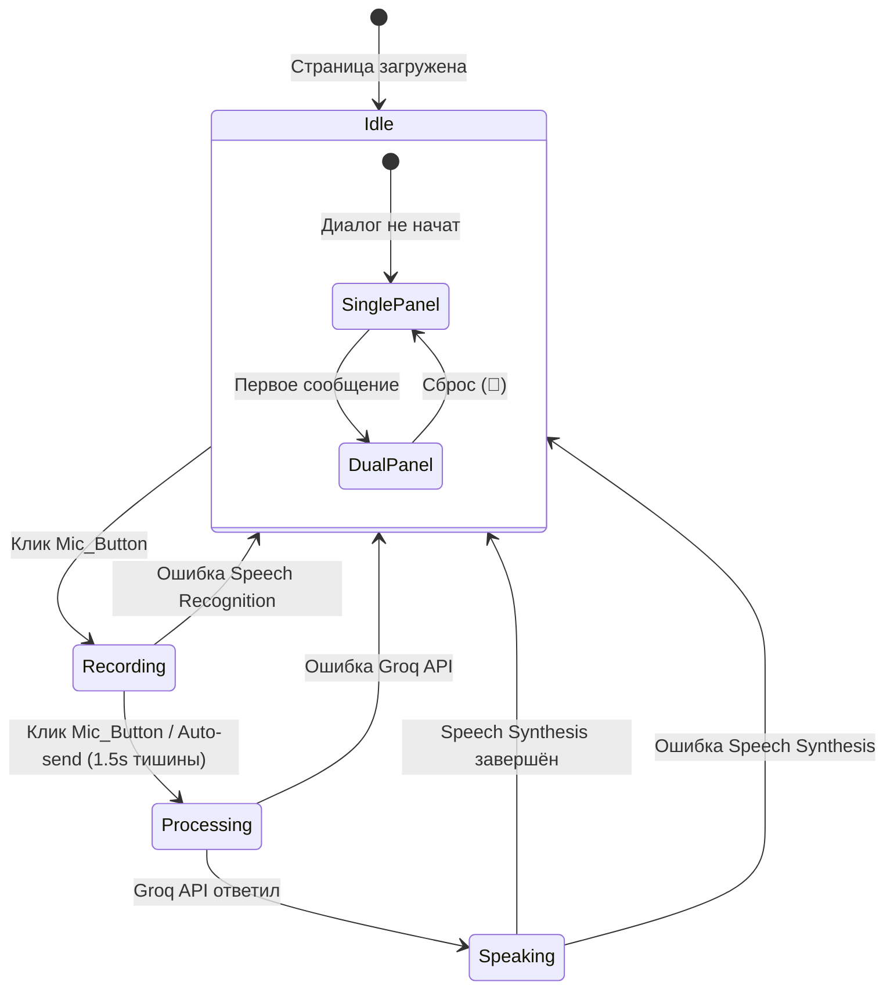

# Дизайн-документ: Voice Chat Widget

## Обзор

Переработка UI страницы `ai-broker-chat.html` — замена линейного чат-интерфейса на двухпанельный layout с Voice Chat виджетом. Виджет представляет собой карточку с зелёной кнопкой микрофона (Mic_Button), пульсирующим кольцом (Pulse_Ring), заголовком, описанием и списком фич (Feature_List). При начале диалога слева от виджета появляется панель транскрипта (Transcript_Panel). Вся существующая функциональность (Groq API, Speech Recognition, Speech Synthesis, сценарии, Prep Screen, Feedback, History, Firebase Auth, XP) сохраняется.

### Ключевые решения

- Реализация полностью в одном файле `ai-broker-chat.html` (inline CSS + JS) — соответствует текущей архитектуре проекта
- Замена существующего `.chat` контейнера и `.input-area` на новый `App_Layout` с Voice_Chat_Widget и Transcript_Panel
- Переиспользование существующих JS-функций (`toggleMic`, `processMsg`, `callAI`, `speakText`, `addMsg` и т.д.) с минимальными изменениями
- CSS-анимации для Pulse_Ring и переходов layout (без JS-анимаций)
- Адаптивность через CSS Grid + media queries

## Архитектура

### Текущая структура (до изменений)

```
body
├── #shared-nav-container
├── Modals (Prep Screen, Feedback, History)
└── .app (max-width: 800px, flex column)
    ├── .hdr (header с аватаром, кнопками)
    ├── .sbar (scenario bar)
    ├── .phrase-hints
    ├── .chat (scrollable message list)
    ├── .typing (typing indicator)
    ├── .speaking-indicator
    ├── .transcript-display
    └── .input-area (mic button)
```

### Новая структура (после изменений)

```
body
├── #shared-nav-container
├── Modals (Prep Screen, Feedback, History) — без изменений
└── .app (max-width: 1200px, flex column)
    ├── .hdr — без изменений
    ├── .sbar — без изменений
    ├── .phrase-hints — без изменений
    └── .app-layout (CSS Grid container)
        ├── .transcript-panel (скрыта до начала диалога)
        │   ├── .transcript-panel-header ("Транскрипт")
        │   └── .transcript-panel-messages (scrollable, role="log")
        │       ├── .msg.user
        │       ├── .msg.broker
        │       └── .msg.sys
        └── .voice-chat-widget (центрирован)
            ├── .vcw-title ("Voice Chat")
            ├── .vcw-subtitle ("Have natural, hands-free conversations with AI.")
            ├── .vcw-mic-container
            │   ├── .pulse-ring
            │   └── .mic-btn (переиспользован)
            ├── .vcw-status (индикатор состояния: ожидание / запись / обработка / говорит)
            └── .vcw-features (Feature_List)
                ├── "🎙️ Speak naturally, get instant responses"
                ├── "🔊 Choose from multiple AI voices"
                └── "✋ Fully hands-free interaction"
```

### Диаграмма переходов состояний



### Диаграмма переходов layout

```mermaid
stateDiagram-v2
    [*] --> SinglePanel: Загрузка страницы
    SinglePanel --> DualPanel: startScenario() / первый processMsg()
    DualPanel --> SinglePanel: resetChat()
    
    state SinglePanel {
        note right of SinglePanel
            Voice_Chat_Widget по центру
            Transcript_Panel скрыта
            .app-layout: grid-template-columns: 1fr
        end note
    }
    
    state DualPanel {
        note right of DualPanel
            Desktop (>768px): 1fr 1fr
            Mobile (<768px): 1fr (вертикально)
        end note
    }
```

## Компоненты и интерфейсы

### 1. Voice Chat Widget (`.voice-chat-widget`)

Центральный UI-компонент. Содержит Mic_Button, заголовок, описание, Feature_List и индикатор состояния.

**CSS-свойства:**
- `background`: полупрозрачный с `backdrop-filter: blur(16px)`
- `border-radius`: 20px
- `border`: 1px solid var(--border)
- Центрирование через `place-self: center` в grid

**Состояния:**
| Состояние | Mic_Button цвет | Pulse_Ring | Статус-текст | mic disabled |
|-----------|----------------|------------|--------------|--------------|
| idle | зелёный градиент | зелёная пульсация | — | false |
| recording | красный градиент | красная пульсация | "Слушаю..." | false |
| processing | зелёный (dim) | нет | "Обработка..." | true |
| speaking | зелёный (dim) | нет | "Брокер говорит..." + wave | true |

### 2. Transcript Panel (`.transcript-panel`)

Боковая панель с хронологическим списком сообщений.

**Поведение:**
- Скрыта по умолчанию (`display: none`)
- Появляется при `app-layout.classList.add('dialog-active')`
- Автопрокрутка к последнему сообщению
- Лимит 50 сообщений в DOM (переиспользование существующей логики `MSG_LIMIT`)
- Промежуточный текст (interim) отображается курсивом серого цвета внизу панели

**Accessibility:**
- `role="log"`
- `aria-live="polite"`
- `aria-label="Транскрипт диалога"`

### 3. App Layout (`.app-layout`)

CSS Grid контейнер, управляющий расположением панелей.

**CSS Grid:**
```css
.app-layout {
    display: grid;
    grid-template-columns: 1fr;
    gap: 0;
    flex: 1;
    min-height: 0;
    overflow: hidden;
    transition: grid-template-columns 0.35s ease;
}

.app-layout.dialog-active {
    grid-template-columns: 1fr 1fr;
    gap: 16px;
    padding: 0 16px;
}
```

### 4. Pulse Ring (`.pulse-ring`)

CSS-only анимация вокруг Mic_Button.

```css
.pulse-ring {
    position: absolute;
    inset: -8px;
    border-radius: 50%;
    border: 2px solid rgba(16, 185, 129, 0.4);
    animation: pulse-green 2s ease-in-out infinite;
}

@keyframes pulse-green {
    0%, 100% { transform: scale(1); opacity: 0.6; }
    50% { transform: scale(1.15); opacity: 0; }
}

.mic-btn.rec ~ .pulse-ring,
.vcw-mic-container.recording .pulse-ring {
    border-color: rgba(239, 68, 68, 0.4);
    animation: pulse-red 1s ease-in-out infinite;
}
```

### 5. Модифицированные существующие функции

| Функция | Изменение |
|---------|-----------|
| `addMsg(type, text)` | Добавляет сообщение в `.transcript-panel-messages` вместо `.chat` |
| `startScenario(s)` | Добавляет класс `dialog-active` к `.app-layout`, показывает Transcript_Panel |
| `resetChat()` | Убирает `dialog-active`, очищает Transcript_Panel, возвращает виджет в центр |
| `toggleMic()` | Обновляет `aria-label`, `aria-pressed`, визуальное состояние виджета |
| `processMsg(text)` | Обновляет статус виджета (processing → speaking → idle) |
| `TranscriptDisplay` | Промежуточный текст показывается внутри Transcript_Panel (внизу) |

### 6. Интеграция с существующими модалами

Модалы (Prep Screen, Feedback, History) остаются без изменений — они используют `position: fixed` и `z-index: 1000`, поэтому корректно отображаются поверх нового layout.

## Модели данных

### Состояние виджета (в JS)

```javascript
// Новые переменные состояния
let widgetState = 'idle'; // 'idle' | 'recording' | 'processing' | 'speaking'
let dialogActive = false; // управляет layout (single/dual panel)

// Существующие переменные (без изменений)
let hist = [];           // история сообщений для Groq API
let scen = 'free';       // текущий сценарий
let broker = 'Mike';     // имя брокера
let busy = false;        // блокировка во время обработки
let isRec = false;       // состояние записи
let recognition = null;  // SpeechRecognition instance
let synth = window.speechSynthesis;
```

### Структура сообщения в Transcript Panel

Переиспользуется существующая структура `.msg`:

```html
<!-- Сообщение пользователя -->
<div class="msg user" role="article" aria-label="Ваше сообщение в 14:32">
    Текст сообщения
    <span class="ts">14:32 ✓</span>
</div>

<!-- Сообщение брокера -->
<div class="msg broker" role="article" aria-label="Сообщение от брокера Mike в 14:32">
    <div class="who">Mike</div>
    Текст ответа
    <span class="ts">14:32</span>
</div>

<!-- Промежуточный текст (interim) -->
<div class="transcript-interim" style="font-style:italic;color:#94a3b8;">
    распознаваемый текст...
</div>
```

### CSS-переменные (существующие, без изменений)

```css
:root {
    --primary: #06b6d4;
    --accent: #f97316;
    --success: #10b981;
    --danger: #ef4444;
    --bg: #070b14;
    --bg2: #0d1117;
    --card: #111827;
    --border: rgba(255,255,255,.06);
    --t1: #ffffff;
    --t2: #e2e8f0;
    --t3: #cbd5e1;
    --nav: 64px;
}
```

## Свойства корректности (Correctness Properties)

*Свойство (property) — это характеристика или поведение, которое должно оставаться истинным при всех допустимых выполнениях системы. По сути, это формальное утверждение о том, что система должна делать. Свойства служат мостом между человекочитаемыми спецификациями и машинно-верифицируемыми гарантиями корректности.*

### Property 1: Layout toggle round-trip

*For any* сценарий и состояние страницы, вызов `startScenario(s)` должен переключить `.app-layout` в двухпанельный режим (класс `dialog-active` присутствует, Transcript_Panel видима), а последующий вызов `resetChat()` должен вернуть layout в однопанельный режим (класс `dialog-active` отсутствует, Transcript_Panel скрыта, Transcript_Panel пуста).

**Validates: Requirements 2.1, 6.5**

### Property 2: Message chronological ordering

*For any* последовательность сообщений, добавленных в Transcript_Panel через `addMsg()`, порядок DOM-элементов `.msg` в панели должен совпадать с хронологическим порядком их добавления — то есть индекс каждого сообщения в DOM должен быть строго больше индекса любого ранее добавленного сообщения.

**Validates: Requirements 2.2**

### Property 3: Transcript auto-scroll

*For any* сообщение, добавленное в Transcript_Panel, после вызова `addMsg()` значение `scrollTop` контейнера сообщений должно быть равно `scrollHeight - clientHeight` (т.е. прокрутка в самый низ).

**Validates: Requirements 2.3**

### Property 4: Mic toggle state machine

*For any* начальное состояние `idle`, нажатие Mic_Button должно перевести `widgetState` в `recording` (isRec=true, кнопка имеет класс `rec`). Повторное нажатие в состоянии `recording` должно перевести состояние в `processing` (isRec=false, класс `rec` убран), при условии наличия распознанного текста.

**Validates: Requirements 3.1, 3.3**

### Property 5: Mic disabled during processing

*For any* вызов `processMsg(text)`, на протяжении всего выполнения (от начала до завершения `speakText`) свойство `micBtn.disabled` должно быть `true`, а `busy` — `true`.

**Validates: Requirements 3.4**

### Property 6: Messages contain required metadata

*For any* сообщение пользователя, добавленное через `addMsg('user', text)`, результирующий DOM-элемент должен содержать текст сообщения и метку времени (`.ts`). *For any* сообщение брокера, добавленное через `addMsg('broker', text)`, результирующий DOM-элемент должен содержать имя брокера (`.who`), текст ответа и метку времени (`.ts`).

**Validates: Requirements 4.2, 4.3**

### Property 7: Interim text display in transcript

*For any* промежуточный текст (interim result) от Speech Recognition, вызов отображения interim-текста должен показать его в Transcript_Panel курсивом серого цвета, а при получении финального результата interim-текст должен быть очищен.

**Validates: Requirements 4.1**

### Property 8: DOM message limit invariant

*For any* количество сообщений N, добавленных в Transcript_Panel, количество DOM-элементов `.msg` в панели никогда не должно превышать 50 (MSG_LIMIT). Если N > 50, в DOM должны остаться только последние 50 сообщений.

**Validates: Requirements 4.5**

### Property 9: Mic button ARIA attributes across states

*For any* переход состояния Mic_Button (idle → recording, recording → idle, idle → disabled), атрибут `aria-pressed` должен соответствовать состоянию записи (`true` при recording, `false` иначе), а `aria-label` должен соответствовать текущему состоянию: "Начать запись" (idle), "Остановить запись" (recording), "Микрофон заблокирован" (disabled).

**Validates: Requirements 8.1, 8.4**

## Обработка ошибок

### Speech Recognition

| Ошибка | Поведение |
|--------|-----------|
| `not-allowed` / `permission-denied` | Уведомление о блокировке микрофона, Mic_Button disabled, widgetState → idle |
| `audio-capture` | Уведомление "Микрофон не найден", Mic_Button disabled |
| `network` | Уведомление об ошибке сети, widgetState → idle |
| `no-speech` | Тихая обработка (без уведомления), продолжение записи |
| `aborted` | widgetState → idle |
| Браузер не поддерживает SR | Уведомление при загрузке, Mic_Button permanently disabled |

### Groq API

| Ошибка | Поведение |
|--------|-----------|
| Timeout (8s) | Уведомление "AI не ответил вовремя", widgetState → idle, mic enabled |
| 429 Rate Limit | Уведомление "Подождите минуту", widgetState → idle |
| 401 Auth Error | Уведомление об ошибке авторизации |
| Network Error | Уведомление о проблемах с сетью |
| Empty Response | Уведомление об ошибке, сообщение пользователя удаляется из hist |

### Speech Synthesis

| Ошибка | Поведение |
|--------|-----------|
| `onerror` | Индикатор "Брокер говорит..." скрывается, widgetState → idle, mic enabled |
| `synth` недоступен | Пропуск озвучки, widgetState → idle |

### Layout / UI

| Ситуация | Поведение |
|----------|-----------|
| Transcript_Panel переполнена | Автоматическое удаление старых сообщений (>50) |
| Потеря фокуса при записи | Recognition продолжает работать (continuous=true) |
| Двойной клик на Mic_Button | Защита через `busy` флаг |

## Стратегия тестирования

### Подход

Используется двойной подход: unit-тесты для конкретных примеров и edge-cases, property-based тесты для универсальных свойств.

### Библиотека для property-based тестирования

**fast-check** (JavaScript) — зрелая PBT-библиотека для JS/TS с поддержкой произвольных генераторов, shrinking и интеграцией с основными test runners.

### Конфигурация property-based тестов

- Минимум 100 итераций на каждый property-тест
- Каждый тест помечен комментарием: `// Feature: voice-chat-widget, Property N: <описание>`
- Каждое свойство корректности реализуется одним property-based тестом

### Unit-тесты (примеры и edge-cases)

1. **Начальное состояние виджета** — проверка наличия заголовка "Voice Chat", подзаголовка, Feature_List с 3 пунктами, Mic_Button (Req 1.1, 1.2, 1.3)
2. **Transcript_Panel скрыта до диалога** — проверка display:none до startScenario (Req 2.4)
3. **Scenario_Bar видима над виджетом** — проверка DOM-порядка (Req 6.1)
4. **Prep Screen при выборе сценария** — клик на сценарий показывает prep screen (Req 6.2)
5. **Кнопки анализа и завершения** — вызов getAnalysis() и endSession() (Req 6.3)
6. **Feedback Modal поверх layout** — проверка z-index и position:fixed (Req 6.4)
7. **CSS transition на layout** — проверка transition-duration 300-400ms (Req 7.3)
8. **Transcript_Panel ARIA атрибуты** — role="log", aria-live="polite" (Req 8.2)
9. **Клавиатурная навигация** — Tab, Enter, Space на Mic_Button (Req 8.3)
10. **Индикатор "Брокер говорит..."** — проверка отображения во время Speech Synthesis (Req 4.4)
11. **Mic_Button recording визуальное состояние** — красный цвет, красная пульсация (Req 3.2)
12. **Speech Recognition недоступен** — уведомление и disabled mic (Req 3.5, edge-case)

### Property-based тесты

| # | Свойство | Генератор | Итерации |
|---|----------|-----------|----------|
| 1 | Layout toggle round-trip | Произвольный сценарий из ['free','negotiate','book','problem','cold','followup'] | 100 |
| 2 | Message chronological ordering | Произвольная последовательность {type: 'user'\|'broker', text: string} | 100 |
| 3 | Transcript auto-scroll | Произвольное сообщение (type + text) | 100 |
| 4 | Mic toggle state machine | Последовательность кликов с произвольными задержками | 100 |
| 5 | Mic disabled during processing | Произвольный текст сообщения | 100 |
| 6 | Messages contain required metadata | Произвольный {type: 'user'\|'broker', text: string, brokerName: string} | 100 |
| 7 | Interim text display | Произвольная строка interim текста | 100 |
| 8 | DOM message limit invariant | Произвольное число N (1..200) сообщений | 100 |
| 9 | Mic button ARIA across states | Произвольная последовательность переходов состояний | 100 |
